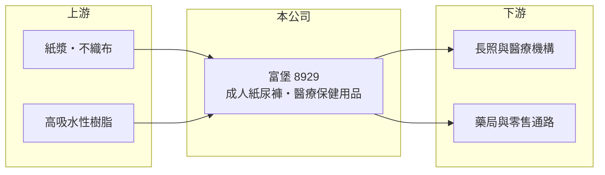

# 8929 富堡

> 上櫃｜[[產業索引-其他業|其他業]]｜上市（櫃）日期 2000/11/30

# 第一章：企業模式與商業藍圖

> [!info] 撰寫說明
> 精簡版，由 Claude 依公開資料整理，架構比照 [[2330台積電]]，資料截至 2026-10-07。來源：winvest 營收快訊（2026 年 4 月至 8 月）。公開資料有限。#待校對

富堡是成人紙尿褲等醫療保健用品製造商，受惠高齡化但面臨價格競爭。

- **核心業務：** 製造與銷售[[成人紙尿褲]]等醫療保健用品。
- **營收結構：** 公開資料未揭露產品比重，以成人紙尿褲為主。
- **營運據點：** 以台灣為主，成立於 1977 年。
- **長期方向：** [[高齡化]]帶動成人失禁用品需求，公司以穩定內需市場為主（推估）。

# 第二章：護城河深度與競爭優勢

成人紙尿褲需求穩定，但通路議價力強、品牌競爭激烈。

- **競爭優勢：** 長期經營醫療保健用品，累積長照機構與通路客戶（推估）。
- **主要對手：** 國際品牌與台灣衛生用品廠，如 [[9919康那香]]、[[1907永豐餘]]旗下品牌（推估）。
- **觀察重點：** 獲利能否穩定轉正，以及[[不織布]]等原料成本變化。

# 第三章：財務體質與盈利規模

資料日期：2026-10-07，以下數字是撰寫當時的快照；最新月營收、毛利率、累計 EPS 由自動排程寫在本筆記的屬性欄位（月營收、毛利率、累計EPS 等）。#待校對

富堡營收持平，2026 年第二季轉為獲利。

- **營收規模：** 2026 年 8 月營收 5,317.7 萬元，年減 3.04%；1 至 8 月累計 4.55 億元，年減 1.2%。
- **獲利：** 2025 年 EPS -0.45 元；2026 年第二季 EPS 0.22 元，上半年累計 0.16 元。
- **財務特色：** 資本額 5.06 億元，市值約 6.58 億元；[[毛利率]]資料未查得。

# 第四章：總體風險與地緣政治

富堡的風險在於原料成本與價格競爭。

- **產業週期：** 成人紙尿褲屬民生必需品，需求穩定，受景氣影響小。
- **營運風險：** 通路與長照機構採購議價壓力大，品牌競爭限制漲價空間。
- **其他風險：** 紙漿、不織布與高吸水性樹脂等原料價格波動，以及長照政策與補助變化。

# 專有名詞解析

## 金融

- **[[毛利率]]**：毛利除以營收，反映產品或服務本身的獲利能力。

## 產業

- **[[成人紙尿褲]]**：供失禁或行動不便成人使用的拋棄式吸收性用品，主要用於居家與長照機構。
- **[[高齡化]]**：65 歲以上人口比例上升，帶動醫療、長照與失禁用品需求。
- **[[不織布]]**：不經紡織、以纖維直接黏合或纏結而成的布材，是紙尿褲的主要原料之一。

# 核心供應鏈

- 上游：紙漿、不織布與高吸水性樹脂供應商（推估）
- 下游／客戶：長照與醫療機構、藥局與零售通路（推估）
- 同業：[[9919康那香]]、[[1907永豐餘]]等衛生用品業者（推估）

## 最新新聞
<!-- news:start -->
<!-- news:end -->

## 相關連結
- [公開資訊觀測站](https://mopsov.twse.com.tw/mops/web/t05st03?step=1&firstin=1&co_id=8929)
- [Goodinfo](https://goodinfo.tw/tw/StockDetail.asp?STOCK_ID=8929)
- [Yahoo 股市](https://tw.stock.yahoo.com/quote/8929)
- [鉅亨網新聞](https://www.cnyes.com/twstock/8929/news)
