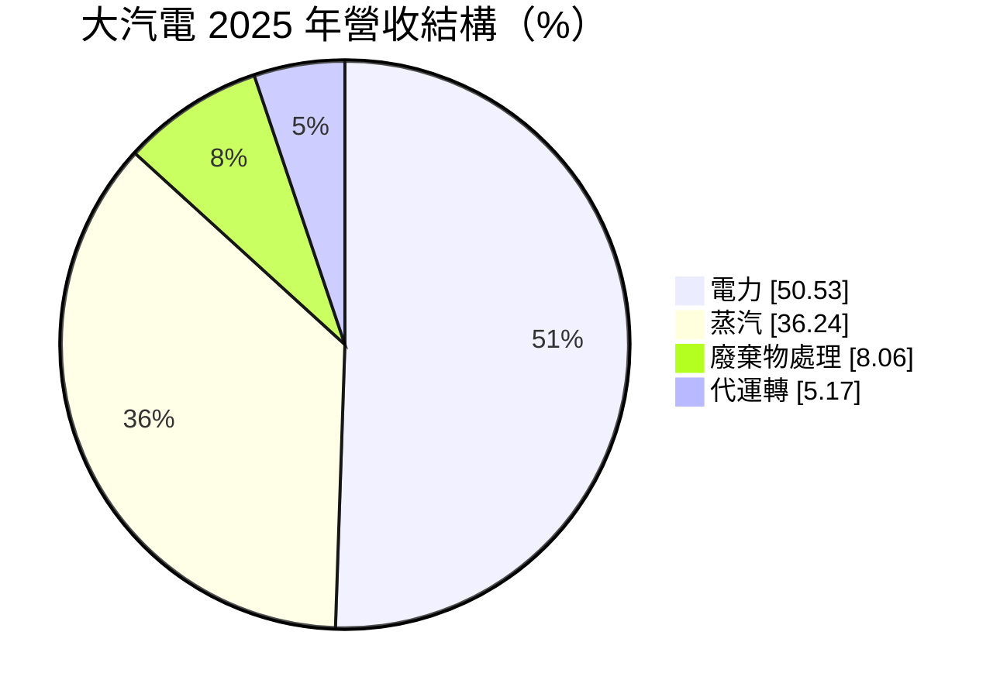
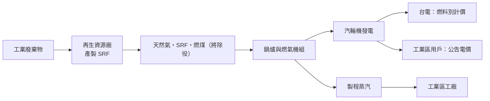
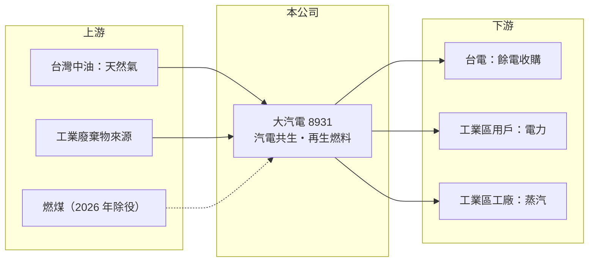

# 8931 大汽電

> 上櫃｜[[產業索引-油電燃氣業|油電燃氣業]]｜上市（櫃）日期 2001/05/10

# 第一章：企業模式與商業藍圖

> [!info] 撰寫說明
> 本文由 Claude 依公開資料整理，架構比照 [[2330台積電]] 的四章研究，資料截至 2026-10-08。財務數字來源：Goodinfo 年度經營績效頁、富果研究 2026 年 3 月法說會整理（AI 摘要）、櫃買中心開放資料（基本資料、2026 年第二季資產負債與綜合損益、每月營收、本益比殖利率）；廠址與服務區域依公司名稱與記憶整理，標註待校對；產業描述為整理性內容，尚未逐條比對原始文件。#待校對

在評估單一個股的長期投資價值時，首要步驟是拆解企業的底層獲利邏輯。本章說明大園汽電共生（股票代號：8931，以下簡稱大汽電）如何以一座工業區汽電共生廠，同時賣蒸汽、賣電與處理廢棄物，以及它正在進行的「燃煤轉燃氣」轉型。

## 一、核心定位：工業區的蒸汽與電力供應者

大汽電成立於 1993 年，2001 年在櫃買中心掛牌，實收資本額約 12.2 億元，董事長為吳進忠。公司經營[[汽電共生]]廠，服務桃園大園工業區一帶的工廠（廠址與服務範圍待校對）：鍋爐燃燒燃料產生高壓蒸汽，先推動汽輪機發電，再把發電後的蒸汽以管線供應給工業區內的染整、紡織、造紙、食品等需要蒸汽的工廠。這種「一份燃料、兩種產品」的設計，整體能源效率明顯高於工廠各自設鍋爐。

大汽電的第二個事業是廢棄物處理：再生資源廠處理工業廢棄物，產製[[固體再生燃料]]（SRF），再送進自己的再生燃料機組燃燒發電。這讓廢棄物處理費成為收入，廢棄物本身又成為燃料，是一個循環經濟的模式。

## 二、業務板塊：電力、蒸汽、廢棄物處理

依富果研究整理的 2026 年 3 月法說會資料，2025 年營收結構如下：

* **電力：** 約一半售予台電，採燃料別計價，電價隨天然氣採購成本浮動；另一半售予工業區用戶，電價依台電公告電價計算，成本無法即時完全轉嫁。
* **蒸汽：** 售價隨天然氣價格調整，成本幾乎可全數轉嫁給客戶。
* **廢棄物處理與代運轉：** 處理工業廢棄物與替其他設施代為運轉，是較穩定的服務收入。

## 三、資本轉化邏輯：一套鍋爐、兩種產品、一個循環

汽電共生廠的獲利取決於兩件事：機組的穩定運轉，以及燃料成本能否轉嫁。蒸汽與台電餘電的價格大多能隨燃料成本調整，風險較低；售予工業區用戶的電力則依台電公告電價，天然氣成本上漲時會壓縮利潤。2025 年毛利率從 21.9% 降到 16.7%，部分原因就是燃料轉換期間的成本與轉嫁時間差（推估）。

## 四、企業長期藍圖：燃煤退場、轉向天然氣與再生燃料

大汽電正處在一個關鍵轉型期。燃氣渦輪機組已於 2025 年 6 月商轉，燃氣複循環機組預計 2026 年第三季商轉，燃煤汽電共生機組預計 2026 年第四季退場除役，僅保留燃煤鍋爐作為緊急備用，目標是達成零用煤。轉型完成後，大汽電的碳排放將大幅下降，也較能符合工業區客戶的減碳要求。公司另計畫自 2026 年第四季起開拓 AI 算力中心等用電客戶，並持續優化 SRF 製程與研發液態廢棄物處理技術。

# 第二章：護城河深度與競爭優勢

本章分析大汽電作為工業區能源供應者的競爭優勢，以及這些優勢對區內產業的依賴。

## 一、護城河的核心組成要素

* **蒸汽管網的區域獨占：** 蒸汽無法長距離輸送，工業區內一旦建好供汽管網，客戶幾乎沒有其他集中供汽的選擇；改為自設鍋爐需要投資與環保許可，成本高且排放管制嚴格。
* **電業與環保執照：** 汽電共生廠與廢棄物處理廠都需要電業、環評與廢棄物處理許可，新進者取得不易。
* **循環經濟模式：** 處理廢棄物同時取得處理費與燃料，降低燃料成本，這種模式需要處理許可、燃料製程與燃燒機組的配合，不易複製。
* **燃料轉嫁機制：** 蒸汽與台電餘電的價格可隨燃料成本調整，降低燃料價格波動的衝擊。

## 二、主要競爭對手與替代方案

| 對手／替代者 | 定位 | 對大汽電的影響 |
|---|---|---|
| 工廠自設鍋爐 | 蒸汽替代方案 | 受環保法規限制，通常比集中供汽貴 |
| 台電 | 電力替代來源 | 工業區用戶可改向台電購電 |
| [[8926台汽電]] | 民營發電與汽電共生集團 | 規模大得多，屬同業比較對象 |
| 其他工業區汽電共生廠 | 不同區域 | 不直接競爭 |

## 三、優勢轉化：守得住、守不住與觀察重點

* **守得住：** 工業區內的蒸汽供應地位與廢棄物處理業務。
* **守不住：** 區內產業的蒸汽需求。若工業區內的傳統產業因關稅、景氣或外移而減產，蒸汽與電力需求都會下降；法說會已提到部分客戶受關稅影響減少用量。
* **觀察重點：** 第一，燃氣複循環機組商轉後的效率與獲利；第二，燃煤機組除役後的成本結構；第三，AI 算力中心等新用電客戶的開拓成果。

# 第三章：財務體質與盈利規模

資料日期：2026-10-08。數字取自 Goodinfo 年度經營績效頁、富果研究法說會整理與櫃買中心開放資料，表格是撰寫當時的快照；最新月營收、毛利率、累計 EPS 由自動排程寫在本筆記的屬性欄位（月營收、毛利率、累計EPS 等）。#待校對

財務報表是檢驗護城河是否真實存在的最終標準。本章用多年度的三率、ROE 與資本報酬，檢視大汽電的獲利品質與轉型成本。

## 一、獲利能力的基石：三率

| 年度 | 營收（新台幣） | [[毛利率]] | [[營業利益率]] | EPS（元） | [[ROE]] |
|---|---|---|---|---|---|
| 2019 | 16.3 億 | 18.2% | 11.1% | 1.20 | 8.20% |
| 2020 | 18.4 億 | 20.8% | 14.2% | 1.49 | 9.56% |
| 2021 | 20.0 億 | 18.2% | 11.5% | 1.39 | 8.45% |
| 2022 | 28.6 億 | 21.0% | 15.3% | 3.01 | 17.4% |
| 2023 | 27.2 億 | 19.8% | 13.6% | 2.32 | 13.0% |
| 2024 | 25.2 億 | 21.9% | 15.1% | 2.32 | 13.4% |
| 2025 | 24.7 億 | 16.7% | 10.9% | 1.87 | 11.2% |
| 2026 上半年 | 13.0 億 | 14.7%（推算） | 8.85%（推算） | 0.73 | 未查得 |

註：2026 上半年比率依櫃買中心綜合損益資料（營收 13.0 億元、毛利 1.91 億元、營業利益 1.15 億元）推算。

* **毛利率穩定在兩成上下：** 2019 至 2024 年毛利率在 18% 至 22% 之間，營業利益率 11% 至 15%，反映汽電共生廠相對穩定的獲利結構。
* **轉型期的壓力：** 2025 年與 2026 年上半年毛利率降到 15% 至 17%，可能與燃料由煤轉氣的成本上升、新機組初期運轉與部分客戶用量減少有關（推估）。
* **營收成長：** 2021 至 2025 年營收從 20.0 億元增加到 24.7 億元，年複合成長率約 5.4%（推算），主要反映燃料價格轉嫁與廢棄物處理業務。

## 二、[[ROE]]：資本效率

2021 至 2025 年平均 ROE 約 12.7%（推算），以公用事業性質的公司而言表現不錯，2022 年因電價與蒸汽價格調整達到 17.4% 的高點。2026 年第二季底權益約 19.8 億元、負債約 32.2 億元（櫃買中心開放資料），負債比約 62%，法說會指出近兩年燃煤轉燃氣的設備改造使負債比升高，公司預期資本支出減少後逐年下降。

## 三、資本支出、自由現金流與股利

2024 至 2026 年是大汽電的資本支出高峰，燃氣機組與相關設備改造使自由現金流轉弱（推估，具體金額未查得）。轉型完成後，資本支出回到維護水準，自由現金流可望恢復。股利方面，2025 年度預計配發現金股利 1.6 元，配發率約 86%，前一年度為 2 元（法說會資料）；Goodinfo 統計歷年一般平均現金股利約 0.89 元，近年配息明顯提高。

## 四、[[ROIC]] 與 [[WACC]]：價值創造利差

**ROIC 推算：** 2025 年營業利益約 2.69 億元（營收 24.7 億元 × 營業利益率 10.9%），扣除 20% 稅率後約 2.15 億元。2026 年第二季底權益約 19.8 億元，負債約 32.2 億元，假設其中約七成為有息負債（設備改造借款，推估約 22.5 億元），投入資本約 42.3 億元，ROIC 約 5.1%（推算）。以 2024 年營業利益約 3.81 億元計算，ROIC 約 7.2%（推算，資本基礎以近期數字代替）。

**WACC 推算：** 假設台灣 10 年期公債殖利率 1.75%、市場風險溢酬 6%、β 取電力公用事業常見值 0.6，股東權益成本約 5.35%。負債成本假設 2.5%，稅後約 2.0%；以帳面價值計權益約占 47%、負債約占 53%，WACC 約 3.6%（推算）。

**結論：** 大汽電 ROIC 約 5% 至 7%，高於約 3.6% 的資金成本，利差約 1.5 至 3.5 個百分點，屬於穩定但利差不大的價值創造。轉型期間投入資本增加、獲利下滑，利差縮小；燃氣機組全面商轉後，若能提高效率並維持蒸汽客戶，利差可望回升。

# 第四章：總體風險與地緣政治

任何企業都無法脫離宏觀環境獨立存在。本章分析大汽電長期必須面對的能源政策、客戶產業、營運與技術風險。

## 一、能源與環保政策

* **碳費與減碳要求：** 台灣自 2025 年起開徵碳費，燃煤機組退場能大幅降低碳排與碳費負擔，但天然氣仍是化石燃料，長期仍需面對淨零要求。
* **電價政策：** 售予工業區用戶的電力依台電公告電價，電價凍漲而燃料成本上升時，利潤會被壓縮。
* **廢棄物處理法規：** SRF 的製造與燃燒受環保法規嚴格管理，法規變動可能影響廢棄物處理收入與燃料來源。

## 二、客戶產業結構

* **工業區傳統產業：** 蒸汽客戶多為染整、紡織、造紙等傳統產業（待校對），這些產業面臨關稅、成本上升與外移壓力，長期蒸汽需求可能下降。
* **新客戶開拓：** 公司嘗試開拓 AI 算力中心用電客戶，若成功可分散客戶結構，但仍在起步階段。

## 三、營運環境的隱性風險

* **新機組運轉：** 燃氣複循環機組初期運轉若出現故障或效率不如預期，會影響售電與供汽。
* **天然氣供應：** 改為以天然氣為主後，燃料供應依賴中油，供氣中斷時需依賴緊急備用燃料。
* **高負債：** 轉型期間負債比升高，利率上升會增加利息負擔。

## 四、科技演進

汽電共生廠的長期方向是低碳燃料：天然氣、再生燃料、生質燃料，甚至混氫燃燒。大汽電的 SRF 循環模式是減碳與廢棄物處理的結合，若能擴大規模，將成為燃氣之外的差異化優勢。

# 專有名詞解析

## 金融

- **[[ROIC]]**：投入資本報酬率，稅後營業利益除以股東權益與有息負債的合計，衡量本業對所有資金提供者的報酬。
- **[[WACC]]**：加權平均資金成本，依股東權益與負債的比重加權計算的資金成本，ROIC 高於它才代表創造價值。

## 產業

- **[[汽電共生]]**：同時產生電力與蒸汽的發電方式，蒸汽供工廠製程使用，整體能源效率比單純發電高。
- **[[固體再生燃料]]**：以工業或一般廢棄物加工製成的固體燃料，簡稱 SRF，可替代部分燃煤。
- **[[燃氣複循環]]**：先以燃氣渦輪機發電，再用排出的高溫廢氣產生蒸汽推動汽輪機發電，效率高於單循環。
- **[[碳費]]**：政府對溫室氣體排放大戶依排放量收取的費用，台灣自 2025 年起開徵，水泥、鋼鐵等產業首當其衝。

# 核心供應鏈

## 1. 上游：燃料
- 台灣中油：天然氣
- 工業廢棄物：再生資源廠的原料，產製 SRF

## 2. 中游：大汽電本身與同業
- 民營發電與汽電共生同業：[[8926台汽電]]

## 3. 下游：客戶
- 台電：約一半售電量
- 工業區內的電力與蒸汽用戶

## 最新新聞
<!-- news:start -->
<!-- news:end -->

## 相關連結
- [公開資訊觀測站](https://mopsov.twse.com.tw/mops/web/t05st03?step=1&firstin=1&co_id=8931)
- [Goodinfo](https://goodinfo.tw/tw/StockDetail.asp?STOCK_ID=8931)
- [Yahoo 股市](https://tw.stock.yahoo.com/quote/8931)
- [鉅亨網新聞](https://www.cnyes.com/twstock/8931/news)
