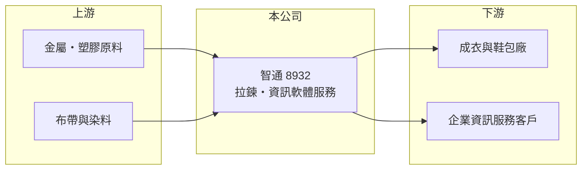

# 8932 智通

> 上櫃｜[[產業索引-其他業|其他業]]｜上市（櫃）日期 2001/03/29

# 第一章：企業模式與商業藍圖

> [!info] 撰寫說明
> 精簡版，由 Claude 依公開資料整理，架構比照 [[2330台積電]]，資料截至 2026-10-07。來源：winvest 營收快訊（2026 年 4 月至 8 月）。公開資料有限，業務轉型細節待校對。#待校對

智通以拉鍊製造起家，營業項目另含資訊軟體服務，產業分類已列為數位雲端，市值遠高於本業獲利規模。

- **核心業務：** [[拉鍊]]、拉鍊配件與拉鍊機零件的製造加工買賣與進出口貿易，另有資訊軟體服務。
- **營收結構：** 公開資料未揭露拉鍊與資訊服務的比重。
- **營運據點：** 成立於 1978 年，生產據點細節公開資料未揭露。
- **長期方向：** 產業分類為數位雲端，顯示公司朝資訊與雲端服務轉型（推估，待校對）。

# 第二章：護城河深度與競爭優勢

拉鍊是成熟產業，智通的評價更多取決於新業務能否落地。

- **競爭優勢：** 拉鍊本業有長期客戶與穩定現金流；資訊服務若成形可提供新成長動能（推估）。
- **主要對手：** 拉鍊市場由日本 YKK 主導，另有中國大陸眾多拉鍊廠。
- **觀察重點：** 資訊雲端業務的實際營收貢獻，以及市值與獲利之間的落差。

# 第三章：財務體質與盈利規模

資料日期：2026-10-07，以下數字是撰寫當時的快照；最新月營收、毛利率、累計 EPS 由自動排程寫在本筆記的屬性欄位（月營收、毛利率、累計EPS 等）。#待校對

智通營收成長，但獲利較去年衰退。

- **營收規模：** 2026 年 8 月營收 2.06 億元，年增 12.76%；1 至 8 月累計 16.89 億元，年增 11.97%。
- **獲利：** 2025 年 EPS 1.85 元；2026 年第二季 EPS 0.60 元，上半年累計 1.13 元，年減約 39%。
- **財務特色：** 資本額 8.95 億元，市值約 324 億元，[[本益比]]遠高於傳統拉鍊業，反映市場對轉型的預期。

# 第四章：總體風險與地緣政治

智通的主要風險在於評價與基本面的落差。

- **產業週期：** 拉鍊需求跟隨成衣與鞋包景氣，品牌[[庫存調整]]時訂單下滑。
- **營運風險：** 新業務若進展不如預期，高評價可能大幅修正。
- **其他風險：** 匯率波動，以及成衣供應鏈移轉與關稅政策影響拉鍊出貨。

# 專有名詞解析

## 金融

- **[[本益比]]**：股價除以每股盈餘，數值越高代表市場對未來成長的期待越高。

## 產業

- **[[庫存調整]]**：下游品牌或通路降低庫存、減少拉貨的期間，上游供應商訂單會明顯下滑。
- **[[拉鍊]]**：服飾、鞋包使用的開合配件，由鏈齒、拉頭與布帶組成。

# 核心供應鏈

- 上游：金屬、塑膠原料、布帶與染料供應商（推估）
- 下游／客戶：成衣與鞋包廠、企業資訊服務客戶（推估）
- 同業：YKK 與中國大陸拉鍊廠

## 最新新聞
<!-- news:start -->
<!-- news:end -->

## 相關連結
- [公開資訊觀測站](https://mopsov.twse.com.tw/mops/web/t05st03?step=1&firstin=1&co_id=8932)
- [Goodinfo](https://goodinfo.tw/tw/StockDetail.asp?STOCK_ID=8932)
- [Yahoo 股市](https://tw.stock.yahoo.com/quote/8932)
- [鉅亨網新聞](https://www.cnyes.com/twstock/8932/news)
