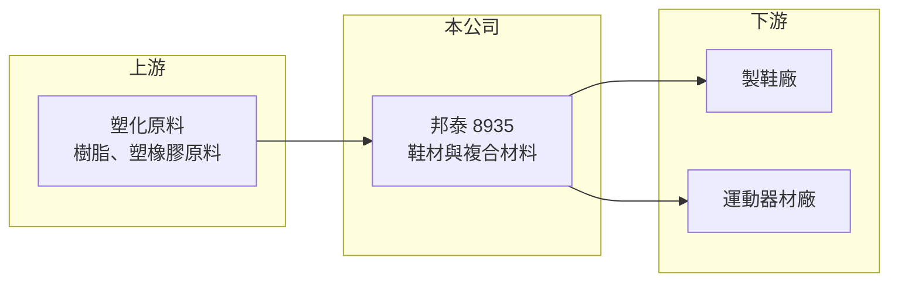

# 8935 邦泰

> 上櫃｜[[產業索引-其他業|其他業]]｜上市（櫃）日期 2002/03/26

# 第一章：企業模式與商業藍圖

> [!info] 撰寫說明
> 精簡版，由 Claude 依公開資料整理，架構比照 [[2330台積電]]，資料截至 2026-10-07。來源：winvest.tw 營收快訊、nstock.tw 邦泰公司概況。公開資料有限，產品營收比重、客戶與據點本次未查到。#待校對

邦泰是做塑膠與橡膠[[複合材料]]的小型材料廠，產品以鞋材與運動器材零組件為主。

- **核心業務：** 公司從事樹脂、塑橡膠原料與鞋底材料的複合製造，並以[[射出成型]]、壓出成型生產運動器材零組件，也開發工程塑膠複合材料。
- **營收結構：** 本次未查到各產品營收比重；2025 年全年營收 5.18 億元，規模偏小。
- **營運據點：** 公司 1982 年成立、1991 年上櫃，生產據點與海外布局本次未查到。
- **長期方向：** 近年營收逐年下滑且連續虧損，重點在穩住鞋材訂單與工程塑膠新應用（推估）。

# 第二章：護城河深度與競爭優勢

邦泰規模小，在鞋材供應鏈中議價能力有限。

- **競爭優勢：** 具備塑橡膠配方與複合加工經驗，可依客戶需求調整材料特性（推估）。
- **主要對手：** 國內外鞋材與塑膠射出廠，例如 [[9938百和]] 等鞋材供應商。
- **觀察重點：** 月營收年減幅能否收斂、毛利率能否回到足以支應費用的水準，以及虧損是否持續擴大。

# 第三章：財務體質與盈利規模

資料日期：2026-10-07，表格是撰寫當時的快照；最新月營收、毛利率、累計 EPS 由自動排程寫在本筆記的屬性欄位（月營收、毛利率、累計EPS 等）。#待校對

邦泰營收持續衰退，本業處於虧損。

- **營收規模：** 2026 年 8 月營收 3,587 萬元，年減 17.69%；1 至 8 月累計 3.15 億元，年減 12.41%。
- **獲利：** 2026 年第一季 [[毛利率]] 17.49%、[[營業利益率]] 負 4.32%；第二季 EPS 負 0.09 元，上半年累計負 0.18 元。2025 年全年 EPS 負 0.76 元。
- **財務特色：** 資本額 11.35 億元，2025 年度未配發股利；第一季 ROE 負 1.22%。

# 第四章：總體風險與地緣政治

邦泰的風險在於需求端與規模劣勢。

- **產業週期：** 鞋材與運動器材需求受品牌商庫存循環影響，品牌去化庫存時訂單會快速減少。
- **營運風險：** 營收規模小、固定成本占比高，營收下滑時虧損容易擴大。
- **其他風險：** 塑化原料價格波動影響成本；製鞋產業移往東南亞，台灣接單可能持續流失（推估）。

# 專有名詞解析

## 金融

- **[[毛利率]]**：毛利占營收的比例，反映產品定價能力與生產成本控制。
- **[[營業利益率]]**：營業利益占營收的比例，扣除營業費用後衡量本業獲利能力。

## 產業

- **[[複合材料]]**：由兩種以上材料組合而成、兼具各自特性的材料，例如塑膠加橡膠或樹脂加纖維。
- **[[射出成型]]**：把熔融塑膠以高壓注入模具、冷卻後成型的加工方式，適合大量生產塑膠零件。

# 核心供應鏈

- 上游：樹脂與塑橡膠原料供應商，例如 [[1301台塑]]、[[1326台化]]（推估）
- 下游／客戶：製鞋廠與運動器材廠，客戶名稱未揭露
- 同業：[[9938百和]] 等鞋材廠

## 最新新聞
<!-- news:start -->
<!-- news:end -->

## 相關連結
- [公開資訊觀測站](https://mopsov.twse.com.tw/mops/web/t05st03?step=1&firstin=1&co_id=8935)
- [Goodinfo](https://goodinfo.tw/tw/StockDetail.asp?STOCK_ID=8935)
- [Yahoo 股市](https://tw.stock.yahoo.com/quote/8935)
- [鉅亨網新聞](https://www.cnyes.com/twstock/8935/news)
