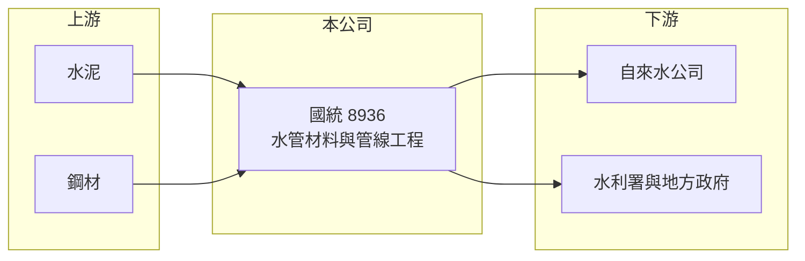

# 8936 國統

> 上櫃｜[[產業索引-其他業|其他業]]｜上市（櫃）日期 2002/09/09

# 第一章：企業模式與商業藍圖

> [!info] 撰寫說明
> 精簡版，由 Claude 依公開資料整理，架構比照 [[2330台積電]]，資料截至 2026-10-07。來源：winvest.tw 營收快訊、nstock.tw 國統公司概況。產品營收比重本次未查到。#待校對

國統是台灣自來水管材與管線工程業者，營收主要來自公共供水建設。

- **核心業務：** 製造[[預力混凝土管]]、鋼管直管、推進鋼管、[[球墨鑄鐵管]]與水泥製品，並承攬自來水管線埋設工程。
- **營收結構：** 本次未查到管材、工程與預拌混凝土的比重；2026 年 1 至 8 月累計營收 44.09 億元，年增 17.13%。
- **營運據點：** 以台灣為主，生產據點細節本次未查到。
- **長期方向：** 公司也跨入[[海水淡化]]處理，配合政府強化供水韌性的政策延伸業務。

# 第二章：護城河深度與競爭優勢

國統在大口徑輸水管材有長期實績，屬於公共工程型的利基廠商。

- **競爭優勢：** 同時具備管材製造與管線施工能力，可承接從供料到埋設的整包工程（推估）。
- **主要對手：** 國內鋼管、鑄鐵管廠與水利工程營造商，在標案上競爭。
- **觀察重點：** 自來水公司與水利署的管網汰換、輸水幹線與海淡廠標案進度，以及工程毛利率變化。

# 第三章：財務體質與盈利規模

資料日期：2026-10-07，表格是撰寫當時的快照；最新月營收、毛利率、累計 EPS 由自動排程寫在本筆記的屬性欄位（月營收、毛利率、累計EPS 等）。#待校對

國統 2026 年營收與獲利同步成長。

- **營收規模：** 2026 年 8 月營收 5.56 億元，年增 12.34%；1 至 8 月累計 44.09 億元，年增 17.13%。
- **獲利：** 2026 年第二季 EPS 0.88 元，上半年累計 1.87 元、年增 16%；第二季 [[毛利率]] 22.44%、[[營業利益率]] 18.87%。2025 年全年 EPS 4.08 元。
- **財務特色：** 資本額 24.81 億元；近五年平均現金股利 1.6 元，以撰寫時股價計算的[[殖利率]]約 5.7%。

# 第四章：總體風險與地緣政治

國統的營運高度依賴公共工程預算。

- **產業週期：** 營收隨政府水利預算與標案釋出時程起伏，大型工程認列時點會造成季度波動。
- **營運風險：** 工程履約期間若鋼材、水泥等原料上漲，固定價格合約的毛利會被壓縮。
- **其他風險：** 政府預算排擠或政策轉向、工期延誤與缺工問題。

# 專有名詞解析

## 金融

- **[[殖利率]]**：每股現金股利除以股價，衡量以現價買進可領到的現金報酬。

## 產業

- **[[預力混凝土管]]**：在混凝土管內預先施加壓力以提高承壓能力的管材，常用於大口徑輸水幹管。
- **[[球墨鑄鐵管]]**：在鑄鐵中加入球化劑、讓石墨呈球狀，兼具強度與韌性的自來水管材。
- **[[海水淡化]]**：把海水去除鹽分轉為可用淡水的技術，常見為逆滲透法，用於補充離島與缺水地區供水。

# 核心供應鏈

- 上游：水泥 [[1101台泥]]、鋼材 [[2002中鋼]]（推估）
- 下游／客戶：台灣自來水公司、經濟部水利署與地方政府等公共工程業主（推估）
- 同業：國內鋼管、鑄鐵管廠與水利工程營造商；水處理相關的 [[8473山林水]]

## 最新新聞
<!-- news:start -->
<!-- news:end -->

## 相關連結
- [公開資訊觀測站](https://mopsov.twse.com.tw/mops/web/t05st03?step=1&firstin=1&co_id=8936)
- [Goodinfo](https://goodinfo.tw/tw/StockDetail.asp?STOCK_ID=8936)
- [Yahoo 股市](https://tw.stock.yahoo.com/quote/8936)
- [鉅亨網新聞](https://www.cnyes.com/twstock/8936/news)
