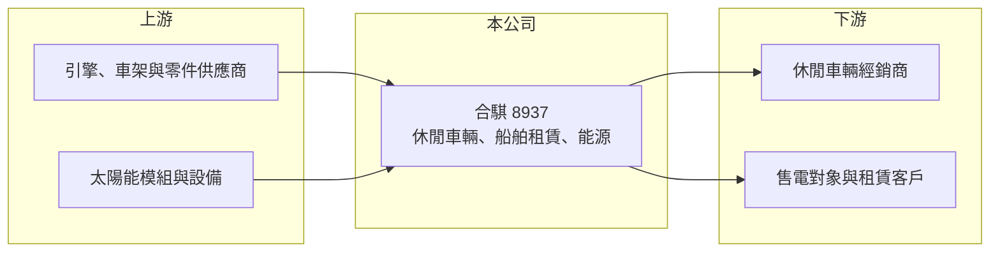

# 8937 合騏

> 上櫃｜[[產業索引-其他業|其他業]]｜上市（櫃）日期 2002/10/29

# 第一章：企業模式與商業藍圖

> [!info] 撰寫說明
> 精簡版，由 Claude 依公開資料整理，架構比照 [[2330台積電]]，資料截至 2026-10-07。來源：winvest.tw 營收快訊、nstock.tw 合騏公司概況。公開資料有限，2026 年營收大增的原因與各業務比重本次未查到。#待校對

合騏原本是沙灘車與機車製造商，近年延伸到船舶租賃與再生能源。

- **核心業務：** 生產多功能休閒車、[[沙灘車]]、電動代步車及零件，另經營船舶租賃、能源技術服務與[[太陽光電]]發電。
- **營收結構：** 本次未查到各業務比重；2026 年 1 至 8 月累計營收 4.89 億元，年增 898.66%，成長來源未揭露。
- **營運據點：** 公司 1975 年成立，生產與案場據點本次未查到。
- **長期方向：** 由車輛本業轉向多元經營，能源業務的占比與獲利是轉型關鍵（推估）。

# 第二章：護城河深度與競爭優勢

合騏規模小，各項業務的競爭地位都還在建立中。

- **競爭優勢：** 具長期休閒車輛製造經驗；新業務的競爭優勢本次未查到（推估）。
- **主要對手：** 休閒車輛有國內外機車與沙灘車廠，能源業務則面對眾多太陽能電廠開發商。
- **觀察重點：** 營收暴增是否為一次性案件認列、能否轉為穩定獲利，以及營業虧損能否收斂。

# 第三章：財務體質與盈利規模

資料日期：2026-10-07，表格是撰寫當時的快照；最新月營收、毛利率、累計 EPS 由自動排程寫在本筆記的屬性欄位（月營收、毛利率、累計EPS 等）。#待校對

合騏營收大增但仍處虧損，營收波動很大。

- **營收規模：** 2026 年 8 月營收 7,768 萬元，年增 1,403%；但 7 月僅約 778 萬元，月營收落差極大。
- **獲利：** 2026 年第二季 EPS 負 0.14 元，上半年累計負 0.21 元；第二季 [[毛利率]] 21.14%、[[營業利益率]] 負 14.86%。2025 年全年 EPS 負 0.71 元。
- **財務特色：** 資本額 10.79 億元，近五年平均現金股利僅 0.02 元；市值相對營收規模偏高。

# 第四章：總體風險與地緣政治

合騏的風險在於營收不穩定與轉型不確定性。

- **產業週期：** 休閒車輛屬非必需消費，出口需求受歐美景氣影響。
- **營運風險：** 營收集中在少數月份，可能來自單一案件認列，後續延續性不明。
- **其他風險：** 再生能源的躉購費率與法規變動、匯率波動，以及股價與基本面落差帶來的波動。

# 專有名詞解析

## 應用

- **[[沙灘車]]**：可在沙地、泥地等非鋪面道路行駛的四輪休閒車輛，英文 ATV。

## 金融

- **[[毛利率]]**：毛利占營收的比例，反映產品定價能力與生產成本控制。
- **[[營業利益率]]**：營業利益占營收的比例，扣除營業費用後衡量本業獲利能力。

## 產業

- **[[太陽光電]]**：利用太陽能電池把陽光直接轉成電力的發電方式，涵蓋電池、模組、案場開發與維運。

# 核心供應鏈

- 上游：引擎與車輛零件供應商、太陽能模組與電力設備（推估）
- 下游／客戶：海內外休閒車輛經銷商、售電與船舶租賃客戶，名稱未揭露
- 同業：[[2206三陽工業]] 等機車廠；國內太陽能電廠開發商

## 最新新聞
<!-- news:start -->
<!-- news:end -->

## 相關連結
- [公開資訊觀測站](https://mopsov.twse.com.tw/mops/web/t05st03?step=1&firstin=1&co_id=8937)
- [Goodinfo](https://goodinfo.tw/tw/StockDetail.asp?STOCK_ID=8937)
- [Yahoo 股市](https://tw.stock.yahoo.com/quote/8937)
- [鉅亨網新聞](https://www.cnyes.com/twstock/8937/news)
