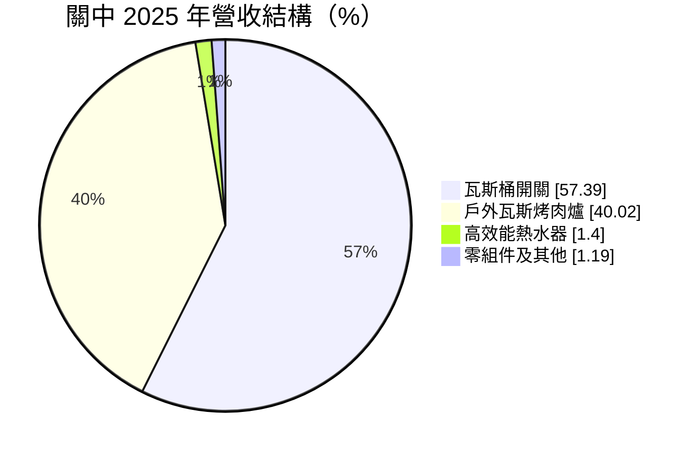
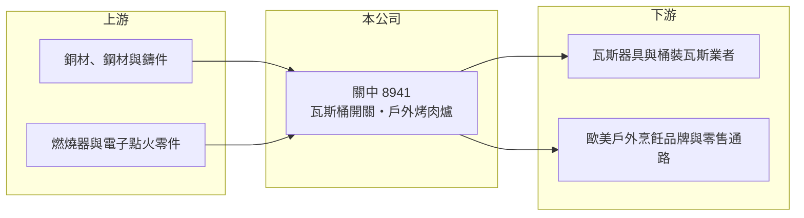

# 8941 關中

> 上櫃｜[[產業索引-居家生活|居家生活]]｜上市（櫃）日期 2003/01/20

# 第一章：企業模式與商業藍圖

> [!info] 撰寫說明
> 精簡版，由 Claude 依公開資料整理，架構比照 [[2330台積電]]，資料截至 2026-10-08。來源：MoneyDJ 理財網財務比率年表（2021 至 2025 年）與個股基本資料（2025 年營收比重）、櫃買中心公開資料彙整的 2026 年第二季財報與股利資料。公開資料有限，客戶、生產據點與業外收益來源未逐條查證。#待校對

關中是台灣歷史悠久的瓦斯器具製造商，2025 年營收以瓦斯桶開關與戶外瓦斯烤肉爐為主，兩者合計約占 97%，產品主要供應戶外烹飪市場。

- **核心業務：** 關中 1976 年成立，2003 年上櫃，英文網址為 grandhall。公司生產液化瓦斯桶的開關閥件與戶外瓦斯烤肉爐，前者是瓦斯器具的安全關鍵零件，後者是歐美家庭後院烤肉文化的消費性耐久財。兩條產品線的需求都和戶外烹飪、居家休閒消費連動。
- **營收結構：** 依 MoneyDJ 資料，2025 年瓦斯桶開關占 57.39%，戶外瓦斯烤肉爐占 40.02%，高效能熱水器占 1.40%，零組件及其他占 1.19%。閥件屬於安全認證零組件，需求相對穩定；烤肉爐則屬季節性與景氣敏感的消費品。

- **營運據點：** 總部位於台北市內湖區；生產據點與主要銷售市場本次未查得，依產品特性推估以外銷歐美為主。
- **長期方向：** 戶外生活與居家烹飪在疫情後成為長期消費趨勢之一，關中長期要靠安全閥件的認證門檻穩住基本盤，並在烤肉爐產品上提升設計與附加價值。

# 第二章：護城河深度與競爭優勢

關中的優勢主要來自瓦斯閥件的安全認證與長年製造經驗，烤肉爐則面對激烈的價格競爭。

- **競爭優勢：** 瓦斯桶開關直接關係使用安全，必須通過各國的安全規範與認證，客戶更換供應商需要重新驗證，因此具備一定的轉換成本。毛利率長期維持在 27% 至 30%，代表產品並非純粹的低價商品。
- **主要對手：** 烤肉爐市場有歐美知名戶外烹飪品牌，以及大量中國代工廠；瓦斯閥件則與中國、歐洲的閥件製造商競爭。台股中缺乏直接可比的同業。
- **觀察重點：** 營業利益率長期只有 1% 至 3.3%，本業獲利能力偏弱，但 2022 至 2024 年 EPS 達 5 至 7 元，顯示獲利有相當比重來自[[業外收益]]。長期要看本業營業利益率能否提升，而不是只依賴業外。

# 第三章：財務體質與盈利規模

資料日期：2026-10-08，表格是撰寫當時的快照；最新月營收、毛利率、累計 EPS 由自動排程寫在本筆記的屬性欄位（月營收、毛利率、累計EPS 等）。#待校對

關中營收約在 29 億至 33 億元之間，毛利率穩定，但營業利益率很低，EPS 與本業獲利的落差大。

| 年度 | 營收（億元） | [[毛利率]] | [[營業利益率]] | EPS（元） | [[ROE]] |
|---|---|---|---|---|---|
| 2021 | 約 32.1（推算） | 27.17% | 1.60% | 3.60 | 12.82% |
| 2022 | 約 33.1（推算） | 28.79% | 2.67% | 6.94 | 23.12% |
| 2023 | 約 29.0（推算） | 30.36% | 2.17% | 6.34 | 19.93% |
| 2024 | 約 31.5（推算） | 28.91% | 3.33% | 5.06 | 16.70% |
| 2025 | 約 29.8（推算） | 29.13% | 1.06% | 1.16 | 3.21% |

註：2025 年營收以每股營業額 85.27 元乘以約 3,497 萬股推算，其他年度依 MoneyDJ 營收成長率回推。以 2022 年為例，營業利益約 0.9 億元（推算），稅後淨利約 2.4 億元（EPS × 股數推算），差額主要來自業外，來源未查得。

- **長期指標：** 2021 至 2025 年營收年複合成長率約 -1.8%（推算），近 5 年平均 ROE 約 15.2%（推算），但其中相當部分來自業外。最新一年度現金股利 1 元，約占 2025 年 EPS 的 86%。自由現金流資料本次未查得。
- **[[ROIC]] 與 [[WACC]]：** 2025 年稅後營業利益約 0.25 億元（營收約 29.8 億元 × 營業利益率 1.06% × 0.8），投入資本約 16.6 億元（2026 年第二季股東權益約 10.6 億元，加上以總負債約 11.8 億元的一半推估的有息負債約 5.9 億元），ROIC 約 1.5%（推算）；2024 年較好時約 5%（推算，以目前投入資本計算）。WACC 約 5.3%（推算：無風險利率 1.75%、市場風險溢酬 6%、β 取家電與五金同業常見值 0.9，股東權益成本 7.15%；稅前負債成本 2.5%、稅率 20%；權益比重約 64%）。本業 ROIC 長期低於 WACC，代表若排除業外收益，本業並未替股東創造超額報酬。
- **財務特色：** 負債比率由 2022 年的 65% 降到 2025 年的 51%。2026 年上半年本業小幅虧損（營業利益率 -0.48%），但 EPS 仍有 2.36 元，再次顯示業外收益對獲利的影響很大，評估時應把本業與業外分開看。

# 第四章：總體風險與地緣政治

關中的風險在於本業獲利薄、歐美消費週期，以及業外收益的不可持續性。

- **產業週期：** 烤肉爐屬於季節性的戶外消費耐久財，需求集中在春夏，並受歐美消費景氣與零售通路庫存影響。疫情期間的戶外熱潮過後，通路去化庫存會讓上游訂單下滑，形成[[長鞭效應]]。
- **營運風險：** 營業利益率只有 1% 至 3%，鋼材、銅材價格或運費上漲都可能讓本業轉為虧損。若獲利長期依賴業外收益，一旦業外收益減少，EPS 會大幅回落。
- **其他風險：** 瓦斯器具涉及使用安全，產品瑕疵可能引發召回與責任賠償；各國安全法規改變需要重新認證；美國對進口產品的關稅與新台幣匯率也會影響競爭力與獲利。

# 專有名詞解析

## 金融

- **[[業外收益]]**：本業以外的收入，例如投資收益、處分資產利益或匯兌利益，通常不具持續性。
- **[[長鞭效應]]**：終端需求的小幅變動，沿供應鏈往上游傳遞時被逐級放大，造成上游庫存與訂單劇烈波動。
- **[[ROIC]]**：投入資本報酬率，稅後營業利益除以股東權益加有息負債，衡量本業運用資本的效率。
- **[[WACC]]**：加權平均資金成本，股東與債權人要求報酬率的加權平均，是 ROIC 要超越的門檻。

# 核心供應鏈

- 上游：銅材、鋼材、鑄件、燃燒器與點火零件供應商（供應商名稱未查得）。
- 下游／客戶：瓦斯器具製造商、桶裝瓦斯業者，以及歐美戶外烹飪品牌與零售通路（客戶名稱未查得，推估）。
- 同業：歐美戶外烹飪品牌、中國烤肉爐與瓦斯閥件製造商。

## 最新新聞
<!-- news:start -->
<!-- news:end -->

## 相關連結
- [公開資訊觀測站](https://mopsov.twse.com.tw/mops/web/t05st03?step=1&firstin=1&co_id=8941)
- [Goodinfo](https://goodinfo.tw/tw/StockDetail.asp?STOCK_ID=8941)
- [Yahoo 股市](https://tw.stock.yahoo.com/quote/8941)
- [鉅亨網新聞](https://www.cnyes.com/twstock/8941/news)
