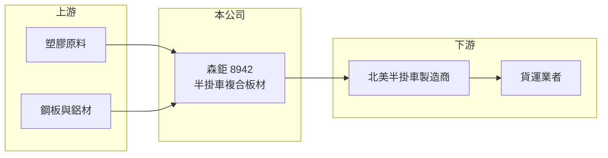

# 8942 森鉅

> 上櫃｜[[產業索引-其他業|其他業]]｜上市（櫃）日期 2003/05/16

# 第一章：企業模式與商業藍圖

> [!info] 撰寫說明
> 精簡版，由 Claude 依公開資料整理，架構比照 [[2330台積電]]，資料截至 2026-10-07。來源：winvest.tw 營收快訊、nstock.tw 森鉅公司概況、富果研究森鉅法說會整理。#待校對

森鉅是複合板材製造商，產品主要賣到北美[[半掛車]]市場。

- **核心業務：** 研發與製造[[複合材料]]板材，用於半掛車廂壁板，另有塑膠板材、鋁塑複合板與建材。
- **營收結構：** 依法說會資料，超過九成營收來自北美半掛車市場；A-Bond 產品以鋁材替代鋼材，主打[[輕量化]]。
- **營運據點：** 公司 1994 年成立、2003 年上市，並在美國田納西州設廠，預計 2027 年量產。
- **長期方向：** 公司預期半掛車市場自 2026 年下半年復甦、2027 至 2029 年進入成長週期，美國廠可縮短交期並貼近客戶。

# 第二章：護城河深度與競爭優勢

森鉅在北美半掛車複合板市場是兩大供應商之一。

- **競爭優勢：** 掌握烤漆、發泡與複合板接合技術，可客製顏色並使用回收塑料降低重量。
- **主要對手：** 美國 Wabash，依法說會資料雙方各占北美複合板市場約五成。
- **觀察重點：** 北美半掛車訂單何時回升、美國廠量產時程，以及本業何時由虧轉盈。

# 第三章：財務體質與盈利規模

資料日期：2026-10-07，表格是撰寫當時的快照；最新月營收、毛利率、累計 EPS 由自動排程寫在本筆記的屬性欄位（月營收、毛利率、累計EPS 等）。#待校對

森鉅 2026 年本業虧損，但業外收益讓 EPS 大增。

- **營收規模：** 2026 年 8 月營收 2.97 億元，年增 47.62%；1 至 8 月累計 19.31 億元，年減 35.89%。
- **獲利：** 2026 年第二季 EPS 3.01 元，上半年累計 4.06 元；但第二季 [[毛利率]] 僅 3.7%、[[營業利益率]] 負 20.89%，淨利率 69.01%，獲利主要來自[[業外收益]]（推估為一次性項目）。2025 年全年 EPS 1.83 元。
- **財務特色：** 資本額 19.88 億元，法說會時現金約 14 億元、負債比 26.6%，財務穩健；2025 年度配發現金股利 1 元。

# 第四章：總體風險與地緣政治

森鉅的風險集中在單一市場與單一產業。

- **產業週期：** 北美半掛車需求與貨運景氣高度連動，下行時訂單轉為短單急單，營收大幅下滑。
- **營運風險：** 客戶與市場集中，美國設廠初期折舊與開辦費可能拖累獲利。
- **其他風險：** 美國關稅政策、美元匯率，以及塑膠、鋁、鋼材原料價格波動。

# 專有名詞解析

## 應用

- **[[半掛車]]**：沒有前軸、需由曳引車牽引的貨運拖車，是北美長途陸運的主要載具。

## 金融

- **[[業外收益]]**：本業以外的收入，例如投資收益、處分資產利益與匯兌收益，通常不具持續性。

## 產業

- **[[複合材料]]**：由兩種以上材料組合而成、兼具各自特性的材料，例如塑膠加橡膠或樹脂加纖維。
- **[[輕量化]]**：以較輕材料取代鋼材以減少車重，可提高載重量並降低油耗。

# 核心供應鏈

- 上游：塑膠原料、鋼板與鋁材供應商（推估）
- 下游／客戶：北美半掛車製造商，客戶名稱未揭露
- 同業：美國 Wabash

## 最新新聞
<!-- news:start（自動產生，請勿手動編輯此範圍） -->
- 2026-10-05 📰 媒體 16:50｜營收速報 - 森鉅(8942)9月營收2.48億元年增率高達81.53％｜[鉅亨網](https://news.cnyes.com/news/id/6621782)

完整紀錄：[[8942森鉅 新聞]]
<!-- news:end -->

## 相關連結
- [公開資訊觀測站](https://mopsov.twse.com.tw/mops/web/t05st03?step=1&firstin=1&co_id=8942)
- [Goodinfo](https://goodinfo.tw/tw/StockDetail.asp?STOCK_ID=8942)
- [Yahoo 股市](https://tw.stock.yahoo.com/quote/8942)
- [鉅亨網新聞](https://www.cnyes.com/twstock/8942/news)
