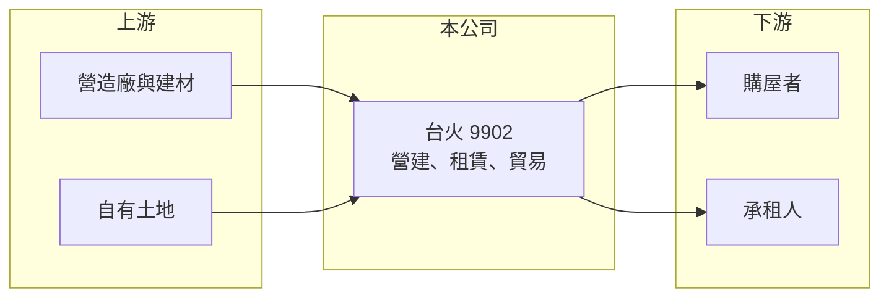

# 9902 台火

> 上市｜[[產業索引-其他業|其他業]]｜上市（櫃）日期 1964/07/14

# 第一章：企業模式與商業藍圖

> [!info] 撰寫說明
> 精簡版，由 Claude 依公開資料整理，架構比照 [[2330台積電]]，資料截至 2026-10-07。來源：winvest.tw 營收快訊、nstock.tw 台火公司概況。公開資料有限，各業務比重、建案與租賃資產明細本次未查到。#待校對

台火原是火柴製造商，工廠停產後轉型為以營建、租賃與貿易為主的[[資產活化]]型公司。

- **核心業務：** 新竹與台中的火柴及木材工廠已分別於 1973 年、2004 年停產，目前推展營建、國際貿易與租賃業務。
- **營收結構：** 本次未查到各業務比重；2025 年全年營收 3.79 億元，2026 年前 9 月累計僅 0.87 億元，營收隨建案認列大幅波動。
- **營運據點：** 以台灣為主，主要資產為原廠區土地（推估）。
- **長期方向：** 透過土地開發與租賃取得收入，獲利節奏取決於建案完工交屋與資產處分時點（推估）。

# 第二章：護城河深度與競爭優勢

台火的價值主要來自持有的土地資產，而非經營規模。

- **競爭優勢：** 早年取得的土地成本低，開發或處分時可實現較高利益（推估）。
- **主要對手：** 中小型建商與不動產開發公司。
- **觀察重點：** 新建案推出與交屋時程、租賃收入是否穩定，以及是否有資產處分利益。

# 第三章：財務體質與盈利規模

資料日期：2026-10-07，表格是撰寫當時的快照；最新月營收、毛利率、累計 EPS 由自動排程寫在本筆記的屬性欄位（月營收、毛利率、累計EPS 等）。#待校對

台火 2026 年本業規模小且虧損，獲利來自業外。

- **營收規模：** 2026 年 6 月營收 834 萬元、7 月 219 萬元，前 9 月累計 0.87 億元，明顯低於 2025 年全年的 3.79 億元。
- **獲利：** 2026 年第二季 EPS 0.84 元，但 [[毛利率]] 17.23%、[[營業利益率]] 負 36.27%、淨利率 410.91%，獲利主要來自[[一次性收益]]或業外項目（推估）。
- **財務特色：** 資本額 9.80 億元，近五年平均現金股利 0.22 元，2025 年度未配發現金股利。

# 第四章：總體風險與地緣政治

台火的風險在於收入不連續與不動產景氣。

- **產業週期：** 房市景氣、央行信用管制與利率影響建案銷售與去化速度。
- **營運風險：** 營收高度依賴個別建案，沒有建案認列的年度本業容易虧損。
- **其他風險：** 土地開發法規與都市計畫變更、營建成本上漲與缺工。

# 專有名詞解析

## 金融

- **[[一次性收益]]**：處分資產、土地或投資等不會每年重複的收益，會讓單期 EPS 偏離本業實力。
- **[[毛利率]]**：毛利占營收的比例，反映產品定價能力與生產成本控制。
- **[[營業利益率]]**：營業利益占營收的比例，扣除營業費用後衡量本業獲利能力。

## 產業

- **[[資產活化]]**：把閒置土地或廠房改作開發、出租或出售，以產生收益的經營方式。

# 核心供應鏈

- 上游：營造廠、建材供應商與公司自有土地（推估）
- 下游／客戶：購屋者、承租人與貿易客戶，名稱未揭露
- 同業：中小型建商與不動產開發公司

## 最新新聞
<!-- news:start（自動產生，請勿手動編輯此範圍） -->
- 2026-10-07 📰 媒體 19:50｜營收速報 - 台火(9902)9月營收4,028萬元年增率高達504.14％｜[鉅亨網](https://news.cnyes.com/news/id/6623962)

完整紀錄：[[9902台火 新聞]]
<!-- news:end -->

## 相關連結
- [公開資訊觀測站](https://mopsov.twse.com.tw/mops/web/t05st03?step=1&firstin=1&co_id=9902)
- [Goodinfo](https://goodinfo.tw/tw/StockDetail.asp?STOCK_ID=9902)
- [Yahoo 股市](https://tw.stock.yahoo.com/quote/9902)
- [鉅亨網新聞](https://www.cnyes.com/twstock/9902/news)
