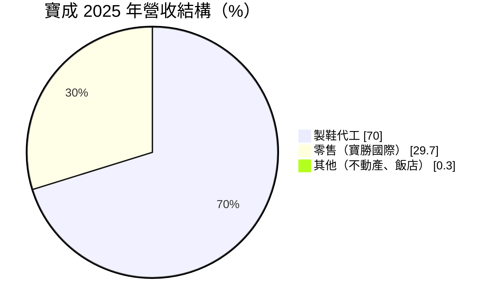
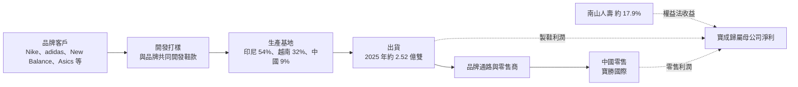
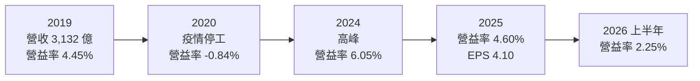
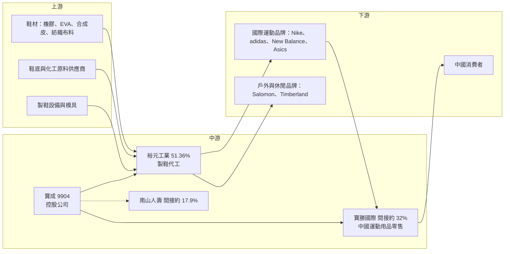

# 9904 寶成

> 上市｜[[產業索引-運動休閒|運動休閒]]｜上市（櫃）日期 1990/01/19

# 第一章：企業模式與商業藍圖

> [!info] 撰寫說明
> 本文由 Claude 依公開資料整理，架構比照 [[2330台積電]] 的四章研究，資料截至 2026-10-08。財務數字來源：Goodinfo 年度經營績效、證交所開放資料（基本資料、資產負債、綜合損益、營益分析、股利）、富果研究 2025 年法說會整理、工商時報、優分析；產業描述為整理性內容，尚未逐條比對原始文件。#待校對

全球每年賣出的知名品牌運動鞋中，有相當大的比例出自台灣企業在東南亞的工廠。本章針對寶成工業（股票代號：9904，以下簡稱寶成）的商業模式進行定性分析，說明它如何以控股結構同時經營全球最大規模之一的運動鞋代工、中國運動用品零售，以及對南山人壽的長期投資，並說明這三塊業務如何影響它的獲利與評價。

## 一、核心定位：全球運動鞋代工龍頭的控股公司

寶成成立於 1969 年，總部位於台中，1990 年上市。它本身是一家控股公司，主要業務透過子公司經營：

* **製鞋代工：** 寶成持有香港上市的裕元工業 51.36% 股權（富果研究整理），裕元負責集團的製鞋業務，替國際運動品牌生產運動鞋、休閒鞋與戶外鞋。依工商時報報導，客戶包括 Nike、adidas、Asics、New Balance、Salomon 與 Timberland 等。
* **中國運動用品零售：** 裕元持有香港上市的寶勝國際 62.67% 股權，寶成間接持有約 32.13%。寶勝在中國經營運動品牌的零售與通路，2025 年底直營門市約 3,310 家。
* **南山人壽投資：** 依工商時報報導，潤成投資持有南山人壽 89.55% 股權，寶成持有潤成 20%，間接持有南山人壽約 17.9%。這筆投資透過[[權益法]]認列損益，是寶成業外收益的主要來源。

這種三層控股結構讓寶成的財報較為複雜：合併營收主要來自製鞋與零售，但歸屬母公司的淨利又受到南山人壽投資收益與[[非控制權益]]的影響。依證交所開放資料，2026 年第二季底權益總計約 2,707 億元，其中非控制權益約 837 億元，比重相當高，正反映裕元與寶勝都不是全資子公司。

## 二、終端應用與產品板塊

依富果研究整理的 2025 年法說會資料，寶成合併營收結構如下：

* **製鞋代工：** 2025 年出貨約 2.52 億雙，年減 1.2%；平均單價約 21.00 美元，年增 3.7%；製鞋毛利率約 18.2%。以美元計的製鞋營收年增 0.5%。出貨量持平但單價提高，代表產品組合往較高價位的鞋款移動。
* **零售：** 寶勝 2025 年以人民幣計的營收年減 7.2%，毛利率 33.5%，營業利益率約 2.1%。線上銷售占比已超過 30%，2019 年只有 12%。零售業務毛利率較高，但營業費用也高，營業利益率偏低，且直接受中國消費景氣影響。
* **其他：** 不動產開發與飯店等，占比很小。

## 三、資本轉化邏輯：勞力密集製造與多國產能布局

* **勞力密集的代工製造：** 運動鞋生產需要大量人工進行裁切、縫製與成型，自動化程度有限。代工廠的競爭力取決於大規模、多據點的產能與穩定的工人供給。2025 年製鞋產量約 54% 在印尼、32% 在越南、9% 在中國，另有孟加拉、柬埔寨與緬甸等據點（富果研究整理）。
* **產能隨工資遷移：** 寶成的產能從台灣移到中國，再從中國移到越南與印尼，現在又在印度建新廠。2025 年製造業資本支出約 2.92 億美元，主要用於印度新廠與印尼、越南擴產。這種「追著工資與關稅走」的布局，是運動鞋代工業者長期維持成本競爭力的方式。
* **毛利由產能利用率決定：** 2025 年製鞋毛利率受到各廠負荷不均、工資上漲與新產能爬坡的壓力。工廠滿載時，固定成本被充分分攤；訂單不足或新廠尚未成熟時，毛利率就會下滑。
* **成本轉嫁有時間差：** 公司表示原物料成本可以透過價格調整轉嫁給客戶，但會有時間落差。這是代工廠普遍的特性。

## 四、企業長期藍圖：產能多元化與零售數位化

* **印度與東南亞擴產：** 印度新廠是寶成分散產地的新方向，既可以服務品牌客戶分散供應鏈的需求，也可能受惠印度本地市場的成長。印尼與越南的擴產則鞏固現有主力產區。
* **提高產品單價：** 平均單價持續提升，代表寶成爭取更多高價位、技術較複雜的鞋款。高單價鞋款的加工費較高，也較不容易被小型代工廠搶走。
* **寶勝的全通路轉型：** 寶勝把線上銷售比重從 2019 年的 12% 提升到 30% 以上，並調整門市結構。中國運動用品市場成長放緩，零售業務的重點從展店轉向提升效率與獲利。
* **南山人壽的長期收益：** 南山人壽是台灣大型壽險公司，其獲利受利率、股市與匯率影響。依工商時報報導，分析師預估南山人壽 2026 年獲利年增超過一成，對寶成的 EPS 貢獻樂觀估計可達約 2 元，但這屬於樂觀情境。

# 第二章：護城河深度與競爭優勢

運動鞋代工看似門檻不高，但全球真正能承接大型品牌大量訂單的業者屈指可數。本章分析寶成的競爭優勢來源、主要對手，以及它在品牌客戶議價壓力下能守住多少。

## 一、護城河的核心組成要素

* **規模與多國產能：** 寶成在印尼、越南、中國、孟加拉、柬埔寨、緬甸與印度都有生產據點，年出貨數億雙。品牌客戶需要能同時在多國大量生產、品質一致的供應商，這種規模是小型代工廠無法提供的。
* **與品牌的長期共同開發：** 寶成與 Nike、adidas 等品牌合作數十年，參與新鞋款的開發與打樣。品牌更換代工廠需要重新開發模具、驗證品質與培訓工人，轉換成本高。
* **多品牌客戶組合：** 客戶涵蓋多家國際運動品牌，降低對單一品牌的依賴。當某一品牌庫存調整時，其他品牌的訂單可以部分彌補。
* **零售通路與資產組合：** 寶勝提供中國市場的零售通路，南山人壽投資提供業外收益。這讓寶成的獲利來源比純代工廠更分散，但也讓本業表現較難單獨評估。

## 二、全球主要競爭對手格局

| 對手 | 地區 | 主要業務 | 與寶成的關係 |
|---|---|---|---|
| [[9910豐泰]] | 台灣 | Nike 運動鞋代工 | 以單一大客戶為主，獲利率較高 |
| 華利集團 | 中國 | Nike、Vans、Puma 等運動鞋代工 | 越南產能大、成長快的主要對手 |
| [[9802鈺齊-KY]] | 台灣 | 戶外鞋與休閒鞋代工 | 在戶外鞋領域競爭 |
| 越南、印尼本地代工廠 | 東南亞 | 中低價鞋款 | 以低成本競爭標準化產品 |
| 中國運動品牌自建產能 | 中國 | 安踏、李寧等自有生產 | 寶勝在中國零售端面對本土品牌競爭 |

## 三、優勢轉化：守得住與守不住

* **守得住：** 國際大品牌的大量訂單與高單價鞋款。品牌客戶需要規模、品質與多國產能，寶成在這些條件上具有明顯優勢，平均單價持續提高也證明這一點。
* **守不住：** 製鞋業務的毛利率。品牌客戶議價能力強，工資與原物料上漲難以完全轉嫁，寶成製鞋毛利率約 18%，低於部分以單一客戶為主、產品組合較集中的同業。中國零售業務則面臨本土品牌崛起與消費疲弱，營業利益率只有約 2%。
* **觀察重點：** 第一，印度新廠與東南亞擴產能否提升整體產能利用率與毛利率；第二，寶勝能否在中國市場維持獲利；第三，南山人壽的投資收益是否穩定。這三點決定寶成的獲利能否擺脫長期低於 10% 的 ROE。

# 第三章：財務體質與盈利規模

資料日期：2026-10-08。數字取自 Goodinfo 年度經營績效、證交所開放資料與富果研究法說會整理，表格是撰寫當時的快照；最新月營收、毛利率、累計 EPS 由自動排程寫在本筆記的屬性欄位（月營收、毛利率、累計EPS 等）。#待校對

財務報表是檢驗護城河是否真實存在的最終標準。本章用多年度的三率、ROE 與資本報酬，檢視寶成在製鞋週期與業外收益之間的獲利品質。

## 一、獲利能力的基石：三率

| 年度 | 營收（新台幣） | [[毛利率]] | [[營業利益率]] | EPS（元） | [[ROE]] |
|---|---|---|---|---|---|
| 2019 | 3,132 億 | 25.4% | 4.45% | 4.01 | 10.5% |
| 2020 | 2,500 億 | 21.9% | -0.84% | 1.64 | 2.0% |
| 2021 | 2,399 億 | 24.3% | 1.03% | 4.90 | 8.12% |
| 2022 | 2,675 億 | 24.2% | 3.96% | 4.29 | 8.67% |
| 2023 | 2,466 億 | 24.8% | 4.14% | 3.61 | 8.30% |
| 2024 | 2,638 億 | 24.7% | 6.05% | 5.44 | 11.0% |
| 2025 | 2,514 億 | 23.1% | 4.60% | 4.10 | 8.12% |
| 2026 上半年 | 1,261 億 | 21.09% | 2.25% | 2.37 | 未查得 |

註：2019 至 2025 年取自 Goodinfo；2026 上半年取自證交所營益分析與綜合損益開放資料。

* **[[毛利率]]：** 寶成合併毛利率長期在 22% 至 25% 之間，看起來高於一般代工廠，主要是因為合併了毛利率約 33% 的零售業務。製鞋本身的毛利率約 18%。
* **[[營業利益率]]：** 營業利益率長期只有 1% 至 6%，原因是零售業務的門市租金、人事與行銷費用很高，吃掉大部分毛利。2025 年營業利益約 116 億元，年減 27.5%（富果研究整理）。
* **業外收益的重要性：** 寶成的稅後淨利常與營業利益相當甚至更高。2026 年上半年營業利益約 28.4 億元，業外收益約 65.6 億元，稅後淨利約 84.5 億元（證交所綜合損益開放資料）。業外收益主要來自南山人壽等權益法投資，是寶成 EPS 的重要支柱。
* **營收趨勢：** 2025 年營收比 2019 年少約 20%，6 年年複合成長率約 -3.6%（推算）。新台幣與人民幣匯率變動、寶勝營收下滑與製鞋出貨持平，都是營收未能回到疫情前水準的原因。

## 二、[[ROE]]：資本效率

2021 至 2025 年平均 ROE 約 8.8%（推算），即使在 2024 年的高峰也只有 11%。寶成股東權益中有大量南山人壽投資與子公司資產，這些資產規模大、報酬率不高，是 ROE 偏低的結構性原因。2026 年第二季底每股淨值約 63.46 元，股價淨值比僅約 0.39 倍、本益比約 5.21 倍（證交所開放資料，2026 年 10 月初），市場對控股結構與業外收益的不確定性給予很大的折價，這是典型的「控股公司折價」。

## 三、資本支出、自由現金流與股利

2025 年製造業資本支出約 2.92 億美元（富果研究整理），主要用於印度新廠與東南亞擴產。製鞋與零售的營業現金流通常足以支應這類資本支出，[[自由現金流]]長期為正（推估，具體金額未查得）。

股利方面，2025 年度配發現金股利 1.3 元（證交所股利資料），以 EPS 4.10 元計算[[配息率]]約 32%（推算）。公司章程以不低於當期稅後淨利 30% 為原則。寶成的配息率偏低，原因之一是南山人壽的權益法收益屬於帳面認列，不一定轉成寶成可分配的現金。對收益型投資人而言，寶成的現金殖利率主要來自偏低的股價，而不是高配息率。

## 四、[[ROIC]] 與 [[WACC]]：價值創造利差

**ROIC 推算：** 2025 年營業利益約 116 億元，扣除 20% 稅率後約 92.8 億元。2026 年第二季底權益總計約 2,707 億元，總負債約 1,403 億元，假設其中約一半為有息負債（推估，約 700 億元），投入資本約 3,407 億元，ROIC 約 2.7%（推算）。需要注意，這個投入資本包含南山人壽等大量投資性資產；若只計算製鞋與零售實際使用的資產，本業 ROIC 會較高；若把權益法收益計入報酬，整體資本報酬約與 ROE 相近，約 8%（推估）。

**WACC 推算：** 假設台灣 10 年期公債殖利率 1.75%、市場風險溢酬 6%、β 取製鞋代工業常見值 0.7（推估），股東權益成本約 5.95%。負債成本假設 2.5%，稅後約 2.0%；以帳面價值計，權益約占 79%、負債約占 21%，WACC 約 5.1%（推算）。

**結論：** 以合併營業利益計算，寶成的 ROIC 低於資金成本；把南山人壽等投資收益計入後，整體報酬約 8%，略高於資金成本。這代表寶成作為一個整體大致在創造小幅價值，但製鞋與零售本業的資本效率並不高。對長期投資人而言，寶成比較接近「資產股」：價值主要來自持有的裕元、寶勝與南山人壽股權，而不是本業的高成長。價值能否提升，取決於製鞋毛利率的改善與南山人壽獲利的穩定度。

# 第四章：總體風險與地緣政治

任何企業都無法脫離宏觀環境獨立存在。寶成的業務橫跨東南亞製造、中國零售與台灣壽險投資，面對的風險也相當多元。本章分析它必須長期面對的風險。

## 一、地緣政治風險

* **美國關稅：** 寶成的主力產區印尼與越南都是美國關稅政策的焦點。美國若對東南亞國家加徵關稅，品牌客戶可能要求代工廠分擔成本或轉移產地。
* **生產國政治與勞動政策：** 緬甸政局、孟加拉社會情勢與各國最低工資調整，都可能影響工廠運作與成本。
* **中國市場：** 寶勝的營收完全來自中國，受中國消費景氣、政策與本土品牌崛起影響。兩岸關係變化也可能影響台資企業在中國的經營環境。

## 二、產業週期與市場結構風險

* **品牌庫存週期：** 運動品牌在需求旺盛時大量下單，需求轉弱時又大幅削減訂單調整庫存，[[長鞭效應]]讓代工廠的出貨波動大於終端需求。
* **品牌議價壓力：** Nike、adidas 等品牌議價能力強，品牌本身營運壓力大時，會壓低代工價格或調整供應商比重。
* **中國運動用品市場成熟：** 中國本土品牌快速成長，國際品牌在中國的市占面臨壓力，寶勝作為國際品牌的零售商會直接受影響。

## 三、營運環境的隱性風險

* **工資上漲與勞動力供給：** 運動鞋製造仰賴大量工人，印尼與越南工資持續上漲，熟練工人不足會影響效率與品質。
* **匯率：** 製鞋以美元計價，零售以人民幣計價，財報以新台幣表達，三種貨幣的匯率變動都會影響營收與獲利。
* **南山人壽獲利波動：** 南山人壽的獲利受利率、股市與匯率影響，波動會直接傳導到寶成的業外收益。依工商時報報導，2025 年新台幣升值與股市修正曾使分析師預期南山人壽獲利收縮。
* **原物料與航運：** 中東情勢可能影響航運與原料供應，原物料成本雖能轉嫁，但有時間落差。

## 四、科技或法規演進

運動鞋製造的自動化與數位化是長期趨勢，例如 3D 列印鞋底與自動化縫製。若品牌把部分生產轉向高度自動化、靠近消費市場的工廠，傳統勞力密集代工的角色可能被削弱。法規方面，歐美對供應鏈強迫勞動、碳排放與化學品使用的要求日益嚴格，代工廠需要投入更多成本建立追溯與稽核系統。壽險業的國際會計準則與清償能力制度改變，也可能影響南山人壽的獲利認列與股利政策，進而影響寶成的業外收益。

# 專有名詞解析

## 金融

- **[[權益法]]**：持有被投資公司 20% 至 50% 股權或具重大影響力時，依持股比例認列其損益的會計方法。
- **[[非控制權益]]**：子公司中不屬於母公司持有的股權，對應的淨利不歸屬母公司股東。
- **[[控股公司折價]]**：控股公司市值低於其持有資產價值總和的現象，常因結構複雜、現金流不易分配給股東而產生。
- **[[業外收益]]**：本業以外的收入，例如投資收益、利息與匯兌利益，波動較大且不一定能持續。
- **[[配息率]]**：現金股利占每股盈餘的比例，用來觀察公司把多少獲利分配給股東。
- **[[自由現金流]]**：營業活動現金流減去資本支出，代表企業可自由用於配息、還債或併購的現金。
- **[[長鞭效應]]**：終端需求的小幅變動，沿供應鏈往上游傳遞時被逐級放大，造成上游庫存與訂單劇烈波動。
- **[[毛利率]]**：營業毛利占營收的比例，反映產品或服務扣除直接成本後的獲利空間。
- **[[營業利益率]]**：營業利益占營收的比例，反映本業扣除營業費用後的獲利能力。
- **[[ROE]]**：股東權益報酬率，稅後淨利除以股東權益，衡量公司用股東資金賺錢的效率。
- **[[ROIC]]**：投入資本報酬率，稅後營業利益除以股東權益與有息負債之和，衡量所有投入資本的報酬。
- **[[WACC]]**：加權平均資金成本，依權益與負債比重加權的資金成本，是 ROIC 需要超越的門檻。

## 產業

- **[[OEM]]**：原廠委託製造，代工廠依品牌提供的設計規格生產，品牌負責研發、行銷與銷售。
- **[[平均單價]]**：每單位產品的平均售價，代工廠平均單價上升通常代表產品組合往較高價位移動。
- **[[全通路]]**：整合實體門市、電商平台與社群等多種銷售管道，讓消費者在不同通路間無縫購買。
- **[[產能利用率]]**：實際產出占最大產能的比例，勞力密集製造業的毛利率高度取決於工廠是否滿載。

# 核心供應鏈

## 1. 上游：鞋材與化工原料
- 鞋材：橡膠、EVA 發泡材、合成皮、紡織布料
- 鞋材與織帶供應商：[[9938百和]] 等（台灣鞋材同業，個別採購關係未查得）
- 製鞋設備與模具供應商

## 2. 中游：寶成集團
- 製鞋代工：裕元工業（香港上市，寶成持股 51.36%）
- 生產基地：印尼、越南、中國、孟加拉、柬埔寨、緬甸、印度
- 中國零售：寶勝國際（香港上市，寶成間接持股約 32.13%）
- 投資：南山人壽（經潤成投資間接持股約 17.9%）

## 3. 下游：品牌客戶與消費者
- 國際運動品牌：Nike、adidas、New Balance、Asics
- 戶外與休閒品牌：Salomon、Timberland
- 中國零售通路的終端消費者

## 4. 同業競爭
- 國內：[[9910豐泰]]、[[9802鈺齊-KY]]
- 國際：華利集團與東南亞本地代工廠

## 最新新聞
<!-- news:start（自動產生，請勿手動編輯此範圍） -->
- 2026-10-07 🏛️ 重訊 17:38｜代重要子公司裕元工業(集團)有限公司("裕元工業")公告 持續關連交易事宜｜[觀測站](https://mops.twse.com.tw/mops/#/web/t05st01)

完整紀錄：[[9904寶成 新聞]]
<!-- news:end -->

## 相關連結
- [公開資訊觀測站](https://mopsov.twse.com.tw/mops/web/t05st03?step=1&firstin=1&co_id=9904)
- [Goodinfo](https://goodinfo.tw/tw/StockDetail.asp?STOCK_ID=9904)
- [Yahoo 股市](https://tw.stock.yahoo.com/quote/9904)
- [鉅亨網新聞](https://www.cnyes.com/twstock/9904/news)
