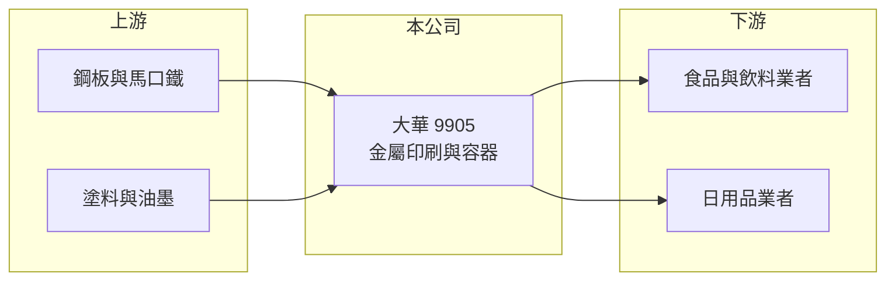

# 9905 大華

> 上市｜[[產業索引-其他業|其他業]]｜上市（櫃）日期 1990/08/08

# 第一章：企業模式與商業藍圖

> [!info] 撰寫說明
> 精簡版，由 Claude 依公開資料整理，架構比照 [[2330台積電]]，資料截至 2026-10-07。來源：winvest.tw 營收快訊、nstock.tw 大華公司概況。產品營收比重、客戶與據點本次未查到。#待校對

大華是金屬印刷與金屬容器製造商，替食品、飲料與日用品業者生產包裝罐。

- **核心業務：** 從事金屬印刷、塗漆，製造[[馬口鐵]]罐等金屬容器與塑膠製品，也製造容器包裝設備。
- **營收結構：** 本次未查到各產品比重；2025 年全年營收 81.81 億元，2026 年 1 至 8 月累計 72.32 億元、年增 27.63%。
- **營運據點：** 1990 年上市，生產據點細節本次未查到。
- **長期方向：** 營收成長明顯，但毛利率偏低，提高產品附加價值是獲利改善的關鍵（推估）。

# 第二章：護城河深度與競爭優勢

金屬罐屬成熟產業，競爭主要在成本與交期。

- **競爭優勢：** 同時具備金屬印刷、製罐與包裝設備能力，可提供客戶一站式服務（推估）。
- **主要對手：** [[9907統一實]] 等製罐與包材業者。
- **觀察重點：** 2026 年營收大增的來源能否延續，以及鋼材成本與售價轉嫁的時間差。

# 第三章：財務體質與盈利規模

資料日期：2026-10-07，表格是撰寫當時的快照；最新月營收、毛利率、累計 EPS 由自動排程寫在本筆記的屬性欄位（月營收、毛利率、累計EPS 等）。#待校對

大華 2026 年營收大幅成長，但利潤率仍薄。

- **營收規模：** 2026 年 8 月營收 10.58 億元，年增 37.83%；1 至 8 月累計 72.32 億元，年增 27.63%。
- **獲利：** 2026 年第二季 EPS 0.53 元，季增 51.43%；[[毛利率]] 12.38%、[[營業利益率]] 7.45%、淨利率 5.87%。
- **財務特色：** 資本額 30.50 億元，2025 年度配發現金股利 1.1 元，以撰寫時股價計算的[[殖利率]]約 5.2%。

# 第四章：總體風險與地緣政治

大華的風險來自原料成本與下游需求。

- **產業週期：** 食品飲料包裝需求相對穩定，但客戶庫存調整會影響訂單節奏。
- **營運風險：** 毛利率低，鋼材或塗料價格上漲若無法即時轉嫁，獲利會被壓縮。
- **其他風險：** 鋁罐、PET 瓶等替代包材競爭，以及匯率與能源成本。

# 專有名詞解析

## 金融

- **[[毛利率]]**：毛利占營收的比例，反映產品定價能力與生產成本控制。
- **[[營業利益率]]**：營業利益占營收的比例，扣除營業費用後衡量本業獲利能力。
- **[[殖利率]]**：每股現金股利除以股價，衡量以現價買進可領到的現金報酬。

## 產業

- **[[馬口鐵]]**：表面鍍錫的薄鋼板，耐腐蝕且易印刷，用於食品罐、飲料罐與奶粉罐。

# 核心供應鏈

- 上游：鋼板與馬口鐵供應商，例如 [[2002中鋼]]、[[9907統一實]]（推估）；塗料與油墨
- 下游／客戶：食品、飲料與日用品業者，客戶名稱未揭露
- 同業：[[9907統一實]] 等製罐業者

## 最新新聞
<!-- news:start -->
<!-- news:end -->

## 相關連結
- [公開資訊觀測站](https://mopsov.twse.com.tw/mops/web/t05st03?step=1&firstin=1&co_id=9905)
- [Goodinfo](https://goodinfo.tw/tw/StockDetail.asp?STOCK_ID=9905)
- [Yahoo 股市](https://tw.stock.yahoo.com/quote/9905)
- [鉅亨網新聞](https://www.cnyes.com/twstock/9905/news)
