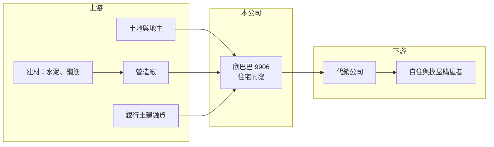

# 9906 欣巴巴

> 上市｜[[產業索引-建材營造業|建材營造業]]｜上市（櫃）日期 1990/12/15

# 第一章：企業模式與商業藍圖

> [!info] 撰寫說明
> 精簡版，由 Claude 依公開資料整理，架構比照 [[2330台積電]]，資料截至 2026-10-08。來源：證交所開放資料（基本資料、資產負債、綜合損益、營益分析、股利、每月營收）、Goodinfo 年度經營績效、富邦 e 點通（MoneyDJ）公司基本資料。公開資料有限，個別建案、推案區域與公司沿革未查得。#待校對

本章說明欣巴巴（9906）以住宅開發為主的建設公司模式，以及營收隨交屋大幅起伏的特性。

- **核心業務：** 欣巴巴事業成立於 1967 年，1990 年上市，是證交所建材營造類的老牌上市公司，總部設在高雄市前鎮區，董事長張宏圖。依 MoneyDJ 2025 年營收比重，營建收入占 99.99%，租金收入不到 0.1%，幾乎完全是建案銷售。
- **營收認列：** 建設公司在完工[[建案交屋]]時一次認列營收，因此欣巴巴的營收在有大案交屋的年度暴增、沒有交屋的年度驟降。2021 至 2024 年營收從 14 億元一路成長到 43.7 億元，2025 年回落到 13 億元，2026 年 1 至 8 月累計約 12.5 億元，正是這種「看交屋排程」的典型。
- **長期方向：** 建設公司的長期價值取決於土地取得成本、推案節奏與去化速度。欣巴巴 2021 至 2024 年連續四年 ROE 超過 30%，顯示該期間推出的建案利潤率不錯；未來能否持續補充土地、維持推案量，是判斷這段高獲利能否延續的關鍵。

# 第二章：護城河深度與競爭優勢

本章分析欣巴巴的競爭條件與觀察重點。

- **競爭優勢：** 地區型建商的優勢來自對當地土地市場與客群的熟悉，能較早取得合適地段並掌握產品定位。欣巴巴 2021 至 2024 年毛利率維持在 29% 至 33%，營業利益率約 18% 至 20%，在建設業屬於中上水準，顯示這段期間的建案規劃與成本控制有一定成效。
- **主要對手：** 南部住宅市場的上市櫃建商包括 [[9946三發地產]]、[[2542興富發]] 等，另有大量未上市的地方建商。2020 年代高雄因半導體設廠帶動房市，吸引北部建商南下推案，競爭比過去更激烈（欣巴巴的實際推案區域未查得）。
- **觀察重點：** 第一是[[已售未入帳]]金額與未來兩三年的交屋排程，這決定營收能否回到 2022 至 2024 年的水準。第二是負債比例，2026 年第二季總負債約為淨值的 4.8 倍。第三是股利政策，2025 年度未配發現金股利。

# 第三章：財務體質與盈利規模

資料日期：2026-10-08，表格是撰寫當時的快照；最新月營收、毛利率、累計 EPS 由自動排程寫在本筆記的屬性欄位（月營收、毛利率、累計EPS 等）。#待校對

本章用多年度數字檢視欣巴巴在交屋循環中的獲利起伏。

| 年度 | 營收（新台幣） | [[毛利率]] | [[營業利益率]] | EPS（元） | [[ROE]] |
|---|---|---|---|---|---|
| 2021 | 14.2 億 | 32.8% | 19.9% | 3.14 | 31.1% |
| 2022 | 29.7 億 | 29.5% | 19.4% | 5.08 | 36.6% |
| 2023 | 37.3 億 | 29.0% | 18.9% | 6.24 | 36.5% |
| 2024 | 43.7 億 | 30.5% | 18.0% | 6.55 | 33.6% |
| 2025 | 13.0 億 | 32.8% | 5.87% | 0.09 | 0.53% |

- **營收規模：** 2020 年營收只有 1.68 億元，2024 年達到 43.7 億元，2025 年又回到 13 億元，年度之間的差距可達數倍，因此計算年複合成長率沒有意義。依證交所資料，2026 年上半年營收約 11.4 億元、毛利率 37.7%、營業利益率 22.2%、EPS 1.90 元。
- **獲利：** 近五年平均 ROE 約 27.7%（推算），但其中四年是高峰、2025 年幾乎沒有獲利，平均值掩蓋了大起大落。毛利率長期穩定在 3 成上下，營業利益率的波動主要來自營收規模不足以攤提固定費用。
- **財務特色：** 2026 年第二季歸屬母公司權益約 15.2 億元，每股淨值 16.79 元，總負債約 73.2 億元（流動 63.2 億、非流動 10.0 億），MoneyDJ 所列負債比例約 83%，屬於高槓桿。Goodinfo 統計歷年平均現金股利約 0.45 元、股票股利約 1.18 元，股本多年來靠配股擴大，2025 年度未配發現金股利。
- **[[ROIC]] 與 [[WACC]]：** 投入資本以股東權益 15.2 億元加上有息負債推算，有息負債以總負債約六成、約 44 億元假設（實際數字未查得），合計約 59 億元。2024 年營業利益約 7.9 億元（43.7 億 × 18%），稅後約 6.3 億元，ROIC 約 10.7%；2025 年營業利益約 0.76 億元，稅後約 0.61 億元，ROIC 約 1.0%（皆為推算）。WACC 以 CAPM 推估：無風險利率 1.75%、市場風險溢酬 6%，MoneyDJ 的 β 為 0.30 不具代表性，改用高槓桿建設股常見值 1.0，股東權益成本約 7.75%；負債成本 2.5%、稅後約 2.0%；以帳面權重股權約 26%，WACC 約 3.5%（推算）。交屋大年 ROIC 明顯高於 WACC，空窗年則低於 WACC，跨週期平均仍為正利差，但高度依賴推案節奏。

# 第四章：總體風險與地緣政治

本章整理欣巴巴長期必須面對的風險。

- **產業週期：** 住宅需求受利率、房貸政策與[[信用管制]]影響，房市降溫時建案去化變慢、售價承壓。建設公司從買地到交屋往往三至五年，買地時的樂觀假設可能在交屋時已不再成立。
- **營運風險：** 營收集中在少數建案，交屋時程延後就會讓單一年度獲利大幅縮水，2025 年就是例子。高負債結構使公司對銀行融資條件高度敏感，土建融收緊時可能被迫放慢推案。
- **其他風險：** 營建材料與工資上漲會壓縮已預售建案的毛利；地區房市集中，若當地供給過多或產業投資放緩，會同時影響多個建案；股本靠配股擴大也會稀釋每股獲利。

# 專有名詞解析

## 金融

- **[[信用管制]]**：央行限制房貸成數、寬限期與土建融條件的政策，用來抑制房市過熱。
- **[[ROIC]]**：投入資本報酬率，稅後營業利益除以投入資本，衡量本業運用資金創造報酬的能力。
- **[[WACC]]**：加權平均資金成本，股東與債權人要求報酬率的加權平均，ROIC 高於 WACC 才代表創造價值。

## 產業

- **[[建案交屋]]**：建設公司把房屋所有權移轉給買方，營收與獲利在此時一次認列。
- **[[已售未入帳]]**：已簽約售出但尚未交屋認列的建案金額，是建設公司未來營收的主要指標。

# 核心供應鏈

- 上游：土地與地主、營造廠、水泥與鋼筋等建材（例如 [[1101台泥]]、[[2002中鋼]]，產業參考，實際供應商未查得），以及提供土建融資的銀行。
- 下游／客戶：自住與換屋購屋者，通常透過代銷公司銷售。
- 同業：[[9946三發地產]]、[[2542興富發]] 等在南部推案的建設公司。

## 最新新聞
<!-- news:start（自動產生，請勿手動編輯此範圍） -->
- 2026-10-05 📰 媒體 16:50｜營收速報 - 欣巴巴(9906)9月營收2.76億元年增率高達1548.4％｜[鉅亨網](https://news.cnyes.com/news/id/6621783)

完整紀錄：[[9906欣巴巴 新聞]]
<!-- news:end -->

## 相關連結
- [公開資訊觀測站](https://mopsov.twse.com.tw/mops/web/t05st03?step=1&firstin=1&co_id=9906)
- [Goodinfo](https://goodinfo.tw/tw/StockDetail.asp?STOCK_ID=9906)
- [Yahoo 股市](https://tw.stock.yahoo.com/quote/9906)
- [鉅亨網新聞](https://www.cnyes.com/twstock/9906/news)
