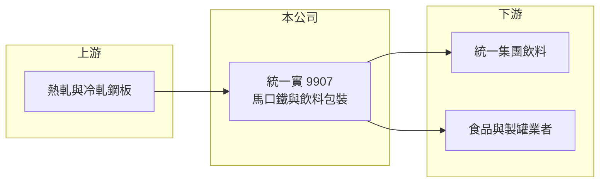

# 9907 統一實

> 上市｜[[產業索引-其他業|其他業]]｜上市（櫃）日期 1991/01/29

# 第一章：企業模式與商業藍圖

> [!info] 撰寫說明
> 精簡版，由 Claude 依公開資料整理，架構比照 [[2330台積電]]，資料截至 2026-10-07。來源：winvest.tw 營收快訊、nstock.tw 統一實公司概況、財訊快報（moneyweekly）。產品營收比重本次未查到。#待校對

統一實是統一集團旗下的馬口鐵與飲料包裝廠，業務涵蓋鋼板加工與製罐。

- **核心業務：** 加工原料鋼板、[[馬口鐵]]等鍍製鋼片，並從事印花製罐與飲料包裝，也代理製罐與馬口鐵機器。
- **營收結構：** 本次未查到鐵產品與飲料包裝的比重；2025 年全年營收 456.38 億元。
- **營運據點：** 1991 年上市，最大股東為統一企業集團，持股約 45.55%；生產據點細節本次未查到。
- **長期方向：** 飲料包裝訂單穩定，鐵產品則隨鋼價與銷量起伏，兩者共同決定獲利（推估）。

# 第二章：護城河深度與競爭優勢

統一實的穩定性來自集團內飲料客戶。

- **競爭優勢：** 背靠 [[1216統一]] 集團，飲料包裝有穩定的集團內需求。
- **主要對手：** 馬口鐵與鋼品方面有 [[2002中鋼]] 等鋼廠，製罐方面有 [[9905大華]] 等業者。
- **觀察重點：** 鋼價走勢與鐵產品銷量、飲料包裝訂單成長，以及高殖利率能否延續。

# 第三章：財務體質與盈利規模

資料日期：2026-10-07，表格是撰寫當時的快照；最新月營收、毛利率、累計 EPS 由自動排程寫在本筆記的屬性欄位（月營收、毛利率、累計EPS 等）。#待校對

統一實 2026 年營收下滑，獲利率偏低。

- **營收規模：** 2026 年 1 至 8 月累計 284.11 億元，年減 11.02%；6 月營收 37.15 億元、年減 6.1%。
- **獲利：** 2026 年第二季 EPS 0.18 元；[[毛利率]] 10.84%、[[營業利益率]] 4.77%、淨利率 2.52%。2025 年全年 EPS 1.36 元，前三季淨利 17.76 億元、年增 56.8%。
- **財務特色：** 資本額 157.91 億元，2025 年度配發現金股利 1.18 元，以撰寫時股價計算的[[殖利率]]約 7%。

# 第四章：總體風險與地緣政治

統一實的風險主要來自鋼價循環。

- **產業週期：** 鐵產品售價與鋼價連動，鋼價下跌時存貨與售價同步承壓。
- **營運風險：** 毛利率薄，原料與售價之間的時間差容易造成獲利波動。
- **其他風險：** 中國鋼品低價傾銷、鋁罐與 PET 瓶的替代、匯率變動。

# 專有名詞解析

## 金融

- **[[毛利率]]**：毛利占營收的比例，反映產品定價能力與生產成本控制。
- **[[營業利益率]]**：營業利益占營收的比例，扣除營業費用後衡量本業獲利能力。
- **[[殖利率]]**：每股現金股利除以股價，衡量以現價買進可領到的現金報酬。

## 產業

- **[[馬口鐵]]**：表面鍍錫的薄鋼板，耐腐蝕且易印刷，用於食品罐、飲料罐與奶粉罐。

# 核心供應鏈

- 上游：鋼板供應商，例如 [[2002中鋼]]（推估）
- 下游／客戶：[[1216統一]] 集團飲料事業、食品與製罐業者
- 同業：[[9905大華]] 等製罐業者、[[2002中鋼]] 等鍍錫鋼片供應商

## 最新新聞
<!-- news:start -->
<!-- news:end -->

## 相關連結
- [公開資訊觀測站](https://mopsov.twse.com.tw/mops/web/t05st03?step=1&firstin=1&co_id=9907)
- [Goodinfo](https://goodinfo.tw/tw/StockDetail.asp?STOCK_ID=9907)
- [Yahoo 股市](https://tw.stock.yahoo.com/quote/9907)
- [鉅亨網新聞](https://www.cnyes.com/twstock/9907/news)
