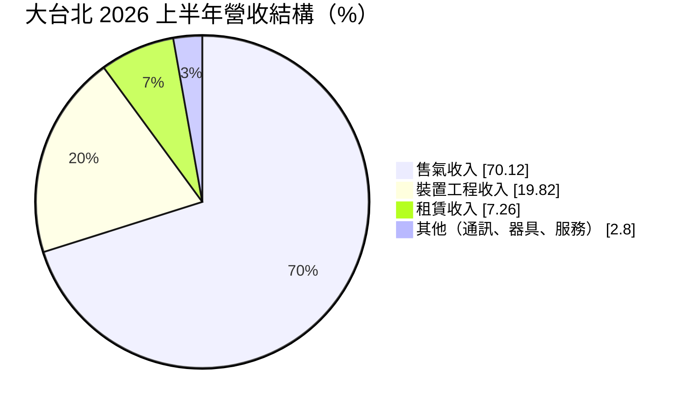
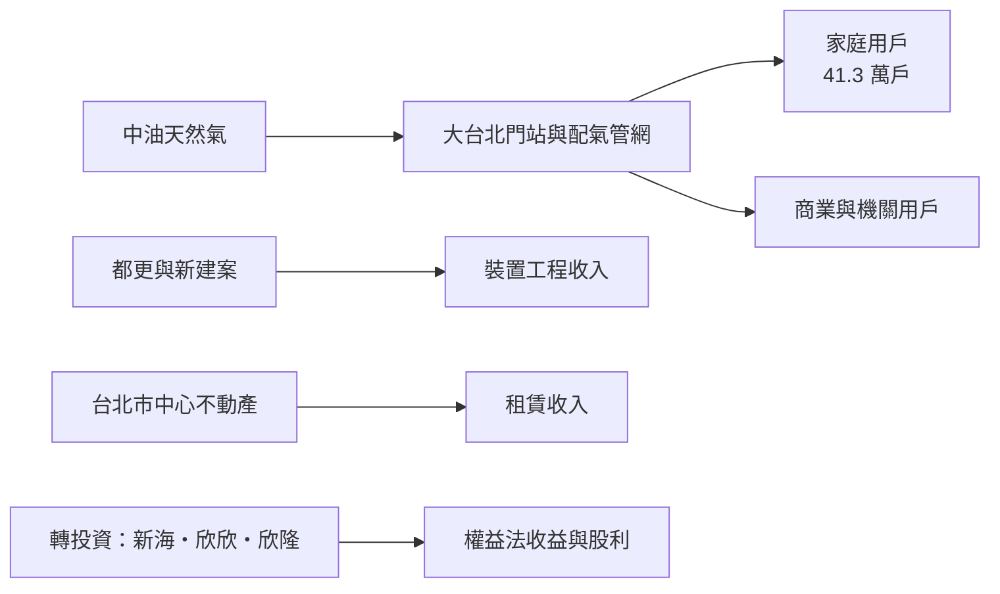
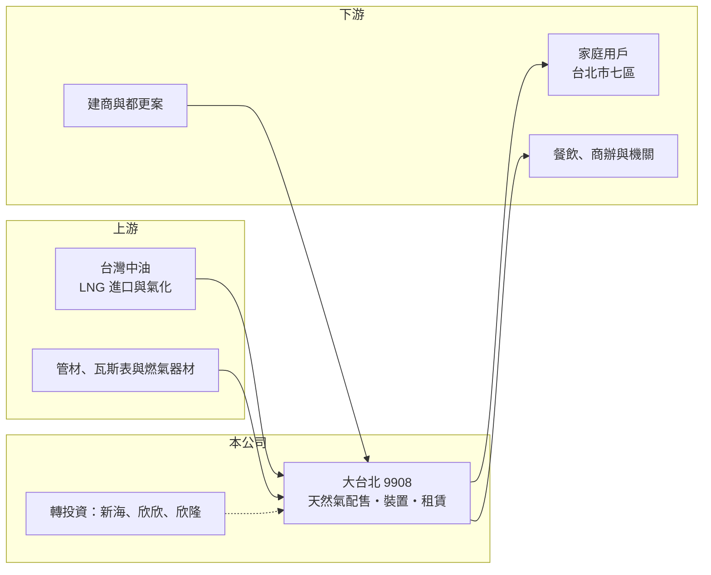

# 9908 大台北

> 上市｜[[產業索引-油電燃氣業|油電燃氣業]]｜上市（櫃）日期 1991/02/06

# 第一章：企業模式與商業藍圖

> [!info] 撰寫說明
> 本文由 Claude 依公開資料整理，架構比照 [[2330台積電]] 的四章研究，資料截至 2026-10-08。財務數字來源：Goodinfo 年度經營績效頁、富果研究 2026 年 10 月法說會整理（AI 摘要）、證交所開放資料（基本資料、2026 年第二季資產負債與綜合損益、股利、營益分析）；產業描述為整理性內容，尚未逐條比對原始文件。#待校對

在評估單一個股的長期投資價值時，首要步驟是拆解企業的底層獲利邏輯。本章說明大台北區瓦斯（股票代號：9908，以下簡稱大台北）這家台北市中心的瓦斯公司，如何同時是一個公用事業與一家瓦斯業投資控股公司。

## 一、核心定位：台北市中心的天然氣公用事業

大台北成立於 1964 年，1991 年上市，實收資本額約 51.6 億元，董事長為吳東進（新光集團）。公司是[[公用天然氣事業]]，向[[中油]]購入天然氣，透過地下管線供應給特許區域內的家庭、商業與機關用戶。

依富果研究整理的 2026 年 10 月法說會資料，大台北的[[特許經營區域]]包括台北市松山、信義、大安、中山、中正、萬華、大同七個行政區，以及士林區的兩個里，是台北市商業與住宅最密集的核心地帶。截至 2026 年 8 月，供氣用戶共 412,515 戶，區域普及率 68.52%，用戶數逐年穩定增加。

## 二、業務板塊：售氣、裝置、租賃與轉投資

* **售氣收入：** 約七成，來自家庭、餐飲、商辦與機關的天然氣用量。
* **[[裝置工程收入]]：** 約兩成，來自新建案、都市更新與老舊建物的管線裝設與汰換。台北市中心的都更與危老重建，讓舊用戶拆除後再以新建案形式重新接管，持續帶來裝置收入。
* **租賃收入：** 約 7%，來自公司持有的不動產出租，台北市中心的土地與建物是大台北的重要資產。
* **轉投資：** 以[[權益法]]投資新海瓦斯、[[9918欣天然]]、欣隆天然氣等同業，另持有金融資產，帶來股利與評價收益。這部分收益列在業外，2026 年上半年營業外收入約 3.83 億元，高於營業利益約 2.82 億元（證交所開放資料）。

## 三、資本轉化邏輯：管網收費站加上投資組合

大台北的價值來自兩個部分。第一是本業的「收費站」：一套已經埋設數十年的管網，每年穩定收取售氣價差與裝置費用。第二是投資組合：對其他瓦斯公司的持股與金融資產，每年帶來權益法收益與股利。這讓大台北的稅後純益率遠高於營業利益率，2026 年上半年稅後純益率 32.73%，營業利益率 15.73%（證交所營益分析）。

## 四、企業長期藍圖

大台北的長期策略有三個重點。第一是管線安全：以耐震、耐腐蝕材料汰換老舊管線，2020 至 2025 年每年汰換目標達成率 100%，2025 年汰換 37,114 公尺；[[微電腦瓦斯表]]裝設率從 2023 年的 70.01% 提高到 2026 年 8 月的 77.72%。第二是能源轉型：在萬華大樓設置以天然氣為燃料的[[固態氧化物燃料電池]]（SOFC），公司表示發電成本低於台電電價、減少約 30% 排放、每年減碳約 631 噸，回收期約 7 年，未來可能延伸到資料中心與大型醫院。第三是數位服務：以生成式 AI 建立客服知識庫，處理抄表、帳單查詢與漏氣通報。

# 第二章：護城河深度與競爭優勢

本章分析大台北作為台北市中心特許公用事業的競爭優勢，以及成熟市場的成長天花板。

## 一、護城河的核心組成要素

* **法定區域獨占：** 台北市中心七個行政區的天然氣供應由大台北獨家經營，其他業者不能在同區鋪設平行管線。
* **管網的沉沒成本：** 台北市中心的地下管線歷經數十年埋設，道路挖掘許可與施工成本極高，替代者不可能重建。
* **高密度市場：** 台北市中心人口與商業密度高，每公里管線的用戶數多，單位管線的收益高。
* **資產與投資組合：** 台北市中心的不動產與對同業的持股，提供本業以外的穩定收益，也增加財務彈性。

## 二、主要競爭對手與替代能源

| 對手／替代者 | 定位 | 對大台北的影響 |
|---|---|---|
| 電力（電熱水器、熱泵、電磁爐） | 家庭與商業電氣化 | 新建案與都更若採全電化，會降低接管率與用量 |
| 桶裝液化石油氣 | 未接管用戶 | 市中心比重低，影響有限 |
| [[9918欣天然]]、[[8917欣泰]]、[[8908欣雄]] 等同業 | 不同特許區域 | 不直接競爭；欣天然同時是大台北的轉投資 |

## 三、優勢轉化：守得住、守不住與觀察重點

* **守得住：** 既有用戶的售氣收入與管網地位，以及都更帶來的裝置收入。
* **守不住：** 售氣量的長期成長。市中心區已高度開發，人口不再增加，小家庭化與外食讓每戶用量下降。
* **觀察重點：** 第一，用戶數與普及率的變化；第二，都更與危老重建案採用天然氣或全電化的比例；第三，SOFC 等新業務能否形成規模。

# 第三章：財務體質與盈利規模

資料日期：2026-10-08。數字取自 Goodinfo 年度經營績效頁、富果研究法說會整理與證交所開放資料，表格是撰寫當時的快照；最新月營收、毛利率、累計 EPS 由自動排程寫在本筆記的屬性欄位（月營收、毛利率、累計EPS 等）。#待校對

財務報表是檢驗護城河是否真實存在的最終標準。本章用多年度的三率、ROE 與資本報酬，檢視大台北的獲利穩定度與資本效率。

## 一、獲利能力的基石：三率

| 年度 | 營收（新台幣） | [[毛利率]] | [[營業利益率]] | EPS（元） | [[ROE]] |
|---|---|---|---|---|---|
| 2019 | 42.4 億 | 20.6% | 14.1% | 1.68 | 7.37% |
| 2020 | 35.4 億 | 24.8% | 17.1% | 1.64 | 7.03% |
| 2021 | 31.7 億 | 26.1% | 17.8% | 1.75 | 7.14% |
| 2022 | 33.2 億 | 26.0% | 18.1% | 1.55 | 6.17% |
| 2023 | 34.7 億 | 25.7% | 18.4% | 2.32 | 8.60% |
| 2024 | 33.2 億 | 22.6% | 13.9% | 1.71 | 6.11% |
| 2025 | 33.7 億 | 23.0% | 14.6% | 1.72 | 6.07% |
| 2026 上半年 | 17.9 億 | 23.17% | 15.73% | 1.10 | 未查得 |

* **營收停滯：** 2021 至 2025 年營收在 31.7 億元到 34.7 億元之間，年複合成長率約 1.5%（推算），符合成熟都會區公用事業的特性。
* **營業利益率穩定：** 長期在 14% 至 18% 之間，2024 年起略降，可能與氣價調整後價差變化及管線汰換費用有關（推估）。
* **EPS 由業外決定：** 營業利益每年約 4.5 億至 6.4 億元，換算每股約 0.7 至 1 元，其餘 EPS 來自轉投資收益與股利。2026 年上半年 EPS 1.10 元，其中業外收益約占稅前淨利的 58%（推算）。

## 二、[[ROE]]：資本效率

2021 至 2025 年平均 ROE 約 6.8%（推算），偏低。原因是大台北的股東權益很大（2026 年第二季底權益約 164.6 億元，其中歸屬母公司約 148.7 億元），其中包含大量轉投資與金融資產，這些資產的報酬以股利與權益法收益為主，拉低了整體 ROE。股價淨值比約 0.98 倍（證交所本益比資料，2026 年 10 月初），市場大致以帳面價值評價這家公司。負債約 66.7 億元，負債比約 29%，財務結構保守。

## 三、資本支出、自由現金流與股利

大台北的資本支出以管線汰換與瓦斯表更新為主，屬於可預期的維護型支出，本業自由現金流長期為正（推估）。股利方面，2024 與 2025 年度都配發現金股利 1.2 元，約為當年 EPS 的七成（法說會資料）；Goodinfo 統計歷年一般平均現金股利約 0.62 元、股票股利約 0.44 元，近年改以現金股利為主。

## 四、[[ROIC]] 與 [[WACC]]：價值創造利差

**ROIC 推算：** 2025 年營業利益約 4.92 億元（營收 33.7 億元 × 營業利益率 14.6%），扣除 20% 稅率後約 3.94 億元。2026 年第二季底權益約 164.6 億元，假設有息負債約 15 億元（負債多為用戶保證金與營運負債，推估），投入資本約 180 億元，ROIC 約 2.2%（推算）。但這個資本基礎包含大量轉投資，若只計算瓦斯本業實際使用的管網資產，本業 ROIC 會明顯較高；若把轉投資收益計入報酬，整體資本報酬約與 ROE 相近，約 6% 至 7%（推估）。

**WACC 推算：** 假設台灣 10 年期公債殖利率 1.75%、市場風險溢酬 6%、β 取公用事業常見值 0.5，股東權益成本約 4.75%。負債比重低（約 8%），稅後負債成本約 2.0%，WACC 約 4.5%（推算）。

**結論：** 以帳面全部資本計算，大台北本業 ROIC 低於資金成本；把轉投資收益計入後，整體報酬約 6% 至 7%，略高於約 4.5% 的資金成本。大台北比較適合理解為「穩定的瓦斯收費站加上一個瓦斯業投資組合」，長期價值取決於本業的穩定、投資組合的報酬，以及台北市中心不動產的價值。

# 第四章：總體風險與地緣政治

任何企業都無法脫離宏觀環境獨立存在。本章分析大台北長期必須面對的能源政策、市場結構與營運風險。

## 一、能源政策

* **價格管制：** 公用天然氣售價與配氣價差受經濟部規範，政策若壓縮價差，獲利會直接受影響。
* **淨零與建築電氣化：** 台灣 2050 淨零路徑下，建築部門的電氣化是長期方向。台北市中心的都更與新建案若普遍改採全電化，會影響新接管與每戶用量，這是十年以上尺度的主要風險。

## 二、市場結構

* **人口與用量：** 台北市人口長期減少，市中心區已高度開發，用戶數成長有限；小家庭化與外食讓每戶用量下降。
* **業外收益波動：** 轉投資與金融資產的收益受同業經營與資本市場影響，金融資產的評價變動會讓 EPS 出現波動。

## 三、營運環境的隱性風險

* **管線安全：** 台北市中心人口密集，瓦斯外洩或爆炸事故的後果嚴重。老舊管線汰換是長期必要支出。
* **地震：** 台灣位於地震帶，地下管線受損風險需要耐震管材與自動遮斷瓦斯表來降低。
* **集團關係：** 大台北屬新光集團，與集團內企業的交易與資本配置，需要注意公司治理與關係人交易的透明度。

## 四、科技演進

燃料電池、氫能混燒與[[生質甲烷]]，是瓦斯公司在淨零時代可能的轉型方向。大台北的 SOFC 示範案是以天然氣發電、替用戶降低用電成本的新模式，若能推廣到資料中心與大型醫院，可能讓天然氣管網找到新的用途；但目前規模仍小，需要長期觀察。

# 專有名詞解析

## 金融

- **[[權益法]]**：持股約兩成至五成的轉投資，依持股比例認列被投資公司損益的會計方法，收益列在業外。
- **[[ROIC]]**：投入資本報酬率，稅後營業利益除以股東權益與有息負債的合計，衡量本業對所有資金提供者的報酬。
- **[[WACC]]**：加權平均資金成本，依股東權益與負債的比重加權計算的資金成本，ROIC 高於它才代表創造價值。

## 產業

- **[[公用天然氣事業]]**：依法取得特定區域經營權，透過管線供應天然氣給家庭、商業與工業用戶的公司。
- **[[中油]]**：台灣中油公司，國營石油公司，是台灣唯一的天然氣進口與批發供應商。
- **[[特許經營區域]]**：政府核定的獨家經營範圍，區內不允許其他業者另建管線競爭。
- **[[裝置工程收入]]**：新用戶接通天然氣時，瓦斯公司向用戶收取的管線安裝費用。
- **[[微電腦瓦斯表]]**：具異常偵測與自動遮斷功能的智慧瓦斯表，可提高用氣安全並支援遠端抄表。
- **[[固態氧化物燃料電池]]**：以陶瓷電解質在高溫下把天然氣或氫氣的化學能直接轉為電力的裝置，簡稱 SOFC，發電效率高。
- **[[生質甲烷]]**：由廚餘、畜牧廢棄物等有機物發酵產生的甲烷，可注入天然氣管網替代部分化石天然氣。

# 核心供應鏈

## 1. 上游：氣源與器材
- 台灣中油：天然氣唯一批發來源
- 管材、微電腦瓦斯表與燃氣器材供應商

## 2. 中游：大台北本身與同業
- 轉投資：[[9926新海]]、[[9918欣天然]]、欣隆天然氣
- 天然氣同業：[[8917欣泰]]、[[8908欣雄]]

## 3. 下游：用戶
- 台北市松山、信義、大安、中山、中正、萬華、大同七區與士林區兩里的家庭、商業與機關用戶
- 建商與都更、危老重建案

## 最新新聞
<!-- news:start -->
<!-- news:end -->

## 相關連結
- [公開資訊觀測站](https://mopsov.twse.com.tw/mops/web/t05st03?step=1&firstin=1&co_id=9908)
- [Goodinfo](https://goodinfo.tw/tw/StockDetail.asp?STOCK_ID=9908)
- [Yahoo 股市](https://tw.stock.yahoo.com/quote/9908)
- [鉅亨網新聞](https://www.cnyes.com/twstock/9908/news)
