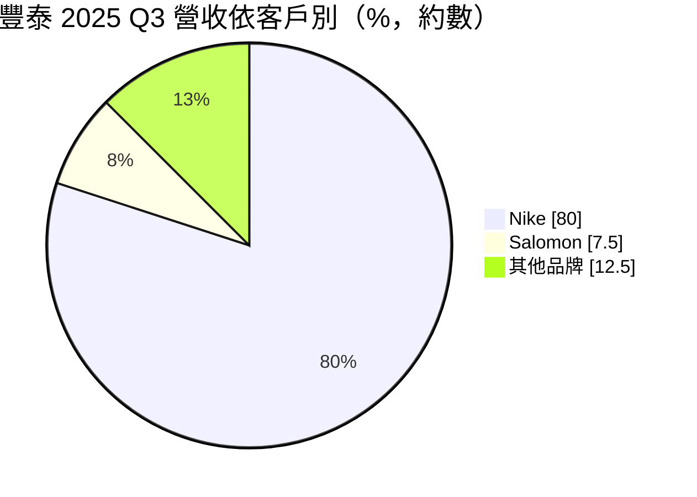
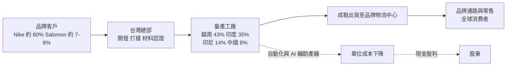
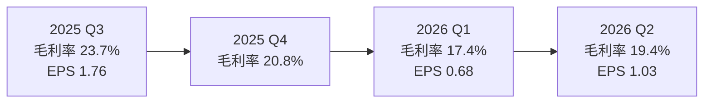
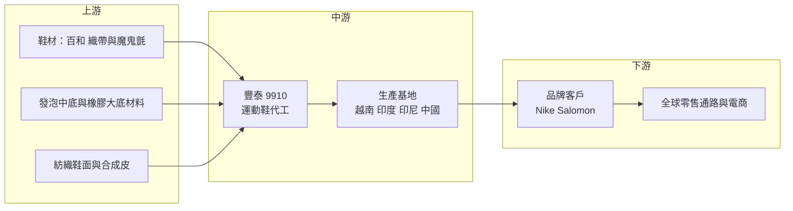

# 9910 豐泰

> 上市｜[[產業索引-運動休閒|運動休閒]]｜上市（櫃）日期 1992/02/18

# 第一章：企業模式與商業藍圖

> [!info] 撰寫說明
> 本文由 Claude 依公開資料整理，架構比照 [[2330台積電]] 的四章研究，資料截至 2026-10-07。財務數字來源：富果研究（豐泰 2025 年第三季法說會摘要）、Poorstock（2026 年 9 月法說會整理）、HiStock（季度利潤比率與 EPS）、鉅亨網 FactSet 調查（2026 年 4 月）、nStock 公司簡介；產業描述為整理性內容，尚未逐條比對原始文件。#待校對

在評估單一個股的長期投資價值時，首要步驟是拆解企業的底層獲利邏輯。本章針對豐泰企業（股票代號：9910，以下簡稱豐泰）的商業模式進行定性分析，說明一家以單一品牌為主要客戶的運動鞋代工廠，如何靠開發能力與多國產能維持議價地位，以及這個模式的天花板在哪裡。

## 一、核心定位：Nike 核心供應商的運動鞋代工廠

豐泰成立於 1971 年，總部設於雲林斗六，以運動鞋 [[OEM]] 代工為本業，另有少量休閒鞋、冰刀鞋、滑雪靴、高爾夫球與背包等產品。依 2025 年第三季法說會資料，Nike 約占營收八成，法國戶外品牌 Salomon 約占 7% 至 8%，其餘為其他運動與戶外品牌。

和同業 [[9904寶成]] 相比，豐泰的定位有兩個特色：

* **客戶高度集中：** 寶成同時服務 Nike、adidas 等多家品牌，並經營零售通路；豐泰則把資源押在 Nike，屬於 Nike 長期的[[策略供應商]]，參與從設計打樣到量產的完整流程。
* **偏重高單價機能鞋：** 豐泰承接較多跑鞋、籃球鞋與足球鞋等需要新材料和新製程的鞋款，每雙平均單價高於一般休閒鞋代工，這也是它過去毛利率能維持在二成以上的原因。

## 二、終端應用與產品板塊：Nike 為主、Salomon 為第二成長引擎

豐泰未按產品別公布營收比重，以下用 2025 年第三季法說會揭露的客戶比重呈現營收結構：

* **Nike：** 跑鞋、籃球鞋、足球鞋與訓練鞋。Nike 的新品節奏、庫存去化與訂單策略，直接決定豐泰的出貨量。
* **Salomon：** 越野跑鞋與戶外鞋，近年在潮流市場走紅。公司在 2025 年第三季法說會表示，預期 Salomon 2026 年仍有雙位數成長，是主要的增量來源。
* **其他：** 其他運動、戶外品牌與非鞋類產品，比重小。

## 三、資本轉化邏輯：多國產能把訂單轉成現金

* **產能分布：** 依 2026 年 9 月法說會資料，越南約占 43%、印度約占 35%、印尼約占 14%、中國約占 8%。和 2025 年第三季相比，越南從 46% 降到 43%、印度從 30% 升到 35%、中國從 10% 降到 8%，反映產能持續由中國移往南亞與東南亞。
* **營運槓桿：** 鞋業代工屬於勞力密集產業，固定成本主要是工廠與人力。訂單充足時，產線效率與規模經濟讓毛利率擴張；訂單減少或「[[少量多樣]]」時，換線頻繁、學習曲線拉長，毛利率就會明顯下滑。
* **新產能的爬坡成本：** 印度、印尼新廠初期良率與效率不如成熟的越南廠，搬遷期間會拉低整體毛利率，這是 2026 年上半年獲利下滑的主要原因之一。

## 四、企業長期藍圖：產能再配置與製程升級

* **南亞產能規模化：** 公司長期寄望印度與印尼產能達到經濟規模，讓搬遷的效率損失轉為成本優勢，同時降低對單一國家關稅的曝險。
* **製程改善與 AI 輔助：** 2025 年第三季法說會提到，將透過製程改善與 AI 輔助生產維持利潤率，應對少量多樣的訂單型態。
* **客戶多元化：** Salomon 的成長讓 Nike 以外的營收比重逐步提高，降低單一客戶風險。不過以目前比重來看，豐泰在可見的未來仍高度依賴 Nike。

# 第二章：護城河深度與競爭優勢

在長期價值投資中，「護城河」指企業抵禦競爭、維持超額利潤的保護機制。本章分析豐泰的護城河構成、全球主要鞋業代工對手，以及在品牌商壓價與關稅變動下，這些優勢能守住多少。

## 一、豐泰護城河的核心組成要素

鞋業代工的進入門檻不高，但頂級品牌的核心供應商名單很少變動。豐泰的護城河屬於「窄護城河」，由三個要素組成：

* **1. 與 Nike 的長期開發綁定：** 機能鞋從設計、材料測試到量產往往需要一年以上的開發期。豐泰深度參與 Nike 的新鞋開發，熟悉其材料規格與品質標準，品牌商若要轉單，需重新認證工廠，轉換成本不低。
* **2. 高單價機能鞋的製程經驗：** 跑鞋、籃球鞋涉及[[飛織鞋面]]、發泡中底與多材料貼合等製程，對良率與一致性要求高，一般小型代工廠難以承接。
* **3. 多國產能與合規：** 品牌商在[[ESG]]稽核、勞工權益與碳排揭露上要求日嚴，大型代工廠具備完整的稽核與管理系統，小廠難以跟上。分散在越南、印度、印尼的產能，也讓品牌商能依關稅調整產地。

## 二、全球主要競爭對手格局

| 對手 | 定位 | 對豐泰的威脅 |
|---|---|---|
| [[9904寶成]] | 全球最大運動鞋代工集團，客戶多元並經營零售 | 規模與議價力大，可承接 Nike 轉單 |
| [[9802鈺齊-KY]] | 戶外與機能鞋代工 | 在戶外鞋領域和 Salomon 類訂單競爭 |
| [[9938百和]] | 鞋材供應（魔鬼氈、織帶） | 非直接對手，屬上游合作夥伴 |
| 華利集團（中國） | 中國大型運動鞋代工，客戶含 Nike、Vans 等 | 以越南產能擴張搶 Nike 新增訂單 |
| 越南與印尼本地代工廠 | 低成本、中低價鞋款 | 在一般鞋款上壓低報價 |

## 三、優勢轉化：哪些市場守得住、哪些守不住

* **守得住：** 開發難度高的跑鞋、籃球鞋與足球鞋，以及 Salomon 的越野跑鞋。這些產品看重開發能力與品質，品牌商不會輕易換廠。
* **守不住：** 毛利率水準。2025 年第二季毛利率仍有 24.2%，2026 年第一季降到 17.4%，第二季回升至 19.4%。品牌商自身也面臨庫存與獲利壓力，會把成本壓力往代工端轉嫁；加上產能搬遷的效率損失，豐泰無法完全守住過去二成以上的毛利率。
* **觀察重點：** Nike 新品週期能否帶動訂單回溫、Salomon 能否維持雙位數成長、印度與印尼工廠效率何時追上越南，以及毛利率能否重回 20% 以上。

# 第三章：財務體質與盈利規模

資料日期：2026-10-07。數字取自法說會整理與財經資料網站，表格是撰寫當時的快照；最新月營收、毛利率、累計 EPS 由自動排程寫在本筆記的屬性欄位（月營收、毛利率、累計EPS 等）。#待校對

財務報表是檢驗護城河是否真實存在的最終標準。本章用三率、ROE、現金流與資本報酬，檢視豐泰在品牌庫存調整與產能搬遷期間的獲利品質。

## 一、獲利能力的基石：三率

| 項目 | 2024 全年 | 2025 全年 | 2025 Q2 | 2026 Q1 | 2026 Q2 |
|---|---|---|---|---|---|
| 營收（新台幣） | 874.9 億 | 835.1 億 | 204.0 億 | 192.4 億 | 203.8 億 |
| [[毛利率]] | 未查得 | 各季介於 20.8% 至 24.2% | 24.2% | 17.4% | 19.4% |
| [[營業利益率]] | 未查得 | 各季介於 6.7% 至 11.5% | 11.5% | 4.0% | 5.9% |
| 稅後淨利 | 58.7 億 | 50.4 億 | 未查得 | 未查得 | 未查得 |
| EPS（元） | 5.94 | 約 5.10 | 0.73 | 0.68 | 1.03 |

* **[[毛利率]]：** 2025 年第三季仍有 23.7%，之後連續兩季下滑，2026 年第一季降到 17.4% 的低點，第二季回升到 19.4%。下滑原因包括訂單少量多樣、產能搬遷的效率損失，以及新台幣匯率變動。
* **[[營業利益率]]：** 2026 年第一季僅 4.0%，第二季回到 5.9%，仍遠低於 2025 年第二季的 11.5%。管銷與研發費用相對固定，營收持平時毛利率的下滑會被放大到營業利益。
* **[[淨利率]]與業外：** 2025 年第二季營業利益率 11.5%，但稅後淨利率只有 4.1%，EPS 0.73 元，推估主要受匯兌損失影響；2026 年第二季 EPS 1.03 元年增約四成，部分來自比較基期偏低。
* **市場預估：** 依 2026 年 4 月 FactSet 調查，分析師預估 2026 年 EPS 中位數 5.35 元、營收約 824.9 億元。以上半年 EPS 合計 1.71 元來看，下半年需要明顯回溫才能達到這個數字，預估可能再下修（推估）。

## 二、[[ROE]]：資本效率

豐泰屬於輕資產的代工模式，主要資產是廠房與營運資金，過去在毛利率二成以上的年度，ROE 可維持在雙位數（推估，依歷年獲利與股本推算）。2026 年上半年獲利下滑，ROE 將明顯低於 2024 年水準。

## 三、資本支出與自由現金流

* **[[CapEx]]：** 近年資本支出主要用於印度、印尼新廠與自動化設備，具體金額未查得。
* **[[自由現金流]]：** 依 2026 年 9 月法說會整理，2026 年上半年營業現金流入僅約 11.35 億元，遠低於 2025 年同期的約 87.22 億元，推估與應收帳款、存貨等營運資金增加有關。若下半年營業現金流未回升，扣除資本支出後的自由現金流將偏緊。
* **股利政策：** 豐泰長期維持高配發率，2024 年度現金股利 5.1 元、配發率約 86%，2025 年度現金股利 4.1 元。近五年平均現金股利約 5.06 元。

## 四、[[ROIC]] 與 [[WACC]]：價值創造利差

鞋業代工的投入資本以廠房與營運資金為主，ROIC 高低取決於毛利率與資產周轉率。2022 年前後的高峰期，豐泰 ROIC 明顯高於資金成本；2026 年毛利率跌破二成，利差明顯收窄（推估，具體數值未查得）。印度與印尼產能能否提升效率，是 ROIC 回升的關鍵。

# 第四章：總體風險與地緣政治

任何企業都無法脫離宏觀環境獨立存在。本章分析豐泰未來必須面對的地緣政治、產業週期與營運風險。

## 一、地緣政治風險

* **美國關稅：** 運動鞋主要銷往美國市場，美國對越南、印度、印尼等生產國的關稅政策直接影響品牌商的訂單配置。2025 年以來美國對多國調整關稅，品牌商會依關稅高低移轉產地，豐泰的產能布局必須跟著調整，這會帶來額外的搬遷成本。
* **印度集中度上升：** 印度產能比重已升到約 35%，印度與美國之間的貿易關係、印度本地的政策與基礎建設，對豐泰的影響比過去大。
* **中國產能縮減：** 中國比重降到 8%，降低了對美出口的關稅風險，但中國廠的轉型或關廠也可能產生一次性費用。

## 二、產業週期與市場結構風險

* **品牌庫存週期：** 運動鞋產業有明顯的[[長鞭效應]]。品牌商在疫情後經歷高庫存、去化、再補貨的循環，終端需求的小幅變動在代工端會被放大。
* **Nike 經營策略：** Nike 近年調整直營與批發通路策略、更換管理層並重整產品線，訂單策略偏保守。Nike 占豐泰營收約八成，任何策略變化都會直接反映在豐泰營收。
* **匯率：** 營收以美元計價、生產成本以越南盾、印度盧比等當地貨幣支付，新台幣與當地貨幣匯率變動都會影響毛利率與業外損益。

## 三、營運環境的隱性風險

* **工資上漲與勞資關係：** 越南、印尼最低工資逐年調升，大型鞋廠員工人數多，工資與勞動條件的變化會直接衝擊成本。
* **新廠效率爬坡：** 印度與印尼新廠的效率與良率需要時間追上越南，若訂單波動，爬坡期可能拉長。
* **營運資金壓力：** 2026 年上半年營業現金流大幅縮水，若持續，可能影響高配發率的股利政策。

## 四、科技或法規演進

* **製程自動化：** 鞋業一直是自動化程度較低的產業，3D 列印鞋底、自動化鞋面貼合與 AI 排程若普及，可能降低勞力成本的重要性，也可能讓品牌商把部分產能移回消費市場附近。
* **ESG 與碳排法規：** 歐盟等市場對產品碳足跡、化學品與強迫勞動的規範日趨嚴格，代工廠需要投入合規成本，但也提高了小廠進入頂級品牌供應鏈的門檻。

# 專有名詞解析

## 金融

- **[[毛利率]]**：毛利除以營收，反映產品售價扣除直接生產成本後的獲利空間。
- **[[營業利益率]]**：營業利益除以營收，反映扣除管銷研發費用後的本業獲利能力。
- **[[ROE]]**：股東權益報酬率，稅後淨利除以股東權益，衡量公司運用股東資本賺錢的效率。
- **[[自由現金流]]**：營業活動現金流減去資本支出，代表企業可自由用於配息、還債或併購的現金。

## 產業

- **[[OEM]]**：原廠委託製造，代工廠依品牌客戶的設計與規格生產，產品掛品牌商的商標。
- **[[策略供應商]]**：品牌商長期合作、參與產品開發並享有優先訂單分配的核心代工夥伴。
- **[[少量多樣]]**：品牌商推出更多鞋款、但每款下單量較少的趨勢，會增加代工廠換線次數並降低生產效率。
- **[[飛織鞋面]]**：以針織機一體編織成形的鞋面技術，重量輕、材料浪費少，常見於高階跑鞋。
- **[[ESG]]**：環境、社會與公司治理，品牌商用來稽核供應商的永續與勞工標準。
- **[[長鞭效應]]**：終端需求的小幅變動沿供應鏈往上游傳遞時被逐級放大，造成代工端訂單劇烈波動。

# 核心供應鏈

## 1. 上游：鞋材供應商
- 織帶與魔鬼氈：[[9938百和]]
- 發泡中底、橡膠大底、紡織鞋面與合成皮等材料供應商（多為品牌商指定供應商）

## 2. 中游：豐泰本身與生產基地
- 台灣雲林總部負責開發與打樣
- 量產工廠位於越南、印度、印尼與中國

## 3. 下游：品牌客戶
- Nike（約占營收八成）
- Salomon（約占營收 7% 至 8%）

## 4. 同業
- [[9904寶成]]、[[9802鈺齊-KY]]、華利集團（中國）

## 最新新聞
<!-- news:start（自動產生，請勿手動編輯此範圍） -->
- 2026-10-07 📰 媒體 12:10｜鉅亨速報 - Factset 最新調查：豐泰(9910-TW)EPS預估下修至4.1元，預估目標價為65.15元｜[鉅亨網](https://news.cnyes.com/news/id/6623549)
- 2026-10-06 📰 媒體 12:10｜鉅亨速報 - Factset 最新調查：豐泰(9910-TW)EPS預估下修至4.15元，預估目標價為70.3元｜[鉅亨網](https://news.cnyes.com/news/id/6622608)

完整紀錄：[[9910豐泰 新聞]]
<!-- news:end -->

## 相關連結
- [公開資訊觀測站](https://mopsov.twse.com.tw/mops/web/t05st03?step=1&firstin=1&co_id=9910)
- [Goodinfo](https://goodinfo.tw/tw/StockDetail.asp?STOCK_ID=9910)
- [Yahoo 股市](https://tw.stock.yahoo.com/quote/9910)
- [鉅亨網新聞](https://www.cnyes.com/twstock/9910/news)
