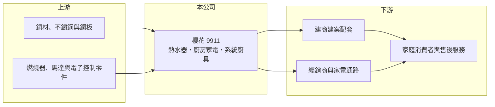

# 9911 櫻花

> 上市｜[[產業索引-居家生活|居家生活]]｜上市（櫃）日期 1992/07/16

# 第一章：企業模式與商業藍圖

> [!info] 撰寫說明
> 精簡版，由 Claude 依公開資料整理，架構比照 [[2330台積電]]，資料截至 2026-10-08。來源：MoneyDJ 理財網財務比率年表（2021 至 2025 年）、證交所公開資料彙整的 2026 年第二季財報與 2025 年度股利資料、天下雜誌、經濟日報與優分析 2025 至 2026 年報導標題。MoneyDJ 營收比重頁面文字亂碼，產品別比重未能辨識。#待校對

台灣櫻花是國內廚房家電與熱水器的領導品牌之一，產品涵蓋熱水器、抽油煙機、瓦斯爐、系統廚具、淨水設備與衛浴，2025 年營收首度突破百億元。

- **核心業務：** 櫻花 1988 年成立，1992 年上市，以「櫻花」[[自有品牌]]經營台灣的廚衛家電市場。產品屬於隨房屋交屋、裝修或汰換而購買的耐久財，消費者重視安全、耐用與售後服務，因此品牌信任與服務網路是這門生意的核心。
- **營收結構：** 公司營收來自兩個主要管道：一是透過經銷商與家電通路賣給一般家庭的零售市場，二是直接配合建商交屋的[[建商配套]]市場。天下雜誌 2025 年報導以「10 大建商 8 家都選它」形容櫻花在建案市場的地位。各產品線比重本次未能從來源辨識，暫不列出。
- **營運據點：** 總部與主要生產基地在台中，產品以台灣市場為主，搭配遍布全台的經銷與服務據點。對消費者來說，安裝、維修與定期保養的即時性，是選擇熱水器與廚具品牌時的重要考量。
- **長期方向：** 公司把自己定位為從廚衛產品升級為「製造服務業」，提供全屋廚衛一站購足與售後服務，並布局智慧廚電與淨水市場。這個方向的長期意義在於從賣產品延伸到賣服務與汰換週期，提高客戶的終身價值。

# 第二章：護城河深度與競爭優勢

櫻花的護城河來自品牌信任、建商通路關係與全台服務網，屬於台灣本土市場中相對穩固的中等護城河。

- **競爭優勢：** 熱水器與瓦斯爐涉及居家安全，消費者傾向選擇熟悉的大品牌，這讓櫻花能長期維持約 35% 的毛利率。建商配套市場需要穩定供貨、大量安裝與交屋後保固，新進品牌很難在短時間內建立同樣的服務能力，因此大型建商的合作關係具有黏著度。
- **主要對手：** 國內主要對手是林內、莊頭北、喜特麗等廚衛品牌，以及進口的歐日高階廚具；衛浴與水龍頭相關領域可對照 [[1810和成]]、[[9934成霖]]。量販與電商通路上也有大量低價品牌競爭。
- **觀察重點：** 長期要看建商配套市場在房市降溫時的韌性、淨水與智慧廚電等新品類能否成為第二成長曲線，以及服務收入的比重是否逐步提高。

# 第三章：財務體質與盈利規模

資料日期：2026-10-08，表格是撰寫當時的快照；最新月營收、毛利率、累計 EPS 由自動排程寫在本筆記的屬性欄位（月營收、毛利率、累計EPS 等）。#待校對

櫻花近五年營收穩定成長，毛利率與營業利益率維持在高檔且波動很小，是本土消費品牌中獲利品質相當穩定的公司。

| 年度 | 營收（億元） | [[毛利率]] | [[營業利益率]] | EPS（元） | [[ROE]] |
|---|---|---|---|---|---|
| 2021 | 約 76.5（推算） | 35.52% | 15.33% | 4.62 | 19.23% |
| 2022 | 約 83.0（推算） | 33.33% | 13.54% | 4.66 | 18.08% |
| 2023 | 約 83.6（推算） | 34.86% | 14.87% | 4.90 | 18.18% |
| 2024 | 約 97.0（推算） | 35.40% | 15.24% | 5.94 | 20.48% |
| 2025 | 約 103.8（推算） | 35.32% | 15.31% | 6.27 | 20.19% |

註：2025 年營收以每股營業額 46.69 元乘以約 2 億 2,233 萬股推算，其他年度依 MoneyDJ 營收成長率回推；2025 年營收破百億與媒體報導一致。

- **長期指標：** 2021 至 2025 年營收年複合成長率約 7.9%（推算），近 5 年平均 ROE 約 19.2%（推算），EPS 每年都成長。2025 年度現金股利 5 元，約占當年 EPS 的 80%，配息穩定且比例高。自由現金流資料本次未查得，但高配息與低負債推估公司長期現金流為正。
- **[[ROIC]] 與 [[WACC]]：** 2025 年稅後營業利益約 12.7 億元（營收約 103.8 億元 × 營業利益率 15.31% × 0.8），投入資本約 86.0 億元（2026 年第二季股東權益約 66.4 億元，加上以總負債約 39.2 億元的一半保守推估的有息負債約 19.6 億元，實際有息負債可能更低），ROIC 約 14.8%（推算）。WACC 約 5.1%（推算：無風險利率 1.75%、市場風險溢酬 6%、β 取民生家電同業常見值 0.7，股東權益成本 5.95%；稅前負債成本 2.5%、稅率 20%；權益比重約 77%）。ROIC 長期約為 WACC 的兩到三倍，代表櫻花的品牌與通路優勢確實轉化為持續的股東價值。
- **財務特色：** 負債比率長期維持在 34% 至 38%，負債多為應付帳款等營運負債，每股淨值由 24.59 元穩定升到 31.44 元。輕資本的品牌經營加上高配息，使櫻花具有穩定收息股的特質。

# 第四章：總體風險與地緣政治

櫻花的風險主要來自台灣房市週期與本土市場的成長天花板。

- **產業週期：** 建商配套營收跟著新屋交屋量走，房市降溫或信用管制收緊時，2 至 3 年後的交屋量會減少，影響配套訂單。零售汰換需求則較穩定，熱水器與抽油煙機的使用年限約 10 年，提供長期的基本需求。
- **營運風險：** 營收幾乎都在台灣，市場規模有限，成長最終受人口與住宅數量限制。銅、不鏽鋼與電子零件價格上漲時，若售價調整跟不上，毛利率會受到壓縮。
- **其他風險：** 瓦斯器具與熱水器的安全事故可能損害品牌信任；能源轉型下電熱水器、熱泵等新技術與節能法規，可能改變產品結構與競爭格局；量販與電商平台的低價品牌也會持續壓抑一般零售市場的價格。

# 專有名詞解析

## 金融

- **[[ROIC]]**：投入資本報酬率，稅後營業利益除以股東權益加有息負債，衡量本業運用資本的效率。
- **[[WACC]]**：加權平均資金成本，股東與債權人要求報酬率的加權平均，是 ROIC 要超越的門檻。

## 產業

- **[[自有品牌]]**：公司以自己的品牌設計與銷售商品，掌握定價與通路，毛利率通常高於代工。
- **[[建商配套]]**：家電或建材廠商直接配合建商，把產品安裝在新建案中隨房屋交屋的銷售模式。

# 核心供應鏈

- 上游：銅材、不鏽鋼、鋼板、燃燒器、馬達與電子控制零件供應商（供應商名稱未查得）。
- 下游／客戶：台灣大型建商、經銷商與家電通路、一般家庭。
- 同業：林內、莊頭北、喜特麗等廚衛品牌，[[1810和成]]、[[9934成霖]]。

## 最新新聞
<!-- news:start（自動產生，請勿手動編輯此範圍） -->
- 2026-10-08 📰 媒體 09:19｜台灣櫻花前三季營收81.27億元年增5.28% 整體營運維持穩健成長｜[鉅亨網](https://news.cnyes.com/news/id/6624510)

完整紀錄：[[9911櫻花 新聞]]
<!-- news:end -->

## 相關連結
- [公開資訊觀測站](https://mopsov.twse.com.tw/mops/web/t05st03?step=1&firstin=1&co_id=9911)
- [Goodinfo](https://goodinfo.tw/tw/StockDetail.asp?STOCK_ID=9911)
- [Yahoo 股市](https://tw.stock.yahoo.com/quote/9911)
- [鉅亨網新聞](https://www.cnyes.com/twstock/9911/news)
