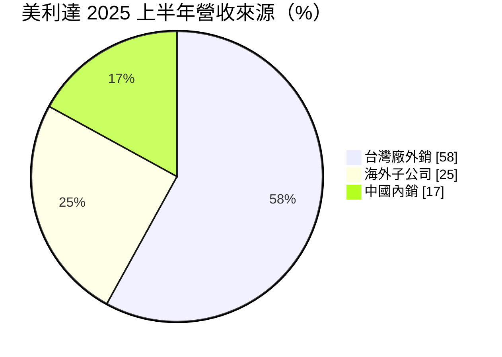
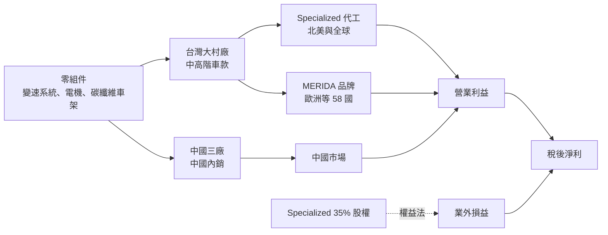
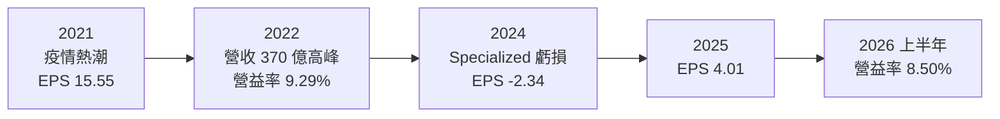
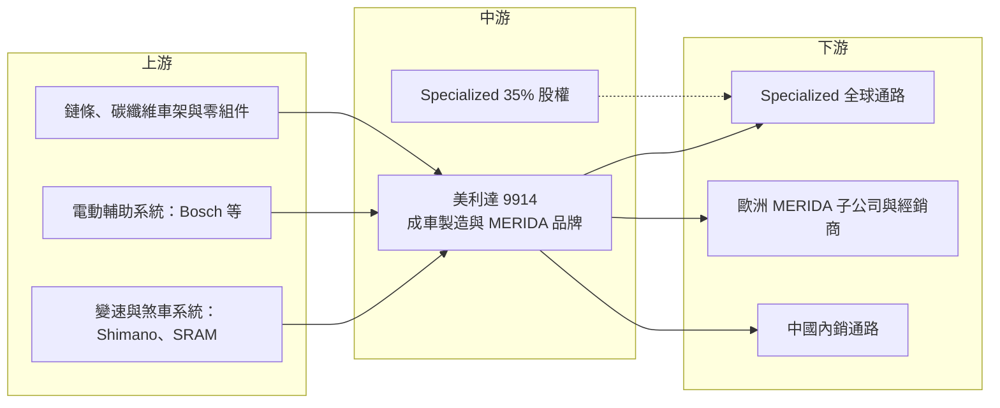

# 9914 美利達

> 上市｜[[產業索引-運動休閒|運動休閒]]｜上市（櫃）日期 1992/09/30

# 第一章：企業模式與商業藍圖

> [!info] 撰寫說明
> 本文由 Claude 依公開資料整理，架構比照 [[2330台積電]] 的四章研究，資料截至 2026-10-08。財務數字來源：Goodinfo 年度經營績效、證交所開放資料（基本資料、資產負債、綜合損益、營益分析、股利）、富果研究 2025 年法說會整理、股感、優分析；產業描述為整理性內容，尚未逐條比對原始文件。#待校對

台灣是全球高階自行車的製造中心，美利達與巨大是其中最具代表性的兩家公司。本章針對美利達工業（股票代號：9914，以下簡稱美利達）的商業模式進行定性分析，說明它如何同時經營自有品牌與替美國品牌 Specialized 代工，以及這種「品牌加代工加轉投資」的結構，如何讓它的獲利在疫情前後大起大落。

## 一、核心定位：自有品牌與代工並行的中高階自行車製造商

美利達成立於 1972 年，總部位於彰化大村，1992 年上市，依證交所開放資料實收資本額約 29.9 億元。依股感整理，美利達是台灣第二大自行車製造商，自行車成車製造與銷售占營收超過 95%。

美利達的定位有三個特點：

* **品牌與代工並行：** 美利達有自有品牌「MERIDA」，在全球 58 個國家銷售，但不在北美銷售（富果研究整理）。同時，美利達也替美國高階品牌 Specialized 代工，依股感整理，目前代工比重高於自有品牌。
* **持有最大客戶 35% 股權：** 美利達持有 Specialized 35% 股權，Specialized 只從事品牌與行銷，生產委由美利達與東南亞業者負責，同時也是美利達最大的客戶（股感）。這種「既是股東、又是供應商」的關係，讓美利達同時賺取代工利潤與品牌獲利，但也讓它的業外損益高度依賴 Specialized 的經營狀況。
* **歐洲為最重要的市場：** 台灣廠外銷歐洲的比重超過 55%，主要銷往西歐與南歐。歐洲是全球高階自行車與[[電動輔助自行車]]最成熟的市場，消費者願意為品質與品牌付出較高價格。

## 二、終端應用與產品板塊

依富果研究整理的 2025 年 8 月法說會資料，2025 年上半年集團營收依銷售來源區分如下：

* **台灣廠外銷：** 台灣大村廠負責中高階車款，包括碳纖維公路車與電動輔助登山車（[[eMTB]]）。2025 年前三季台灣廠外銷歐洲的出貨中，公路車與 eMTB 合計占數量 69%。台灣廠出貨的單價高、技術複雜，是美利達的獲利核心。
* **海外子公司：** 美利達在歐洲設有銷售子公司，在德國設有研發與行銷中心，並有一條生產線。子公司負責品牌的通路銷售，比重從 2024 年的 18% 提升到 25%。
* **中國內銷：** 中國三座工廠（江蘇、山東、深圳）有 98% 以上的產能供應中國內銷，比重從 2024 年的 32% 降到 17%，反映中國自行車市場在疫情熱潮後明顯降溫。

電動輔助自行車是美利達過去十年最重要的成長動能。依股感整理，美利達電動自行車銷量從 2014 年約 7 千台成長到 2018 年約 14.5 萬台。電輔車單價遠高於傳統自行車，帶動平均單價與營收規模同步提升。

## 三、資本轉化邏輯：接單生產、品牌加值、轉投資放大

* **組裝為主的製造模式：** 自行車的關鍵零件如變速系統、電動輔助系統多由 Shimano、SRAM、Bosch 等專業廠商供應，成車廠負責車架設計、組裝與品質控管。美利達的附加價值在於車架設計、碳纖維製程與大量組裝的品質一致性。
* **訂單前置期與產能：** 依公司說明，台灣廠訂單前置期已恢復到疫情前的 90 至 120 天。前置期縮短代表供應鏈恢復正常，但也代表品牌商可以更靈活地下單，不再像疫情期間提前大量備貨。
* **轉投資放大獲利波動：** 美利達透過[[權益法]]認列 Specialized 35% 的損益。景氣好時，Specialized 的獲利會讓美利達 EPS 遠高於本業水準；景氣差時，Specialized 的虧損與減損會直接拖累美利達。2024 年關聯企業投資損失約 40.5 億元，使當年 EPS 變成 -2.34 元（優分析）。

## 四、企業長期藍圖：電輔車與歐洲市場

* **電動輔助自行車：** 歐洲電輔車市場已成為自行車產業的主要成長來源，美利達的 eMTB 與電輔公路車是台灣廠的出貨主力。電輔車需要整合電機、電池與車架設計，技術門檻高於傳統自行車。
* **品牌通路強化：** 美利達在德國舉辦新車發表、擴大歐洲子公司的銷售比重。品牌通路的毛利高於代工，子公司營收比重提高有助於整體獲利率。
* **與 Specialized 的長期關係：** Specialized 在 2025 年第二季轉虧為盈，美利達與 Specialized 改為每季檢視財報，降低一次性認列大額損失的風險（富果研究整理）。Specialized 能否恢復穩定獲利，是美利達長期 EPS 的關鍵。
* **中國策略調整：** 中國市場在疫情熱潮後萎縮，美利達的中國工廠以內銷為主，未來規模將隨中國市場需求調整。

# 第二章：護城河深度與競爭優勢

自行車是成熟產業，但高階自行車與電輔車的設計、品質與品牌仍有明顯門檻。本章分析美利達的競爭優勢、主要對手，以及這些優勢在產業週期中能守住多少。

## 一、護城河的核心組成要素

* **與 Specialized 的綁定關係：** 美利達持有 Specialized 35% 股權並是其主要代工廠，這種股權加訂單的關係讓雙方合作非常穩定。Specialized 是全球高階自行車的領導品牌之一，美利達因此能持續取得高單價車款的訂單。
* **高階製造能力：** 碳纖維車架、電輔車整合與大量組裝的品質一致性，需要多年的製程經驗與供應鏈管理能力。台灣自行車產業聚落完整，零件供應商集中在中部，讓美利達可以快速開發與生產。
* **自有品牌與歐洲通路：** MERIDA 品牌在歐洲經營多年，並有自己的銷售子公司與研發中心。品牌知名度與經銷網路需要長時間累積，新進者難以快速複製。
* **財務體質：** 美利達保留盈餘約 149 億元（證交所資產負債開放資料，2026 年第二季底），負債比率不高，能在產業低谷時維持營運與配息。

## 二、全球主要競爭對手格局

| 對手 | 地區 | 經營模式 | 與美利達的關係 |
|---|---|---|---|
| [[9921巨大]] | 台灣 | 自有品牌 Giant 為主，兼營代工，全資子公司通路 | 全球最大自行車廠之一，最直接的對手 |
| Trek | 美國 | 高階自行車品牌 | 與 Specialized 在北美高階市場競爭 |
| Cannondale、Canyon 等 | 美國、德國 | 高階品牌與直營電商 | 在歐美高階市場競爭 |
| 歐洲電輔車品牌 | 歐洲 | 電輔車品牌與在地組裝 | 在歐洲電輔車市場競爭 |
| 中國與東南亞代工廠 | 亞洲 | 中低價自行車代工 | 以成本優勢競爭中低階訂單 |

## 三、優勢轉化：守得住與守不住

* **守得住：** 歐洲中高階自行車與電輔車市場，以及 Specialized 的高階代工訂單。這些產品重視設計、品質與品牌，美利達的技術與合作關係可以支撐長期訂單。
* **守不住：** Specialized 的經營波動與中國市場需求。美利達無法控制 Specialized 的庫存與經營決策，2024 年的大額損失就是代價。中國市場在熱潮退去後明顯萎縮，內銷比重從 32% 降到 17%。
* **觀察重點：** 第一，Specialized 能否維持穩定獲利，讓業外損益不再大幅拖累 EPS；第二，歐洲電輔車市場能否恢復成長；第三，自有品牌與子公司的營收比重能否持續提高。這三點決定美利達的 ROE 能否回到疫情前的水準。

# 第三章：財務體質與盈利規模

資料日期：2026-10-08。數字取自 Goodinfo 年度經營績效、證交所開放資料與富果研究法說會整理，表格是撰寫當時的快照；最新月營收、毛利率、累計 EPS 由自動排程寫在本筆記的屬性欄位（月營收、毛利率、累計EPS 等）。#待校對

財務報表是檢驗護城河是否真實存在的最終標準。本章用多年度的三率、ROE 與資本報酬，檢視美利達在疫情熱潮、庫存調整與轉投資損失之間的獲利品質。

## 一、獲利能力的基石：三率

| 年度 | 營收（新台幣） | [[毛利率]] | [[營業利益率]] | EPS（元） | [[ROE]] |
|---|---|---|---|---|---|
| 2019 | 282 億 | 13.2% | 6.06% | 8.37 | 18.1% |
| 2020 | 271 億 | 15.0% | 6.96% | 13.36 | 26.4% |
| 2021 | 294 億 | 13.3% | 5.41% | 15.55 | 27.1% |
| 2022 | 370 億 | 15.4% | 9.29% | 11.34 | 17.2% |
| 2023 | 273 億 | 20.6% | 12.4% | 5.66 | 8.35% |
| 2024 | 296 億 | 18.0% | 10.2% | -2.34 | -3.66% |
| 2025 | 268 億 | 14.8% | 6.22% | 4.01 | 6.07% |
| 2026 上半年 | 123 億 | 17.88% | 8.50% | 2.15 | 未查得 |

註：2019 至 2025 年取自 Goodinfo；2026 上半年取自證交所營益分析與綜合損益開放資料。

* **[[毛利率]]：** 美利達毛利率長期在 13% 至 15%，2023 年一度升到 20.6%。2023 至 2024 年的高毛利可能與產品組合及集團內部交易的未實現損益調整有關（推估），公司法說會指出財報毛利率與未調整前的毛利率存在差異（2025 年上半年未調整為 16%，財報揭露為 19%）。投資人比較年度毛利率時，需要留意這項會計因素。
* **[[營業利益率]]：** 2022 至 2024 年營業利益率約 9% 至 12%，是近年高點；2025 年降到 6.22%，2026 年上半年回升到 8.50%。
* **業外損益決定 EPS：** 2020 至 2021 年 EPS 達 13 至 15 元，遠高於本業貢獻，主因是 Specialized 在疫情熱潮中大賺；2024 年業外虧損約 37.7 億元（優分析），讓本業仍有獲利的美利達 EPS 變成負數。美利達的 EPS 波動，主要來自 Specialized 而不是本業。
* **營收趨勢：** 2025 年營收 268 億元，與 2019 至 2020 年水準相當，5 年年複合成長率約 -0.2%（推算）。2022 年 370 億元的高峰屬於疫情熱潮，之後經歷了全產業的庫存調整。

## 二、[[ROE]]：資本效率

2021 至 2025 年平均 ROE 約 11.0%（推算），但年度差距極大，從 2021 年的 27.1% 到 2024 年的 -3.66%。疫情前的 2019 年 ROE 為 18.1%，代表在 Specialized 正常獲利時，美利達的資本效率相當不錯。2026 年第二季底每股淨值約 65.24 元，股價淨值比約 1.01 倍（證交所開放資料，2026 年 10 月初），反映市場對 Specialized 復甦與歐洲市場的觀望態度。

## 三、資本支出、自由現金流與股利

自行車組裝屬於相對輕資產的製造業，[[CapEx]]以廠房維護與產線設備為主，金額不大。2025 年第二季庫存較 2024 年底減少 19%，存貨下降會釋出營運資金，有助於現金流（富果研究整理）。年度[[自由現金流]]的具體數字未查得，但從公司在 2024 年虧損下仍規劃每股 4 元現金股利來看，現金部位相當充裕（推估）。

股利方面，2025 年度配發現金股利 2.8 元（證交所股利資料），以 EPS 4.01 元計算[[配息率]]約 70%（推算）。公司章程規定股東股利為當年度可分配盈餘的 5% 至 60%，且公司在 2024 年 EPS 為負時仍維持配息，顯示管理層重視股利穩定性，並以累積的未分配盈餘支應。

## 四、[[ROIC]] 與 [[WACC]]：價值創造利差

**ROIC 推算：** 2025 年營業利益約 16.7 億元（營收 268 億元乘以營業利益率 6.22%，推算），扣除 20% 稅率後約 13.3 億元。2026 年第二季底權益總計約 199.6 億元，總負債約 158.1 億元，假設有息負債約 60 億元（推估），投入資本約 260 億元，ROIC 約 5.1%（推算）。以同樣方法估算 2022 年高峰（營業利益約 34.4 億元），ROIC 約 11%（推算，資本基礎以近期數字代替）。需要注意，投入資本中包含 Specialized 等轉投資，若只計算自行車製造本業使用的資產，本業 ROIC 會較高。

**WACC 推算：** 假設台灣 10 年期公債殖利率 1.75%、市場風險溢酬 6%、β 取自行車業常見值 0.8（推估），股東權益成本約 6.55%。負債成本假設 2.5%，稅後約 2.0%；以帳面價值計，權益約占 77%、負債約占 23%，WACC 約 5.5%（推算）。

**結論：** 在 2020 至 2023 年的景氣高峰，美利達的 ROIC 明顯高於 WACC，屬於創造價值的期間；2024 至 2025 年產業庫存調整加上 Specialized 虧損，ROIC 大致與資金成本打平。這代表美利達是典型的景氣循環股：本業在正常年份可以小幅創造價值，但整體股東報酬高度取決於 Specialized 的經營與自行車產業的週期。

# 第四章：總體風險與地緣政治

任何企業都無法脫離宏觀環境獨立存在。自行車產業在疫情期間經歷了需求暴增與隨後的庫存崩跌，這種劇烈循環是美利達最主要的風險來源。本章分析它必須長期面對的風險。

## 一、地緣政治風險

* **美國關稅：** 台灣適用美國對等關稅 20%，232 條款涉及電動自行車的鋼製零件（富果研究整理）。美利達本身不在北美銷售自有品牌，但 Specialized 的美國業務會受到關稅與消費者反應影響，進而影響美利達的代工訂單與業外收益。
* **中國產能：** 中國三廠以內銷為主，受中國市場需求與兩岸關係影響。
* **歐洲貿易政策：** 歐盟對中國自行車與電輔車課徵反傾銷稅，對台灣業者是相對有利的因素，但政策若改變，競爭格局也會改變。

## 二、產業週期與市場結構風險

* **疫情後的庫存循環：** 2020 至 2022 年自行車需求暴增，品牌與經銷商大量備貨；2023 至 2024 年需求回落，全產業陷入庫存調整。這是典型的[[長鞭效應]]，代工廠的訂單波動遠大於終端銷售。
* **中國市場萎縮：** 中國內銷比重從 32% 降到 17%，熱潮退去後的需求恢復不確定。
* **電輔車成長放緩：** 歐洲電輔車市場已相當成熟，若成長放緩，美利達最重要的成長動能會減弱。

## 三、營運環境的隱性風險

* **Specialized 經營風險：** 美利達持有 35% 股權卻無控制權，無法主導 Specialized 的庫存與經營決策，2024 年約 40.5 億元的投資損失是最明顯的例子。
* **匯率：** 外銷以美元與歐元計價，新台幣升值會造成匯兌損失。2025 年第二季匯兌損失約 5.3 億元（富果研究整理），就是新台幣急升造成的。
* **零組件供應：** 變速系統與電動輔助系統集中在少數國際大廠，供應短缺或漲價會影響出貨與成本。
* **客戶集中：** Specialized 是最大客戶，若它把訂單轉移到東南亞代工廠，美利達台灣廠的產能利用率會受到影響。

## 四、科技或法規演進

電輔車的技術演進集中在電機、電池與智慧連網，這些核心技術多掌握在 Bosch、Shimano 等系統供應商手中，成車廠需要持續整合新系統，才能維持產品競爭力。歐盟的電池法規要求電池可追溯、可回收並揭露碳足跡，將提高電輔車的合規成本。另一方面，各國推動低碳交通、自行車道建設與電輔車購置補助，是自行車產業長期的結構性支撐。美利達能否在電輔車的設計整合與品牌價值上持續領先，是它在下一個十年的核心課題。

# 專有名詞解析

## 金融

- **[[權益法]]**：持有被投資公司 20% 至 50% 股權或具重大影響力時，依持股比例認列其損益的會計方法。
- **[[業外收益]]**：本業以外的收入，例如投資收益、利息與匯兌利益，波動較大且不一定能持續。
- **[[配息率]]**：現金股利占每股盈餘的比例，用來觀察公司把多少獲利分配給股東。
- **[[自由現金流]]**：營業活動現金流減去資本支出，代表企業可自由用於配息、還債或併購的現金。
- **[[長鞭效應]]**：終端需求的小幅變動，沿供應鏈往上游傳遞時被逐級放大，造成上游庫存與訂單劇烈波動。
- **[[毛利率]]**：營業毛利占營收的比例，反映產品或服務扣除直接成本後的獲利空間。
- **[[營業利益率]]**：營業利益占營收的比例，反映本業扣除營業費用後的獲利能力。
- **[[ROE]]**：股東權益報酬率，稅後淨利除以股東權益，衡量公司用股東資金賺錢的效率。
- **[[ROIC]]**：投入資本報酬率，稅後營業利益除以股東權益與有息負債之和，衡量所有投入資本的報酬。
- **[[WACC]]**：加權平均資金成本，依權益與負債比重加權的資金成本，是 ROIC 需要超越的門檻。

## 產業

- **[[電動輔助自行車]]**：以電機在騎乘者踩踏時提供輔助動力的自行車，需要踩踏才會啟動，是歐洲自行車市場的主要成長來源。
- **[[eMTB]]**：電動輔助登山車，結合電動輔助系統與登山車設計，適合越野與山區騎乘，單價高。
- **[[ODM]]**：原廠委託設計製造，代工廠負責產品設計與生產，品牌商負責行銷與銷售。
- **[[自有品牌]]**：企業以自己的品牌名稱銷售產品，需自行負擔行銷與通路，但可取得較高毛利。
- **[[訂單前置期]]**：從品牌下單到工廠交貨所需的時間，前置期拉長通常代表產能吃緊、需求旺盛。
- **[[反傾銷]]**：進口國對以低於正常價格銷售的進口商品加徵額外關稅，以保護本國產業。

# 核心供應鏈

## 1. 上游：零組件供應商
- 變速與煞車系統：Shimano、SRAM
- 電動輔助系統：Bosch 等
- 鏈條：[[5306桂盟]]（台灣自行車零組件同業，個別採購關係未查得）
- 碳纖維材料與車架：[[4536拓凱]] 等（同上）

## 2. 中游：美利達
- 台灣大村廠：中高階公路車、電輔車與 eMTB
- 中國三廠：江蘇、山東、深圳，供應中國內銷
- 德國研發與行銷中心

## 3. 下游：品牌與通路
- 代工與轉投資：Specialized（持股 35%，最大客戶）
- MERIDA 品牌：歐洲子公司與 58 國經銷商
- 中國內銷通路

## 4. 同業競爭
- 國內：[[9921巨大]]
- 國際：Trek、Cannondale、Canyon 與歐洲電輔車品牌

## 最新新聞
<!-- news:start -->
<!-- news:end -->

## 相關連結
- [公開資訊觀測站](https://mopsov.twse.com.tw/mops/web/t05st03?step=1&firstin=1&co_id=9914)
- [Goodinfo](https://goodinfo.tw/tw/StockDetail.asp?STOCK_ID=9914)
- [Yahoo 股市](https://tw.stock.yahoo.com/quote/9914)
- [鉅亨網新聞](https://www.cnyes.com/twstock/9914/news)
