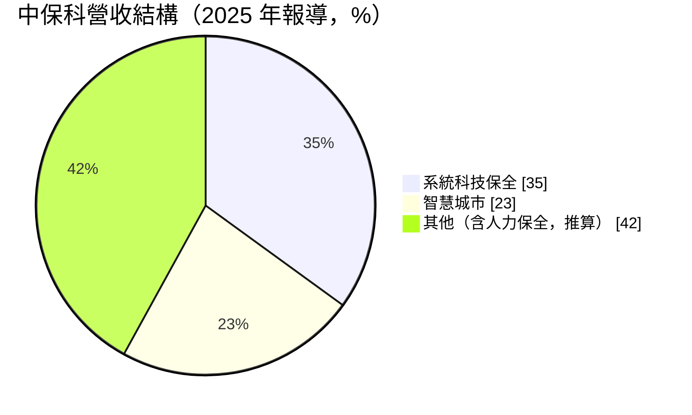
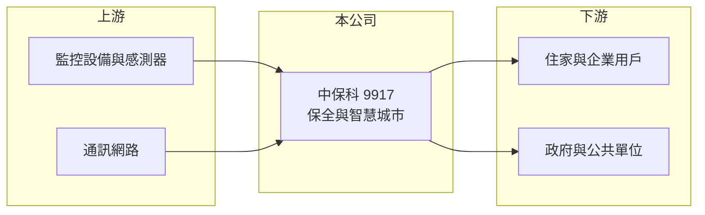

# 9917 中保科

> 上市｜[[產業索引-其他業|其他業]]｜上市（櫃）日期 1993/12/08

# 第一章：企業模式與商業藍圖

> [!info] 撰寫說明
> 精簡版，由 Claude 依公開資料整理，架構比照 [[2330台積電]]，資料截至 2026-10-07。來源：winvest.tw 營收快訊、nstock.tw 中保科公司概況、旺得富理財網（中時）。營收比重為 2025 年報導數字。#待校對

中保科是台灣最大的保全業者之一，正由人力保全轉向科技與[[智慧城市]]服務。

- **核心業務：** 提供[[系統保全]]、[[駐衛保全]]與智慧城市相關服務，1977 年設立、1993 年上市，總部在台北南港。
- **營收結構：** 依 2025 年報導，系統科技保全占營收 35%、智慧城市占 23%，其餘為人力保全等業務（推算）。

- **營運據點：** 以台灣為主，據點細節本次未查到。
- **長期方向：** 公司目標 2027 年系統保全占比提高到 38%、智慧城市到 30%，以科技取代人力。

# 第二章：護城河深度與競爭優勢

中保科的護城河來自用戶規模與長期合約。

- **競爭優勢：** 系統保全客戶採月費制，合約續約率高，收入穩定；全台服務網絡難以複製（推估）。
- **主要對手：** [[9925新保]] 與其他中小型保全公司。
- **觀察重點：** 智慧城市與 AI 監控業務的成長速度，以及人力成本上升對毛利率的影響。

# 第三章：財務體質與盈利規模

資料日期：2026-10-07，表格是撰寫當時的快照；最新月營收、毛利率、累計 EPS 由自動排程寫在本筆記的屬性欄位（月營收、毛利率、累計EPS 等）。#待校對

中保科營收穩定成長，獲利與配息穩健。

- **營收規模：** 2026 年 8 月營收 16.36 億元，年增 4.4%；1 至 8 月累計 127.94 億元。
- **獲利：** 2026 年第二季 EPS 1.75 元，季增 9.38%；[[毛利率]] 32.96%、[[營業利益率]] 17.33%。2025 年前三季 EPS 4.99 元。
- **財務特色：** 資本額 47.38 億元；2025 年度配發現金股利 5.7 元與股票股利 0.5 元，以撰寫時股價計算的[[殖利率]]約 4.9%。

# 第四章：總體風險與地緣政治

中保科的風險多半與人力成本和法規有關。

- **產業週期：** 屬於民生服務業，景氣循環影響小，但新建案與企業擴點速度會影響新增用戶。
- **營運風險：** 基本工資調漲與缺工推升人力保全成本；智慧城市標案毛利率不一。
- **其他風險：** 個資保護與監控相關法規、資安事件，以及政府預算對智慧城市標案的影響。

# 專有名詞解析

## 應用

- **[[智慧城市]]**：以物聯網、影像與資料平台管理交通、停車、公共安全等城市服務。

## 金融

- **[[毛利率]]**：毛利占營收的比例，反映產品定價能力與生產成本控制。
- **[[殖利率]]**：每股現金股利除以股價，衡量以現價買進可領到的現金報酬。

## 產業

- **[[系統保全]]**：以感應器、監視器與連線中心遠端監控住家或企業，異常時派員處理，採月費收費。
- **[[駐衛保全]]**：派保全人員常駐在社區或大樓執行門禁、巡邏與安全管理。

# 核心供應鏈

- 上游：監控攝影機、感測器與通訊網路供應商（推估）
- 下游／客戶：住家、企業與政府機關，客戶名稱未揭露
- 同業：[[9925新保]]

## 最新新聞
<!-- news:start -->
<!-- news:end -->

## 相關連結
- [公開資訊觀測站](https://mopsov.twse.com.tw/mops/web/t05st03?step=1&firstin=1&co_id=9917)
- [Goodinfo](https://goodinfo.tw/tw/StockDetail.asp?STOCK_ID=9917)
- [Yahoo 股市](https://tw.stock.yahoo.com/quote/9917)
- [鉅亨網新聞](https://www.cnyes.com/twstock/9917/news)
