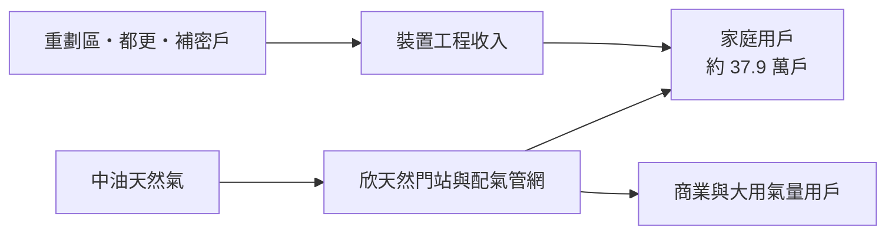
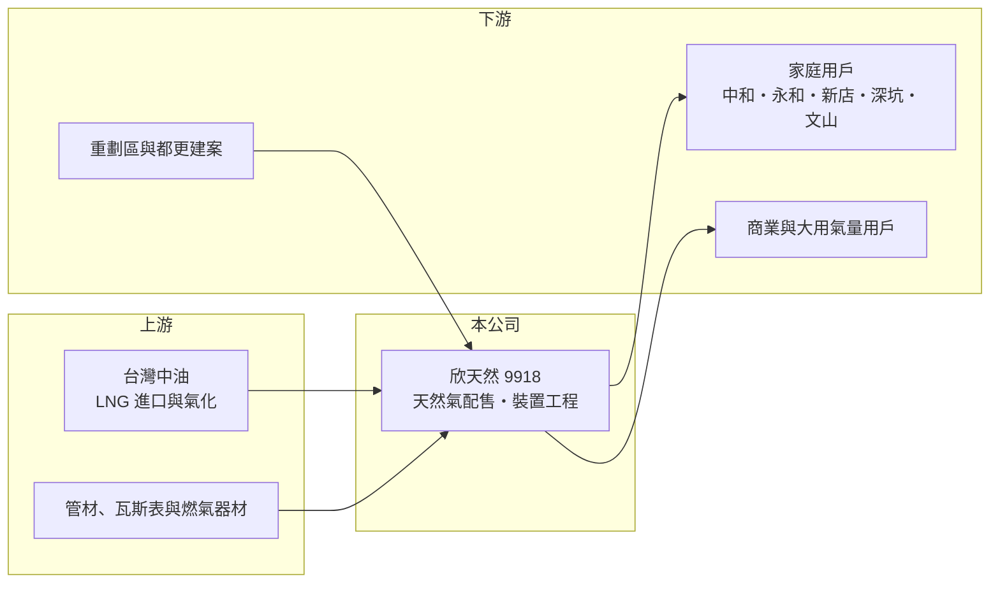

# 9918 欣天然

> 上市｜[[產業索引-油電燃氣業|油電燃氣業]]｜上市（櫃）日期 1994/04/26

# 第一章：企業模式與商業藍圖

> [!info] 撰寫說明
> 本文由 Claude 依公開資料整理，架構比照 [[2330台積電]] 的四章研究，資料截至 2026-10-08。財務數字來源：Goodinfo 年度經營績效頁、富果研究 2026 年 3 月法說會整理（AI 摘要）、富果研究 [[9908大台北]] 2026 年 10 月法說會整理（轉投資關係）、證交所開放資料（基本資料、2026 年第二季資產負債與綜合損益、股利、營益分析）；產業描述為整理性內容，尚未逐條比對原始文件。#待校對

在評估單一個股的長期投資價值時，首要步驟是拆解企業的底層獲利邏輯。本章說明欣欣天然氣（股票代號：9918，以下簡稱欣天然）這家服務新北市南區與台北市文山區的瓦斯公司，如何以穩定的用戶基礎，維持數十年年年配息的紀錄。

## 一、核心定位：雙北南側的天然氣公用事業

欣天然成立於 1971 年，1994 年上市，實收資本額約 18.1 億元，董事長為陳何家。公司是[[公用天然氣事業]]，依主管機關核准，在特定區域以導管供應天然氣，並提供瓦斯管線與安全設備的設計與施工服務。

依富果研究整理的 2026 年 3 月法說會資料，欣天然的[[特許經營區域]]包括新北市中和、永和、新店、深坑四區，以及台北市文山區。這是雙北人口最密集的住宅區之一，中永和更是全台人口密度最高的地區。截至 2025 年底，總供氣戶數近 37.9 萬戶，公司預計 2026 年突破 38 萬戶；2025 年售氣量約 1.1 億度，較前一年微增約 0.4%。依 [[9908大台北]] 的法說會資料，大台北以[[權益法]]持有欣天然股權，兩家公司同屬一個瓦斯業投資網絡。

## 二、業務板塊：售氣與裝置工程

欣天然的收入由售氣收入與[[裝置工程收入]]組成，本次查得的資料未揭露兩者的比重。

* **售氣收入：** 以家庭用戶為主，另有餐飲、商業與部分大用氣量用戶。家庭用氣主要是烹飪與熱水，需求穩定，受景氣影響小。
* **裝置工程收入：** 來自新建案、重劃區、都更案與既有社區的「補密戶」（同一棟大樓中原本未接管的住戶）。新店、中和的重劃區與都更案，是近年新用戶的主要來源。

## 三、資本轉化邏輯：高密度住宅區的收費站

欣天然的商業模式和其他都會區瓦斯公司相同：在特許區域內經營一套管網，每年穩定收取售氣價差與裝置費用。高密度住宅區的優勢在於每公里管線可以服務很多用戶，管網的投資效率高。欣天然的售氣量成長緩慢（2025 年僅增 0.4%），但毛利率長期穩定在 27% 至 30%，代表獲利主要來自穩定的價差與裝置收入，而不是售氣量的擴張。

## 四、企業長期藍圖

欣天然的長期策略包括三個方向。第一是用戶拓展：聚焦重劃區與都更新建案、既有社區補密戶，以及大用氣量用戶。第二是安全強化：持續汰換老舊管線（近年實際汰換長度均超過目標），推廣[[微電腦瓦斯表]]（2025 年底安裝 26.9 萬戶、普及率約 71%），並建置管線設備人員管理資訊系統與應變管理中心。第三是數位服務：推廣電子帳單，2025 年底申請戶數近 3.3 萬戶。公司自 1994 年上市以來年年配息，經營風格穩健保守。

# 第二章：護城河深度與競爭優勢

本章分析欣天然作為區域特許公用事業的競爭優勢，以及成熟住宅區的成長限制。

## 一、護城河的核心組成要素

* **法定區域獨占：** 中和、永和、新店、深坑與文山區的天然氣供應由欣天然獨家經營，其他業者不能鋪設平行管線。
* **管網的沉沒成本：** 高密度住宅區的地下管線歷經數十年埋設，道路挖掘與施工成本極高，不可能被重建。
* **用戶轉換成本：** 住戶的熱水器與瓦斯爐已配合天然氣設計，改用其他能源需要更換設備。
* **高密度帶來的效率：** 中永和的人口密度讓每公里管線的用戶數很高，管網投資報酬優於低密度地區。

## 二、主要競爭對手與替代能源

| 對手／替代者 | 定位 | 對欣天然的影響 |
|---|---|---|
| 電力（電熱水器、熱泵、電磁爐） | 家庭電氣化 | 新建案若採全電化，會降低接管率 |
| 桶裝液化石油氣 | 未接管住戶 | 補密戶的主要替代對象 |
| [[9908大台北]]、[[8917欣泰]]、[[8908欣雄]] 等同業 | 不同特許區域 | 不直接競爭；大台北同時是欣天然的法人股東 |

## 三、優勢轉化：守得住、守不住與觀察重點

* **守得住：** 既有約 38 萬戶用戶的售氣收入與管網地位。
* **守不住：** 售氣量的長期成長。區域已高度開發，2025 年售氣量只增加 0.4%。
* **觀察重點：** 第一，用戶數能否持續增加；第二，新店、中和重劃區與都更案的接管率；第三，業外收益的穩定性。

# 第三章：財務體質與盈利規模

資料日期：2026-10-08。數字取自 Goodinfo 年度經營績效頁、富果研究法說會整理與證交所開放資料，表格是撰寫當時的快照；最新月營收、毛利率、累計 EPS 由自動排程寫在本筆記的屬性欄位（月營收、毛利率、累計EPS 等）。#待校對

財務報表是檢驗護城河是否真實存在的最終標準。本章用多年度的三率、ROE 與資本報酬，檢視欣天然的獲利穩定度。

## 一、獲利能力的基石：三率

| 年度 | 營收（新台幣） | [[毛利率]] | [[營業利益率]] | EPS（元） | [[ROE]] |
|---|---|---|---|---|---|
| 2019 | 21.6 億 | 21.5% | 10.4% | 1.47 | 8.86% |
| 2020 | 19.9 億 | 27.2% | 15.5% | 1.84 | 10.8% |
| 2021 | 17.9 億 | 27.6% | 14.6% | 1.92 | 11.0% |
| 2022 | 19.5 億 | 29.4% | 17.0% | 0.81 | 4.70% |
| 2023 | 19.3 億 | 29.2% | 15.3% | 2.00 | 11.6% |
| 2024 | 19.9 億 | 29.7% | 16.1% | 2.23 | 12.3% |
| 2025 | 20.5 億 | 29.8% | 16.1% | 1.61 | 8.63% |
| 2026 上半年 | 11.7 億 | 31.96% | 18.66% | 1.88 | 未查得 |

* **本業高度穩定：** 2020 至 2025 年毛利率 27% 至 30%、營業利益率 15% 至 17%，幾乎沒有景氣循環，這是典型的公用事業特性。
* **EPS 波動來自業外：** 本業穩定，但 EPS 從 2022 年的 0.81 元到 2024 年的 2.23 元差距很大，主要來自業外收益的變化。2025 年法說會說明營業外收益減少是受匯率與關稅等因素影響；2026 年上半年業外收入約 1.61 億元，使稅後純益率達 28.64%，遠高於營業利益率 18.66%（證交所營益分析），EPS 1.88 元已超過 2025 年全年。評估長期價值時，應以營業利益為主，業外收益視為較不穩定的加分。
* **營收成長緩慢：** 2021 至 2025 年營收從 17.9 億元增加到 20.5 億元，年複合成長率約 3.4%（推算）。

## 二、[[ROE]]：資本效率

2021 至 2025 年平均 ROE 約 9.6%（推算），在公用事業中屬中等水準。2026 年第二季底權益約 33.8 億元、負債約 27.2 億元（證交所開放資料），負債比約 45%；瓦斯公司的負債多為用戶保證金、預收工程款等營運負債，實際有息負債比例未查得。

## 三、資本支出、自由現金流與股利

欣天然的資本支出以管線汰換、新區域管網延伸與瓦斯表更新為主，屬於可預期的維護與成長型支出，本業自由現金流長期為正（推估）。股利方面，自 1994 年上市以來年年配息，2025 年度配發現金股利 1.5 元，以 EPS 1.61 元計算配發率約 93%（推算）；Goodinfo 統計歷年一般平均現金股利約 0.97 元、股票股利約 0.35 元。

## 四、[[ROIC]] 與 [[WACC]]：價值創造利差

**ROIC 推算：** 2025 年營業利益 3.30 億元（法說會資料），扣除 20% 稅率後約 2.64 億元。2026 年第二季底權益約 33.8 億元，假設有息負債約 3 億元（負債多為營運負債，推估），投入資本約 36.8 億元，ROIC 約 7.2%（推算）。

**WACC 推算：** 假設台灣 10 年期公債殖利率 1.75%、市場風險溢酬 6%、β 取公用事業常見值 0.5，股東權益成本約 4.75%。負債比重低（約 8%），稅後負債成本約 2.0%，WACC 約 4.5%（推算）。

**結論：** 欣天然 ROIC 約 7%，高於約 4.5% 的資金成本，利差約 2.5 至 3 個百分點，屬於穩定但不大的價值創造。這個利差由特許區域與高密度用戶支撐，只要價差政策與用戶基礎不變，可以長期維持；但售氣量成長緩慢，利差也難以明顯擴大。

# 第四章：總體風險與地緣政治

任何企業都無法脫離宏觀環境獨立存在。本章分析欣天然長期必須面對的能源政策、市場結構與營運風險。

## 一、能源政策

* **價格管制：** 公用天然氣售價與配氣價差受經濟部規範，政策若壓縮價差，獲利會直接受影響。
* **淨零與建築電氣化：** 台灣 2050 淨零路徑下，新建案若普遍採用熱泵熱水器與電磁爐，天然氣的新接管率與每戶用量都會下降，這是十年以上尺度的主要風險。

## 二、市場結構

* **人口與用量：** 中永和等地區已高度開發，人口成長有限，小家庭化與外食讓每戶用量下降，2025 年售氣量只成長 0.4%。
* **業外收益波動：** 業外收益受匯率、金融資產評價等因素影響，造成 EPS 年度波動。

## 三、營運環境的隱性風險

* **管線安全：** 高密度住宅區發生瓦斯外洩或爆炸，後果嚴重。老舊管線汰換與緊急應變能力是長期必要投入。
* **地震與天災：** 新店、深坑一帶的山坡地與地質條件，增加地下管線受損的風險（推估）。

## 四、科技演進

微電腦瓦斯表與數位服務提升安全與營運效率。長期來看，天然氣管網能否混入氫氣或[[生質甲烷]]，以及燃料電池等新應用能否發展，是公用天然氣事業面對淨零時代的轉型方向，目前仍在研究階段。

# 專有名詞解析

## 金融

- **[[權益法]]**：持股約兩成至五成的轉投資，依持股比例認列被投資公司損益的會計方法，收益列在業外。
- **[[ROIC]]**：投入資本報酬率，稅後營業利益除以股東權益與有息負債的合計，衡量本業對所有資金提供者的報酬。
- **[[WACC]]**：加權平均資金成本，依股東權益與負債的比重加權計算的資金成本，ROIC 高於它才代表創造價值。

## 產業

- **[[公用天然氣事業]]**：依法取得特定區域經營權，透過管線供應天然氣給家庭、商業與工業用戶的公司。
- **[[特許經營區域]]**：政府核定的獨家經營範圍，區內不允許其他業者另建管線競爭。
- **[[裝置工程收入]]**：新用戶接通天然氣時，瓦斯公司向用戶收取的管線安裝費用。
- **[[微電腦瓦斯表]]**：具異常偵測與自動遮斷功能的智慧瓦斯表，可提高用氣安全並支援遠端抄表。
- **[[生質甲烷]]**：由廚餘、畜牧廢棄物等有機物發酵產生的甲烷，可注入天然氣管網替代部分化石天然氣。

# 核心供應鏈

## 1. 上游：氣源與器材
- 台灣中油：天然氣唯一批發來源
- 管材、微電腦瓦斯表與燃氣器材供應商

## 2. 中游：欣天然本身與同業
- 法人股東：[[9908大台北]]（權益法投資）
- 天然氣同業：[[8917欣泰]]、[[8908欣雄]]

## 3. 下游：用戶
- 新北市中和、永和、新店、深坑與台北市文山區的家庭、商業用戶
- 重劃區、都更與新建案

## 最新新聞
<!-- news:start -->
<!-- news:end -->

## 相關連結
- [公開資訊觀測站](https://mopsov.twse.com.tw/mops/web/t05st03?step=1&firstin=1&co_id=9918)
- [Goodinfo](https://goodinfo.tw/tw/StockDetail.asp?STOCK_ID=9918)
- [Yahoo 股市](https://tw.stock.yahoo.com/quote/9918)
- [鉅亨網新聞](https://www.cnyes.com/twstock/9918/news)
