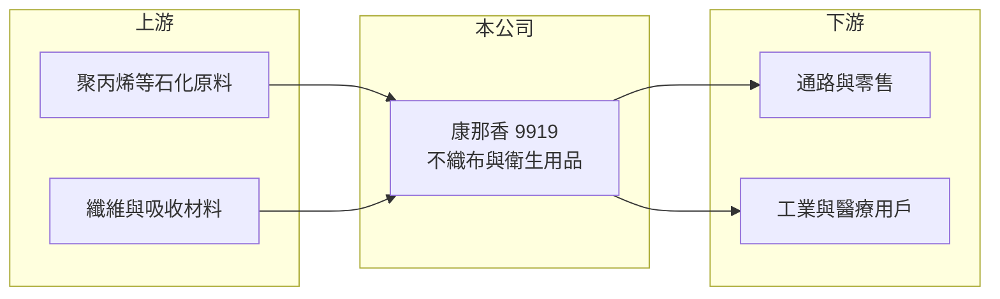

# 9919 康那香

> 上市｜[[產業索引-其他業|其他業]]｜上市（櫃）日期 1994/11/04

# 第一章：企業模式與商業藍圖

> [!info] 撰寫說明
> 精簡版，由 Claude 依公開資料整理，架構比照 [[2330台積電]]，資料截至 2026-10-07。來源：winvest.tw 營收快訊、nstock.tw 康那香公司概況、聯合新聞網。公開資料有限，產品營收比重與據點本次未查到。#待校對

康那香是[[不織布]]與家庭衛生用品製造商，目前處於虧損與轉型期。

- **核心業務：** 從事家庭及衛生用品製造、不織布生產與機器設備製造，1971 年成立。
- **營收結構：** 本次未查到不織布與衛生用品的比重；2026 年 8 月營收 2.26 億元，年增 12.17%。
- **營運據點：** 以台灣為主，近兩年進行廠區整合與產能優化，以降低固定成本。
- **長期方向：** 開發高階機能性不織布與環保產品，朝[[再生材料]]應用發展，並把市場由亞太延伸到歐美與海外華人市場。

# 第二章：護城河深度與競爭優勢

康那香在衛生用品市場面對國際品牌與大型同業的競爭。

- **競爭優勢：** 具備不織布上游材料與下游衛生用品的垂直整合能力（推估）。
- **主要對手：** 國內不織布同業 [[6504南六]]，以及國際衛生用品品牌。
- **觀察重點：** 公司預期 2026 年下半年轉型成果逐步顯現，毛利率能否脫離個位數是關鍵。

# 第三章：財務體質與盈利規模

資料日期：2026-10-07，表格是撰寫當時的快照；最新月營收、毛利率、累計 EPS 由自動排程寫在本筆記的屬性欄位（月營收、毛利率、累計EPS 等）。#待校對

康那香 2026 年上半年虧損擴大。

- **營收規模：** 2026 年 8 月營收 2.26 億元，年增 12.17%；4 至 6 月單月營收約 2.1 億元。
- **獲利：** 2026 年第二季 EPS 負 0.81 元，上半年累計負 1.32 元；第二季 [[毛利率]] 3.77%、[[營業利益率]] 負 24.07%。
- **財務特色：** 資本額 19.54 億元，2024 年度配發現金股利 0.2 元；第二季 ROE 負 8.14%。

# 第四章：總體風險與地緣政治

康那香的風險在於轉型能否及時止血。

- **產業週期：** 衛生用品屬民生必需品，需求穩定，但少子化讓嬰兒尿布市場縮小（推估）。
- **營運風險：** 毛利率極低且持續虧損，廠區整合期間的一次性費用可能延續。
- **其他風險：** 聚丙烯等石化原料價格波動、進口品牌價格競爭與匯率。

# 專有名詞解析

## 金融

- **[[毛利率]]**：毛利占營收的比例，反映產品定價能力與生產成本控制。
- **[[營業利益率]]**：營業利益占營收的比例，扣除營業費用後衡量本業獲利能力。

## 產業

- **[[不織布]]**：不經紡織、以纖維直接黏合或熱壓成型的布料，用於衛材、過濾與包裝。
- **[[再生材料]]**：以回收塑膠或纖維重新加工製成的原料，可降低碳排與原生料用量。

# 核心供應鏈

- 上游：聚丙烯等石化原料，例如 [[1301台塑]]（推估）
- 下游／客戶：零售通路與工業、醫療用不織布客戶，名稱未揭露
- 同業：[[6504南六]]

## 最新新聞
<!-- news:start -->
<!-- news:end -->

## 相關連結
- [公開資訊觀測站](https://mopsov.twse.com.tw/mops/web/t05st03?step=1&firstin=1&co_id=9919)
- [Goodinfo](https://goodinfo.tw/tw/StockDetail.asp?STOCK_ID=9919)
- [Yahoo 股市](https://tw.stock.yahoo.com/quote/9919)
- [鉅亨網新聞](https://www.cnyes.com/twstock/9919/news)
