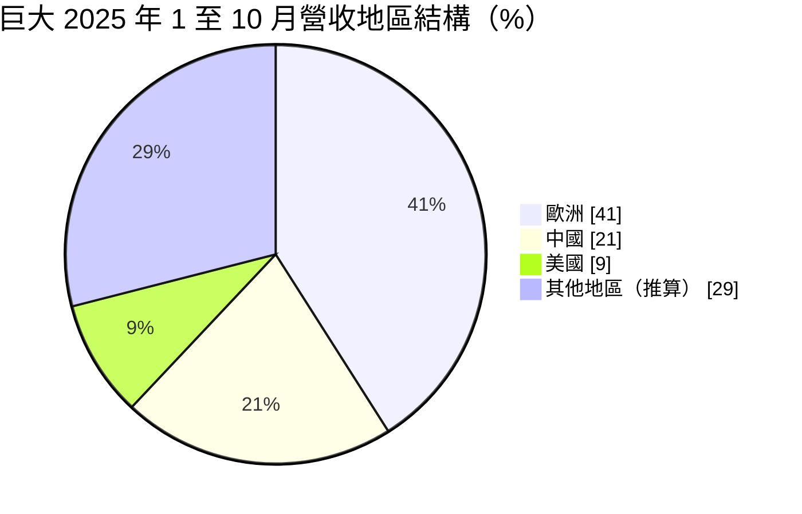
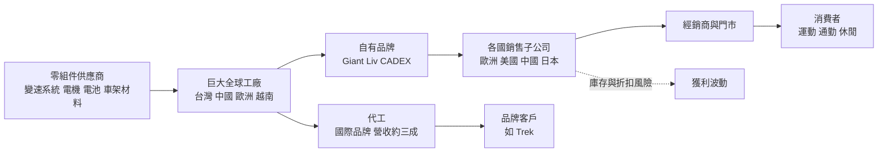
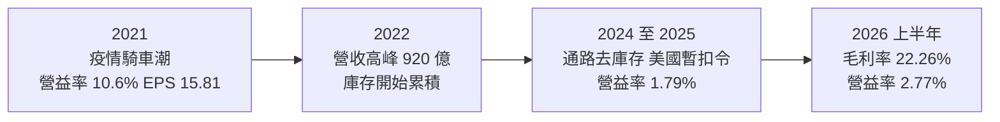
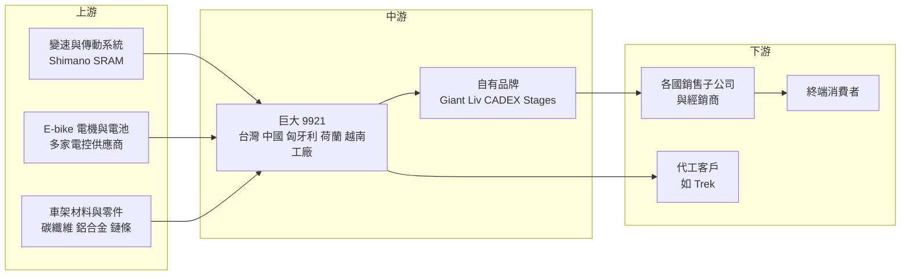

# 9921 巨大

> 上市｜[[產業索引-運動休閒|運動休閒]]｜上市（櫃）日期 1994/12/29

# 第一章：企業模式與商業藍圖

> [!info] 撰寫說明
> 本文由 Claude 依公開資料整理，架構比照 [[2330台積電]] 的四章研究，資料截至 2026-10-08。財務數字來源：Goodinfo 年度經營績效與股利政策頁、MoneyDJ 年度財務比率與資產負債表、富果研究（巨大 2025 年 11 月法說會整理）、理財周刊（2026 年 8 月法說會報導）、優分析（2026 年 4 月營收報導）、證交所開放資料（基本資料、資產負債、綜合損益、營益分析、股利、本益比）；產業描述為整理性內容，尚未逐條比對原始文件。#待校對

在評估單一個股的長期投資價值時，首要步驟是拆解企業的底層獲利邏輯。本章針對巨大機械工業（股票代號：9921，以下簡稱巨大）的商業模式進行定性分析，說明一家從代工起家的台灣企業，如何成為全球最大的自行車品牌製造商之一，以及為什麼它的獲利在疫情後大起大落。

## 一、核心定位：品牌加製造的全球自行車龍頭

巨大成立於 1972 年 10 月，總部位於台中，1994 年 12 月上市。巨大最早替美國品牌代工自行車，之後建立自有品牌 Giant，成為少數同時擁有全球品牌與大規模製造能力的自行車公司。證交所資料顯示，2026 年董事長為劉湧昌、總經理為劉素娟，實收資本額約 39.2 億元。

巨大的商業模式可以概括為「自有品牌為主、代工為輔」的雙軌制：

* **自有品牌（OBM）：** 包括綜合品牌 Giant、女性專屬品牌 Liv，以及高階碳纖維輪組與零件品牌 CADEX。依 2025 年 11 月法說會資料，Liv 占營收約 10%，CADEX 占集團營收超過 5%。巨大在歐洲、美國、中國、日本等主要市場設有銷售子公司，直接經營經銷商通路，這讓它能掌握終端價格與品牌形象。
* **代工（OEM）：** 替國際品牌（如 Trek）代工生產，2025 年代工營收占比預估提升至 33% 至 35%，毛利率約 12%，明顯低於自有品牌。代工的意義在於填滿產能、攤提固定成本，並維持與國際品牌的技術交流。

這種結構讓巨大同時賺「品牌溢價」與「製造規模」兩種錢，但也意味著它要同時承擔品牌端的庫存風險與工廠端的產能利用率風險，這正是 2023 至 2025 年獲利急遽下滑的根源。

## 二、終端應用與市場板塊

依 2025 年 11 月法說會資料，截至 2025 年 10 月的營收地區結構如下（其他地區為推算）：

* **歐洲（約 41%）：** 巨大最重要的市場，也是電動輔助自行車（[[E-bike]]）需求最強的地區。高毛利的 E-bike 車款毛利率可達 28% 以上，經典公路車 Propel 也是主要獲利來源。2026 年 3 月德國單月營收年增超過三成。
* **中國（約 21%）：** 曾是疫情期間的成長引擎，但 2025 年銷售年減約五成，需求轉向中階登山車與通勤車。中國新國標在 2025 年 11 月實施，巨大以半固態防刺穿電池與安全電機系統切入電動自行車市場，2025 年銷售約 7,000 台，2026 年目標 8 萬台。
* **美國（約 9%）：** 2025 年銷售年減約兩成，又受美國海關暫扣令影響高階車款出貨。E-bike 在美國的占比低於 20%，基期低但仍在成長。
* **產品別：** 傳統自行車（公路車、登山車、城市車）、E-bike、零組件（CADEX 輪組等），以及室內騎行設備 Stages。

## 三、資本轉化邏輯：全球工廠與品牌通路

* **全球多地生產：** 2025 年法說會揭露的概估產能為中國約 350 萬台、台灣約 50 萬台、歐洲（匈牙利與荷蘭）約 60 萬台、越南新廠約 15 萬台，集團整體利用率約 75%。公司表示總產能不擴張，而是把產能由中國、台灣移往越南與匈牙利，以因應關稅與地緣政治。
* **品牌通路掌握終端：** 巨大透過各國子公司直接經營經銷網路，可以快速了解市場需求並推出新車款，但也必須自己承擔通路庫存。疫情期間需求暴增後，2022 至 2024 年全球自行車通路累積大量庫存，品牌商被迫打折去化，毛利率因此下滑。
* **營運資金密集：** 自行車產業有明顯的季節性與長交期，品牌商需要預先備貨。MoneyDJ 資料顯示巨大平均售貨天數在 2023 年達 232 天，遠高於 2020 年的 119 天，存貨占用大量資金。

## 四、企業長期藍圖：E-bike、產能移轉與高階化

* **E-bike 是核心成長動能：** 歐洲 E-bike 需求強勁，巨大的 E-bike 電控系統採開放策略、與多家供應商合作，並爭取 2028 年式新車款的代工訂單。E-bike 單價與毛利率都高於傳統自行車，是提升獲利結構的關鍵。
* **產能移轉：** 越南廠利用率已達 90%，將持續擴產並成為銷美核心基地；匈牙利廠服務歐洲市場。這讓巨大能同時應對美國關稅、暫扣令與歐洲對亞洲自行車的反傾銷措施。
* **品牌高階化與多元化：** Liv 女性品牌、CADEX 高階零件與 Stages 室內騎行，讓巨大不只賣整車，還能從高毛利的周邊產品獲利。東南亞（越南、泰國）被視為 5 至 10 年的潛力市場。
* **股利政策：** 管理層表示 2026 年股利發放率預計至少 60%，視營運狀況可能提高至 70% 至 80%。

# 第二章：護城河深度與競爭優勢

在長期價值投資中，「護城河」指企業抵禦競爭、維持超額利潤的保護機制。本章分析巨大的護城河構成、全球主要競爭對手，以及這些優勢在自行車景氣循環中能守住多少。

## 一、巨大護城河的核心組成要素

巨大屬於「窄護城河」企業，護城河由三個要素組成：

* **1. 全球品牌與通路網路：** Giant 是全球知名的自行車品牌之一，在歐洲、美國、中國與亞洲擁有綿密的經銷網路。品牌商要建立遍布全球的經銷商關係與售後服務需要數十年，新進者難以短期複製。
* **2. 規模化製造與碳纖維技術：** 年產能數百萬台、多國設廠，讓巨大在採購與生產上具規模經濟；長年投入碳纖維車架與輪組技術，CADEX 品牌就是這項能力的延伸。同時具備品牌與製造，讓巨大在新車款開發上比純品牌商更快。
* **3. 產能地理分散：** 台灣、中國、歐洲、越南多地生產，讓巨大能把訂單依關稅與貿易政策在不同工廠間調度。美國暫扣令發生後，部分美國訂單轉往越南生產，就是這項優勢的實例。

## 二、全球主要競爭對手格局

| 對手 | 定位 | 對巨大的威脅 |
|---|---|---|
| Trek（美國） | 全球高階自行車品牌，也是巨大的代工客戶 | 在美國與歐洲高階市場直接競爭，同時是巨大代工業務的重要客戶 |
| Specialized（美國） | 高階公路車與登山車品牌 | 在高階碳纖維車款競爭激烈 |
| [[9914美利達]] | 台灣自行車品牌與製造商，持有 Specialized 股權 | 同樣兼具品牌與代工，在歐洲市場直接競爭 |
| 歐洲品牌集團（Pon、Accell 等） | 歐洲 E-bike 與城市車主要品牌 | 在巨大最重要的歐洲 E-bike 市場搶占份額 |
| 中國本土品牌 | 中低價自行車與電動車 | 以價格與本地通路搶中國市場 |

## 三、優勢轉化：哪些市場守得住、哪些守不住

* **守得住：** 歐洲中高階 E-bike 與公路車市場、女性自行車（Liv）與高階零件（CADEX）。這些市場重視品牌、技術與售後服務，巨大的規模與通路是實際優勢。
* **守不住：** 中國的中低價市場與疫情期間的超額需求。中國市場在 2025 年衰退約五成，本土品牌以價格競爭；疫情期間的需求暴增已被證明是一次性的，2023 至 2025 年營收從 920 億元高峰降到 603 億元。
* **觀察重點：** 美國暫扣令能否解除、歐洲 E-bike 成長能否持續、越南與匈牙利產能移轉的效率，以及毛利率能否回到 20% 至 22% 的區間。這些決定巨大能否把營業利益率從 2% 左右拉回疫情前的 5% 以上。

# 第三章：財務體質與盈利規模

資料日期：2026-10-08。數字取自 Goodinfo 年度經營績效頁、MoneyDJ 年度財務比率與資產負債表、法說會整理與證交所開放資料，表格是撰寫當時的快照；最新月營收、毛利率、累計 EPS 由自動排程寫在本筆記的屬性欄位（月營收、毛利率、累計EPS 等）。#待校對

財務報表是檢驗護城河是否真實存在的最終標準。本章用多年度的三率、ROE、現金流與資本報酬，檢視巨大在疫情紅利與庫存調整週期中的獲利品質。

## 一、獲利能力的基石：三率

| 年度 | 營收（新台幣） | [[毛利率]] | [[營業利益率]] | EPS（元） | [[ROE]] |
|---|---|---|---|---|---|
| 2020 | 700 億 | 23.1% | 9.80% | 13.19 | 20.5% |
| 2021 | 818 億 | 24.1% | 10.6% | 15.81 | 22.3% |
| 2022 | 920 億 | 22.6% | 8.60% | 15.51 | 18.8% |
| 2023 | 770 億 | 22.1% | 6.12% | 8.68 | 9.88% |
| 2024 | 713 億 | 19.0% | 2.61% | 3.22 | 4.05% |
| 2025 | 603 億 | 19.8% | 1.79% | 1.84 | 2.35% |
| 2026 上半年 | 291.9 億 | 22.26% | 2.77% | 1.11 | 未查得 |

註：年度數字取自 Goodinfo 合併報表（與 MoneyDJ 一致）；2026 年上半年取自證交所營益分析與綜合損益開放資料。

* **[[毛利率]]：** 2020 至 2023 年維持在 22% 至 24%，2024 年降到 19%，主因是全球通路去庫存、品牌商被迫打折，以及低毛利代工比重上升。2026 年上半年回升到 22.26%，公司目標下半年 20% 至 21%。
* **[[營業利益率]]：** 從 2021 年的 10.6% 一路降到 2025 年的 1.79%，下滑幅度遠大於毛利率。原因是營業費用（品牌行銷、各國子公司人事、研發）相對固定，營收從 920 億元降到 603 億元時，費用率大幅上升，這是典型的[[營運槓桿]]反向作用。2025 年還有約 7,000 萬元的暫扣令相關一次性費用。
* **營收趨勢：** 2020 至 2025 年營收年複合成長率約 -2.9%（推算），但這是從疫情前基期算起；若從 2022 年高峰算起，三年營收減少約 34%。
* **EPS：** 從 2021 年的 15.81 元降到 2025 年的 1.84 元，2026 年第一季虧損、第二季 EPS 1.62 元。

## 二、[[ROE]]：資本效率

2021 至 2025 年平均 ROE 約 11.5%（推算），但這個平均掩蓋了巨大的落差：2020 至 2022 年 ROE 約 19% 至 22%，2024 至 2025 年只有 2% 至 4%。疫情前後的正常年份，巨大的 ROE 大致落在 10% 上下（推估）。

MoneyDJ 資料顯示負債比率從 2022 年的 61.6% 降到 2025 年的 46.9%，平均售貨天數從 2023 年的 232 天降到 2025 年的 176 天，代表庫存去化、借款減少，財務體質已經改善。2025 年底現金及約當現金約 123 億元，有息借款（短期借款、一年內到期長期負債與長期銀行借款）約 120 億元，接近淨現金狀態。

## 三、資本支出、自由現金流與股利

* **營業現金流：** MoneyDJ 的每股現金流量在 2021 年為 -13.22 元（大量備貨），2023 至 2025 年分別為 27.01 元、30.99 元與 28.43 元，反映庫存去化釋放出大量現金。以約 3.92 億股計算，2025 年約 111 億元（推算）。
* **[[CapEx]]：** 年度資本支出金額本次未查得。公司表示總產能不擴張、以移轉為主，越南與匈牙利擴產屬於調整性投資，推估資本支出相對營收不高（推估）。
* **[[自由現金流]]：** 2023 至 2025 年營業現金流大幅轉正，在資本支出不高的前提下，自由現金流推估為正且金額可觀（推估，具體金額未查得）；2021 年則因備貨為負。
* **股利：** 現金股利從 2021 年度的 10 元降到 2025 年度的 1.8 元。各年度[[配息率]]約為 2020 年 61%、2021 年 63%、2022 年 50%、2023 年 58%、2024 年 68%、2025 年 98%（推算，現金股利 ÷ EPS）。巨大長期配發約五到七成盈餘，2025 年在獲利低點仍維持近全數配發，顯示對股東回饋的重視。

## 四、[[ROIC]] 與 [[WACC]]：價值創造利差

**ROIC 推算：** 2025 年營業利益約 10.8 億元（603 億元 × 1.79%），扣除 20% 稅率後約 8.6 億元。2025 年底權益總額 370.17 億元，有息負債約 119.71 億元（短期借款 73.71 億元、一年內到期長期負債 8.54 億元、長期銀行借款 37.46 億元，MoneyDJ 資產負債表，未含租賃負債），投入資本約 489.9 億元，ROIC 約 1.8%（推算）。以同樣的資本基礎回推 2022 年（營業利益約 79.1 億元、稅後約 63.3 億元），ROIC 約 12.9%（推算，資本基礎以 2025 年數字代替，僅供量級參考）。

**WACC 推算：** 假設台灣 10 年期公債殖利率 1.75%、市場風險溢酬 6%、β 取自行車與消費品同業常見值 0.9（同業常見值推估，非來源數字），股東權益成本約 1.75% ＋ 0.9 × 6% ＝ 7.15%。負債成本假設 2.5%，稅後約 2.0%；以帳面價值計，權益約占 76%、有息負債約占 24%，WACC 約 5.9%（推算）。

**結論：** 2020 至 2022 年疫情紅利期，巨大的 ROIC 推估在 10% 以上，明顯高於約 6% 的 WACC，大幅創造價值；2024 至 2025 年 ROIC 降到約 2%，低於 WACC，處於毀損價值的狀態。這說明巨大的護城河在需求正常時能產生超額報酬，但在庫存週期的谷底無法保護獲利。長期投資人應以「完整景氣週期的平均 ROIC 是否高於 WACC」來判斷，2026 年毛利率回升到 22% 以上，是 ROIC 開始回升的第一個訊號（推估）。

# 第四章：總體風險與地緣政治

任何企業都無法脫離宏觀環境獨立存在。本章分析巨大未來必須面對的地緣政治、產業週期與營運風險。

## 一、地緣政治風險

* **美國暫扣令（WRO）：** 美國海關及邊境保護局（CBP）於 2025 年對巨大台灣廠製造的自行車與零件發布暫扣令，涉及移工相關議題，影響約 3% 銷售額，並使台灣廠利用率降至約 60%。巨大已提列約 7,000 萬元費用處理移工議題，完成改善並經第三方驗證，截至 2026 年 8 月仍在等待 CBP 最終裁決。這個事件顯示供應鏈勞動條件已成為進入美國市場的門檻。
* **美國關稅與產能移轉：** 美國對中國製自行車課徵高關稅，巨大把銷美訂單移往越南廠，越南廠利用率已達 90%。
* **中國市場與產能：** 中國同時是巨大最大的生產基地（約 350 萬台產能）與重要市場，兩岸關係、美中對立與中國本土品牌崛起都是長期風險。

## 二、產業週期與市場結構風險

* **疫情後的需求反轉：** 2020 至 2022 年全球騎車潮讓品牌商與通路大量備貨，2023 年起需求回落，全球自行車業經歷長達兩至三年的去庫存。這是典型的[[長鞭效應]]：終端需求小幅變化，經過經銷商、品牌商、零件商層層放大，造成上游訂單劇烈波動。
* **庫存週期：** 截至 2026 年，全球庫存已回到健康水位（歐洲 2 至 3 個月、美國 1 至 2 個月、中國約 2 個月），但自行車業每隔數年就會出現一次庫存循環，投資人應預期未來仍會重演。
* **零組件成本：** 變速系統等關鍵零件由少數國際大廠供應，管理層提到 Shimano 從 2026 年 8 月起調漲零件價格，高階車款可轉嫁成本，入門車款則需部分吸收。
* **匯率：** 營收以歐元、美元與人民幣為主，生產成本在台灣、中國與越南，匯率變動會影響毛利率。

## 三、營運環境的隱性風險

* **費用結構僵固：** 各國銷售子公司與品牌行銷費用固定性高，營收下滑時營業利益率會急遽萎縮。公司已在美國與部分歐洲子公司進行組織重整，目標降低營業費用率。
* **代工比重上升：** 代工毛利率約 12%，低於自有品牌；若代工比重持續提高，整體毛利率會被稀釋。
* **E-bike 電池與安全：** E-bike 涉及鋰電池安全與召回風險，各國法規與保險要求日益嚴格。

## 四、科技或法規演進

* **E-bike 技術競爭：** E-bike 的價值越來越多在電機、電池與軟體，而非車架。巨大採開放式電控策略，與多家供應商合作，好處是彈性高，代價是核心技術掌握在供應商手中。
* **中國新國標：** 中國電動自行車新國標在 2025 年 11 月實施，對電池、電機與安全提出新規範，是巨大切入中國電動車市場的機會，但也要面對本土品牌的價格競爭。
* **永續與供應鏈法規：** 美國強迫勞動防制法（UFLPA）、歐盟供應鏈盡職調查與碳排規範，要求品牌商管理整個供應鏈的勞動與環境條件，合規成本會持續增加。

# 專有名詞解析

## 金融

- **[[營運槓桿]]**：固定成本占比高時，營收小幅變動會造成營業利益大幅變動的現象。
- **[[長鞭效應]]**：終端需求的小幅變動，沿供應鏈往上游傳遞時被逐級放大，造成上游庫存與訂單劇烈波動。
- **[[毛利率]]**：營業毛利除以營收，反映產品本身的獲利能力。
- **[[營業利益率]]**：營業利益除以營收，反映扣除營業費用後的本業獲利能力。
- **[[自由現金流]]**：營業活動現金流減去資本支出，代表企業可自由用於配息、還債或併購的現金。
- **[[配息率]]**：股利占每股盈餘的比例，反映公司把多少獲利分給股東。
- **[[ROE]]**：股東權益報酬率，稅後淨利除以股東權益，衡量公司運用股東資本賺錢的效率。
- **[[ROIC]]**：投入資本報酬率，稅後營業利益除以股東權益加有息負債，衡量本業運用資本的效率。
- **[[WACC]]**：加權平均資金成本，依股權與負債比重加權的資金成本，是判斷 ROIC 是否創造價值的門檻。

## 產業

- **[[E-bike]]**：電動輔助自行車，騎乘者踩踏時由電機提供輔助動力，在歐洲是成長最快的自行車品類。
- **[[OBM]]**：自有品牌製造，企業以自己的品牌設計、生產並銷售產品，可掌握品牌溢價。
- **[[OEM]]**：代工製造，依客戶的設計與規格生產產品，以客戶品牌出售。
- **[[碳纖維]]**：重量輕、強度高的複合材料，用於高階自行車車架與輪組。
- **[[WRO]]**：暫扣令（Withhold Release Order），美國海關對疑似以強迫勞動生產的進口貨物暫扣放行的命令。
- **[[UFLPA]]**：美國維吾爾強迫勞動防制法，要求進口商證明供應鏈未涉及強迫勞動，相關執法也延伸到移工勞動條件。
- **[[反傾銷稅]]**：進口國對以低於正常價格出口的商品加徵的關稅，歐盟長期對中國製自行車課徵。

# 核心供應鏈

## 1. 上游：零組件與材料
- 變速與傳動系統：Shimano、SRAM
- 鏈條：[[5306桂盟]]
- E-bike 電機、電池與電控系統：多家供應商（巨大採開放策略）
- 碳纖維與鋁合金車架材料

## 2. 中游：巨大本身
- 生產基地：台灣（台中）、中國、歐洲（匈牙利、荷蘭）、越南
- 自有品牌：Giant、Liv、CADEX、Stages

## 3. 下游：通路與客戶
- 歐洲、美國、中國、日本等地銷售子公司與經銷商
- 代工客戶：Trek 等國際品牌

## 4. 同業比較
- 台灣：[[9914美利達]]
- 國際品牌：Trek、Specialized、Pon、Accell

## 最新新聞
<!-- news:start（自動產生，請勿手動編輯此範圍） -->
- 2026-10-08 📰 媒體 16:32｜自行車廠巨大9月營收53.68億元年增3% 累計營收衰退收歛｜[鉅亨網](https://news.cnyes.com/news/id/6624847)

完整紀錄：[[9921巨大 新聞]]
<!-- news:end -->

## 相關連結
- [公開資訊觀測站](https://mopsov.twse.com.tw/mops/web/t05st03?step=1&firstin=1&co_id=9921)
- [Goodinfo](https://goodinfo.tw/tw/StockDetail.asp?STOCK_ID=9921)
- [Yahoo 股市](https://tw.stock.yahoo.com/quote/9921)
- [鉅亨網新聞](https://www.cnyes.com/twstock/9921/news)
