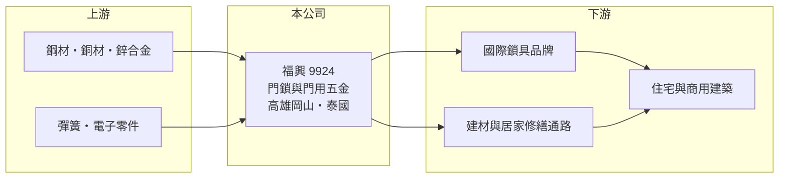

# 9924 福興

> 上市｜[[產業索引-居家生活|居家生活]]｜上市（櫃）日期 1995/03/15

# 第一章：企業模式與商業藍圖

> [!info] 撰寫說明
> 精簡版，由 Claude 依公開資料整理，架構比照 [[2330台積電]]，資料截至 2026-10-08。來源：MoneyDJ 理財網財務比率年表（2021 至 2025 年）與個股基本資料（2025 年營收比重、歷年股利）、優分析與富果等財經媒體的報導標題。公開資料有限，主要客戶、外銷地區比重與各廠產能未查得；歷年營收金額因股本基礎無法對齊，表格只列年增率。#待校對

台灣福興是成立於 1957 年、總部位於高雄岡山的老牌製鎖廠，營收全部來自門用相關製品；它的長期價值建立在穩定的外銷代工訂單、保守的財務結構與高比例的現金配息。

- **核心業務：** 福興生產門鎖與門用五金，依 MoneyDJ 的分類，2025 年「門用相關製品」占營收 100%。門鎖是住宅與商用建築的必需品，一棟房子從新建到翻修都需要更換，因此需求量大、規格標準化，但單價不高，製造商要靠規模與品質穩定度取得訂單。
- **營運模式：** 福興以替國際品牌與通路代工為主（推估，依製鎖產業的常見模式），屬於 [[OEM]] 與 [[ODM]] 型的製造商。這種模式的好處是不必負擔品牌行銷費用，代價是議價力集中在少數大客戶手上，訂單量跟著客戶的庫存循環波動。
- **營運據點：** 總部與主要工廠位於高雄岡山，財經媒體報導公司近年設立泰國新廠並進入試量產（年份待校對）。把產能移到東南亞，主要是為了分散中國生產的關稅風險，並貼近美國客戶要求的「非中國」供應鏈。
- **長期方向：** 2021 至 2025 年營收連續四年衰退，但[[毛利率]]從 17% 提高到 22% 至 24%，顯示公司選擇守住利潤而不是追量。泰國新廠能否帶回訂單，是營收重新成長的關鍵。

# 第二章：護城河深度與競爭優勢

福興的護城河來自長期累積的製造品質與客戶認證，屬於窄護城河；它守得住的是「穩定供貨」，守不住的是終端需求的循環。

- **競爭優勢：** 門鎖牽涉居家安全，品牌商更換代工廠前必須重新做耐用度、防盜等測試，轉換成本不低，因此老牌供應商的訂單黏著度高。福興營運超過一甲子，負債比率由 31% 一路降到 22%，財務穩健也是品牌客戶挑選長期供應商的重要條件。
- **主要對手：** 對手包括中國與東南亞的大型製鎖代工廠，以及國際鎖具集團自有的工廠，具體公司本次未查得。中國廠商以價格競爭為主，福興的差異化只能放在品質、交期與多國產能。
- **觀察重點：** 第一是美國住宅新建與翻修需求，它決定整個產業的訂單量；第二是泰國廠的量產進度與良率；第三是電子鎖、智慧門鎖這類高單價產品的比重能否提升（推估方向，公司未在本次資料中說明）。

# 第三章：財務體質與盈利規模

資料日期：2026-10-08，表格是撰寫當時的快照；最新月營收、毛利率、累計 EPS 由自動排程寫在本筆記的屬性欄位（月營收、毛利率、累計EPS 等）。#待校對

福興近五年營收縮小、但毛利率和營業利益率維持在不錯的水準，獲利能力比營收規模更穩定。

| 年度 | 營收（年增率） | [[毛利率]] | [[營業利益率]] | EPS（元） | [[ROE]] |
|---|---|---|---|---|---|
| 2021 | 未查得（+7.2%） | 17.43% | 7.88% | 3.54 | 11.16% |
| 2022 | 未查得（-1.6%） | 19.39% | 9.49% | 4.83 | 14.27% |
| 2023 | 未查得（-4.8%） | 22.76% | 12.64% | 5.03 | 13.82% |
| 2024 | 未查得（-11.4%） | 23.76% | 11.90% | 4.83 | 12.57% |
| 2025 | 未查得（-8.2%） | 21.98% | 9.79% | 3.08 | 7.38% |

- **長期指標：** 依年增率連乘，2025 年營收約為 2021 年的 76%，年複合成長率約 -6.6%（推算）。近 5 年平均 ROE 約 11.8%（推算）。2021 至 2025 年度現金股利依序為 2.4、2.9、3.0、3.1、2.5 元，[[配息率]]約 60% 至 80%，配息相當穩定。
- **[[ROIC]] 與 [[WACC]]：** 以每股計算：2025 年每股營收約 42.1 元（EPS 3.08 ÷ 稅後淨利率 7.31%），每股營業利益約 4.12 元，稅後約 3.30 元；投入資本以每股淨值 46.67 元加上每股有息負債約 6.6 元（負債比率 22.12% 換算的總負債一半）計，約 53.3 元，ROIC 約 6.2%（推算）。WACC 約 5.5%（推算：無風險利率 1.75%、市場風險溢酬 6%、β 取外銷五金廠常見值 0.7，股東權益成本約 5.95%；稅前負債成本 2.5%、稅率 20%；權益比重約 88%）。2025 年 ROIC 僅略高於 WACC，但 2022 至 2024 年 ROE 在 12% 至 14%，當時的利差明顯較大，整體來看公司長期仍在創造價值，只是營收衰退讓利差縮小。
- **財務特色：** 負債比率約 22%、每股淨值逐年上升，是典型低槓桿的出口製造業。2025 年每股淨值由 39.72 元跳升到 46.67 元，幅度大於當年獲利扣除配息，可能有其他綜合損益或股本變動（推估，待校對）。

# 第四章：總體風險與地緣政治

福興的風險集中在單一產品、外銷市場與匯率，屬於隨美國房市與庫存循環起伏的產業。

- **產業週期：** 門鎖需求跟著住宅新建、翻修與零售通路的庫存走，通路一旦去化庫存，代工廠的訂單會被放大縮減，也就是[[長鞭效應]]。2022 年以後的營收連續下滑，就是這種週期的結果。
- **營運風險：** 營收 100% 來自門用製品，產品線集中；若主要客戶轉單或自建產能，衝擊會很直接。泰國新廠在量產初期可能面臨良率與折舊壓力。
- **其他風險：** 外銷以美元計價（推估），新台幣升值會壓縮毛利；美國對進口五金的關稅政策、鋼材與銅材價格也會影響成本。

# 專有名詞解析

## 金融

- **[[配息率]]**：現金股利占每股盈餘的比率，用來衡量公司把多少獲利發給股東。
- **[[長鞭效應]]**：終端需求的小幅變動沿供應鏈往上游傳遞時被逐級放大，造成上游訂單劇烈波動。
- **[[ROIC]]**：投入資本報酬率，稅後營業利益除以股東權益加有息負債，衡量本業運用資本的效率。
- **[[WACC]]**：加權平均資金成本，股東與債權人要求報酬率的加權平均，是 ROIC 要超越的門檻。

## 產業

- **[[OEM]]**：代工生產，依客戶的設計與規格製造，產品掛客戶的品牌。
- **[[ODM]]**：代工廠同時負責設計與製造，產品仍以客戶品牌銷售。

# 核心供應鏈

- 上游：鋼材、銅材、鋅合金等金屬原料與彈簧、電子零件供應商（名稱未查得），國內鋼材來源例如 [[2002中鋼]]（推估）。
- 下游／客戶：國際鎖具品牌與美國建材、居家修繕通路（客戶名稱未查得）。
- 同業：中國與東南亞的製鎖代工廠、國際鎖具集團自有工廠（名稱未查得）。

## 最新新聞
<!-- news:start -->
<!-- news:end -->

## 相關連結
- [公開資訊觀測站](https://mopsov.twse.com.tw/mops/web/t05st03?step=1&firstin=1&co_id=9924)
- [Goodinfo](https://goodinfo.tw/tw/StockDetail.asp?STOCK_ID=9924)
- [Yahoo 股市](https://tw.stock.yahoo.com/quote/9924)
- [鉅亨網新聞](https://www.cnyes.com/twstock/9924/news)
