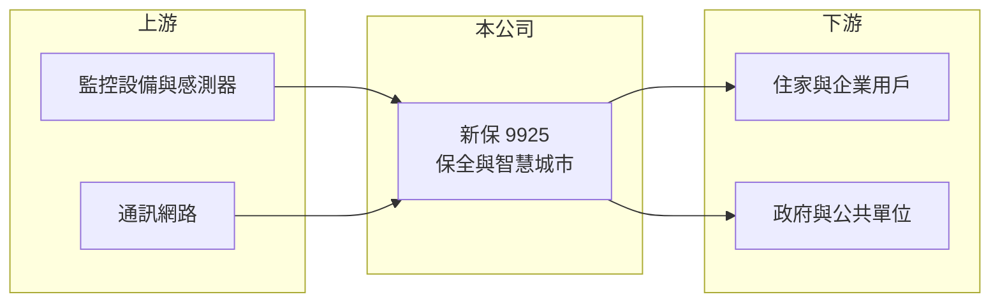

# 9925 新保

> 上市｜[[產業索引-其他業|其他業]]｜上市（櫃）日期 1995/12/09

# 第一章：企業模式與商業藍圖

> [!info] 撰寫說明
> 精簡版，由 Claude 依公開資料整理，架構比照 [[2330台積電]]，資料截至 2026-10-07。來源：winvest.tw 營收快訊、nstock.tw 新保公司概況、旺得富理財網（中時）。#待校對

新保即新光保全，是台灣第二大的保全集團之一，業務逐步由人力轉向電子保全。

- **核心業務：** 從事防災、防盜、防火器具的設計、銷售、出租、安裝與維修，提供[[系統保全]]與[[駐衛保全]]服務。
- **營收結構：** 依 2025 年報導，結合物聯網的[[智慧城市]]與系統保全等電子服務業務占營收超過四成。
- **營運據點：** 在台灣設有 22 家分公司與 69 個辦事處。
- **長期方向：** 公司預估 AI 與物聯網整合服務未來 3 至 5 年有兩位數成長，並切入長照等新需求。

# 第二章：護城河深度與競爭優勢

新保與中保科共同主導台灣保全市場。

- **競爭優勢：** 全台服務網絡與長期月費合約帶來穩定現金流；新光集團背景有助取得企業客戶（推估）。
- **主要對手：** [[9917中保科]] 與其他中小型保全公司。
- **觀察重點：** 電子服務占比提升速度、人力成本變化，以及業外收益對 EPS 的影響。

# 第三章：財務體質與盈利規模

資料日期：2026-10-07，表格是撰寫當時的快照；最新月營收、毛利率、累計 EPS 由自動排程寫在本筆記的屬性欄位（月營收、毛利率、累計EPS 等）。#待校對

新保營收小幅成長，2026 年第二季獲利受業外推升。

- **營收規模：** 2026 年 8 月營收 7.25 億元，年增 6.57%；1 至 8 月累計 55.94 億元。
- **獲利：** 2026 年第二季 EPS 1.46 元，年增 71.76%；[[毛利率]] 31.05%、[[營業利益率]] 8.93%，淨利率 28.93% 遠高於營益率，顯示有大額[[業外收益]]。2025 年前三季 EPS 2.04 元。
- **財務特色：** 資本額 38.75 億元，2025 年度配發現金股利 2 元，以撰寫時股價計算的[[殖利率]]約 4.8%。

# 第四章：總體風險與地緣政治

新保的風險與保全產業共通，加上業外收益的波動。

- **產業週期：** 保全需求穩定，但新增客戶受建案與企業擴點影響。
- **營運風險：** 營業利益率低於中保科，基本工資調漲對人力保全毛利衝擊較大。
- **其他風險：** 業外收益不一定每年重複、個資與監控法規、資安事件。

# 專有名詞解析

## 應用

- **[[智慧城市]]**：以物聯網、影像與資料平台管理交通、停車、公共安全等城市服務。

## 金融

- **[[業外收益]]**：本業以外的收入，例如投資收益、處分資產利益與匯兌收益，通常不具持續性。
- **[[殖利率]]**：每股現金股利除以股價，衡量以現價買進可領到的現金報酬。

## 產業

- **[[系統保全]]**：以感應器、監視器與連線中心遠端監控住家或企業，異常時派員處理，採月費收費。
- **[[駐衛保全]]**：派保全人員常駐在社區或大樓執行門禁、巡邏與安全管理。

# 核心供應鏈

- 上游：監控攝影機、感測器與通訊網路供應商（推估）
- 下游／客戶：住家、企業與政府機關，客戶名稱未揭露
- 同業：[[9917中保科]]

## 最新新聞
<!-- news:start -->
<!-- news:end -->

## 相關連結
- [公開資訊觀測站](https://mopsov.twse.com.tw/mops/web/t05st03?step=1&firstin=1&co_id=9925)
- [Goodinfo](https://goodinfo.tw/tw/StockDetail.asp?STOCK_ID=9925)
- [Yahoo 股市](https://tw.stock.yahoo.com/quote/9925)
- [鉅亨網新聞](https://www.cnyes.com/twstock/9925/news)
