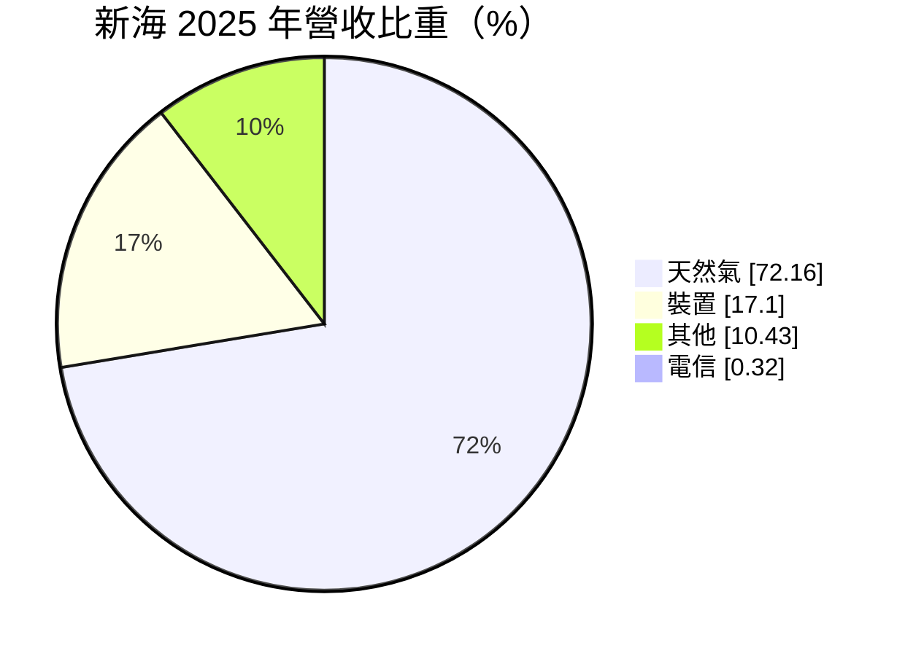
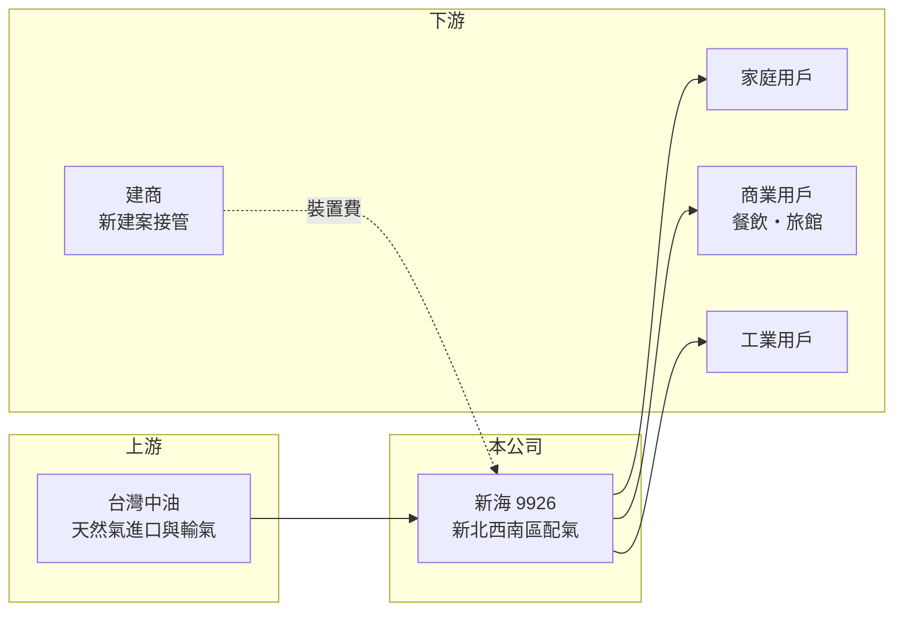

# 9926 新海

> 上市｜[[產業索引-油電燃氣業|油電燃氣業]]｜上市（櫃）日期 1998/04/08

# 第一章：企業模式與商業藍圖

> [!info] 撰寫說明
> 精簡版，由 Claude 依公開資料整理，架構比照 [[2330台積電]] 的四章研究，資料截至 2026-10-08。財務數字來源：Goodinfo 年度經營績效頁、MoneyDJ 個股基本資料（2025 年營收比重）、證交所開放資料（基本資料、2026 年第二季資產負債與綜合損益、營益分析、股利、本益比）；供氣區域與經營細節部分憑既有知識撰寫，已標「待校對」。公開資料有限。#待校對

天然氣配氣公司的商業模式，和一般製造業很不一樣。本章說明新海瓦斯（股票代號：9926，以下簡稱新海）如何在固定的特許區域內，靠管線與用戶基礎賺取穩定的配氣價差。

- **核心業務：** 新海成立於 1966 年，1998 年上市，董事長為林坤正，實收資本額約 17.95 億元。公司向台灣中油購買天然氣，經由自有的地下管線網路配送給家庭、商業與工業用戶。依 MoneyDJ 的 2025 年營收分類，天然氣銷售占 72.16%、[[導管裝置費]]占 17.10%、其他占 10.43%、電信占 0.32%。
- **營運據點：** 新海的供氣區域位於新北市西南側，涵蓋板橋、土城、樹林、三峽、鶯歌一帶（憑既有知識，待校對）。城市配氣是[[區域特許經營]]，同一區域通常只有一家公用天然氣事業，新用戶只能向新海申請接管。
- **獲利來源：** 天然氣售價由主管機關依公式核定，新海賺的是向中油購氣成本與零售價之間的配氣價差，因此毛利率長期穩定在 26% 至 29% 之間。另一個收入來源是新建大樓接管時收取的裝置費，這部分會跟著新北市的住宅開發量起伏。
- **長期方向：** 新海的成長主要來自轄區內新建住宅帶來的用戶數增加，以及工商業用戶的用氣量。用戶數與售氣量的歷年數字這次未查得，建議以公司年報補充。

# 第二章：護城河深度與競爭優勢

公用事業的護城河通常來自法規與實體網路，而不是技術。本章分析新海的競爭優勢與它的限制。

- **競爭優勢：** 地下管線一旦埋設，就幾乎不可能由第二家公司重複建置，加上區域特許制度，新海在轄區內沒有直接競爭者。這讓營收和毛利率的波動遠小於一般產業，2020 至 2025 年營業利益率都維持在 18% 到 22% 之間（Goodinfo）。
- **成長限制：** 特許區域固定，新海無法靠搶市占成長，只能等待轄區人口與建案增加。2020 至 2025 年營收年複合成長率僅約 2.3%（推算），屬於典型的低成長、高穩定公用事業。
- **主要對手：** 嚴格來說沒有直接對手，比較對象是同業 [[9908大台北]]、[[9918欣天然]]、[[8908欣雄]]、[[9931欣高]]。替代能源方面，桶裝液化石油氣與家用電氣化（電熱水器、電磁爐）會影響單戶用氣量。
- **觀察重點：** 一是轄區新建案與接管戶數的趨勢；二是主管機關對售價公式與配氣價差的調整；三是政府淨零政策下，住宅電氣化是否長期壓低家庭用氣。

# 第三章：財務體質與盈利規模

資料日期：2026-10-08，表格是撰寫當時的快照；最新月營收、毛利率、累計 EPS 由自動排程寫在本筆記的屬性欄位（月營收、毛利率、累計EPS 等）。#待校對

本章用多年度的三率、ROE 與資本報酬，檢視新海作為公用事業的獲利品質。

| 年度 | 營收（新台幣） | [[毛利率]] | [[營業利益率]] | EPS（元） | [[ROE]] |
|---|---|---|---|---|---|
| 2020 | 22.0 億 | 26.9% | 20.0% | 2.34 | 13.2% |
| 2021 | 21.4 億 | 29.0% | 21.8% | 2.50 | 13.0% |
| 2022 | 22.4 億 | 28.3% | 21.3% | 2.52 | 12.7% |
| 2023 | 22.9 億 | 28.5% | 21.0% | 2.61 | 12.6% |
| 2024 | 23.3 億 | 27.0% | 19.8% | 2.64 | 11.8% |
| 2025 | 24.7 億 | 26.2% | 18.4% | 2.68 | 11.6% |
| 2026 上半年 | 13.2 億 | 26.80% | 18.15% | 1.61 | 未查得 |

註：2020 至 2025 年取自 Goodinfo，2026 上半年取自證交所營益分析與綜合損益。

- **營收規模：** 2020 至 2025 年營收由 22.0 億元增加到 24.7 億元，年複合成長率約 2.3%（推算）。EPS 從 2.34 元穩定爬升到 2.68 元，六年間沒有一年衰退，這種穩定度在台股中相當少見。
- **獲利結構：** 毛利率與營業利益率近年小幅下滑，可能反映人事與管線維護成本上升，而售價調整有時間落差（推估）。2026 年上半年營業外收入約 1.06 億元，占稅前淨利約三成，代表轉投資或金融資產收益是獲利的重要補充（明細未查得）。
- **長期指標：** 2021 至 2025 年平均 ROE 約 12.3%（推算）。2025 年度每股配發現金股利 2.10 元，以當年 EPS 2.68 元計算，[[配息率]]約 78%（推算，證交所股利資料）。公用事業的資本支出以管線汰換與延伸為主，相對可預期。
- **財務特色：** 2026 年第二季底總負債約 53.0 億元、權益約 44.3 億元（證交所開放資料）。負債中有相當部分應是用戶保證金、預收裝置款等營運性負債，而非銀行借款（推估）。

**[[ROIC]] 與 [[WACC]]：** 以 2025 年營收 24.7 億元乘營業利益率 18.4%，營業利益約 4.54 億元，稅後約 3.64 億元；投入資本以權益 44.3 億元加上假設占總負債三成的有息負債約 15.9 億元，合計約 60.2 億元，ROIC 約 6.0%（推算）。WACC 以 CAPM 推估：無風險利率 1.75%、市場風險溢酬 6%、β 取公用事業常見值 0.4，股東權益成本約 4.15%；負債成本 2.5%、稅後 2.0%；權益約占 74%，WACC 約 3.6%（推算）。ROIC 比 WACC 高約 2 至 3 個百分點，代表新海靠特許經營長期穩定地創造價值，只是幅度溫和，屬於「低風險、低成長」的價值創造型態。

# 第四章：總體風險與地緣政治

公用事業的風險不在景氣，而在法規與能源政策。本章分析新海長期要面對的風險。

- **產業週期：** 天然氣需求受景氣影響小，但裝置費收入會跟著新北市的建案量起伏。房市降溫時，新接管戶數減少，裝置收入與未來的用戶成長都會放慢。
- **營運風險：** 地下管線老化需要持續汰換，若發生管線洩漏或氣爆等公安事故，除了賠償與停業，也可能面臨主管機關更嚴格的檢查要求。購氣全數來自台灣中油，供應來源高度集中。
- **其他風險：** 售價由主管機關核定，國際天然氣價格上漲而售價未能即時反映時，配氣價差會被壓縮。長期來看，淨零政策推動住宅電氣化，可能使每戶用氣量逐步下降。

# 專有名詞解析

## 金融

- **[[配息率]]**：現金股利占每股盈餘的比例，反映公司把獲利發還給股東的程度。
- **[[毛利率]]**：營業毛利占營收的比例，反映產品定價能力與生產成本控制。
- **[[營業利益率]]**：扣除營業費用後的營業利益占營收的比例，衡量本業整體獲利能力。
- **[[ROE]]**：股東權益報酬率，稅後淨利除以股東權益，衡量公司運用股東資金的效率。
- **[[ROIC]]**：投入資本報酬率，稅後營業利益除以股東權益與有息負債的合計，衡量本業對所有資金提供者的報酬。
- **[[WACC]]**：加權平均資金成本，依股東權益與負債的比重加權計算的資金成本，ROIC 高於它才代表創造價值。

## 產業

- **[[區域特許經營]]**：政府核准單一業者在特定區域獨家經營公用事業，換取價格與服務受主管機關管制。
- **[[導管裝置費]]**：新用戶接上天然氣管線時，向公用天然氣事業支付的管線與錶具安裝費用。

# 核心供應鏈

- 上游：台灣中油（天然氣進口、接收站與長途輸氣管線）。
- 下游／客戶：轄區內的家庭、商業與工業用戶，以及申請接管的建商。
- 同業：[[9908大台北]]、[[9918欣天然]]、[[8908欣雄]]、[[9931欣高]]。

## 最新新聞
<!-- news:start -->
<!-- news:end -->

## 相關連結
- [公開資訊觀測站](https://mopsov.twse.com.tw/mops/web/t05st03?step=1&firstin=1&co_id=9926)
- [Goodinfo](https://goodinfo.tw/tw/StockDetail.asp?STOCK_ID=9926)
- [Yahoo 股市](https://tw.stock.yahoo.com/quote/9926)
- [鉅亨網新聞](https://www.cnyes.com/twstock/9926/news)
