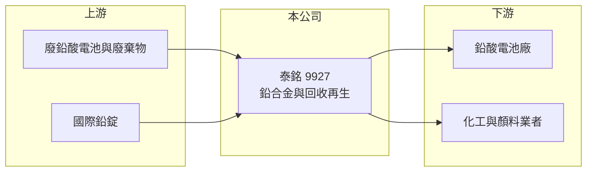

# 9927 泰銘

> 上市｜[[產業索引-其他業|其他業]]｜上市（櫃）日期 1999/03/12

# 第一章：企業模式與商業藍圖

> [!info] 撰寫說明
> 精簡版，由 Claude 依公開資料整理，架構比照 [[2330台積電]]，資料截至 2026-10-07。來源：winvest.tw 營收快訊、nstock.tw 泰銘公司概況。產品營收比重、客戶與據點本次未查到。#待校對

泰銘是鉛合金製造與廢棄物回收業者，產品供應[[鉛酸電池]]產業。

- **核心業務：** 製造鉛銻合金、鉛鈣合金、黃丹與紅丹，並經營一般及事業廢棄物的回收再生。
- **營收結構：** 本次未查到各產品比重；2026 年 1 至 8 月累計營收 65.36 億元。
- **營運據點：** 1999 年上市，2023 年取得經濟部資源再利用許可；廠區細節本次未查到。
- **長期方向：** 以[[資源回收]]取得再生鉛，發展[[循環經濟]]，同時降低原料成本（推估）。

# 第二章：護城河深度與競爭優勢

泰銘的優勢在於回收許可與鉛合金配方。

- **競爭優勢：** 資源再利用許可取得不易，回收與冶煉一條龍可掌握原料來源（推估）。
- **主要對手：** 國內外鉛冶煉與再生鉛業者。
- **觀察重點：** 國際鉛價走勢、回收料取得量，以及高配息能否維持。

# 第三章：財務體質與盈利規模

資料日期：2026-10-07，表格是撰寫當時的快照；最新月營收、毛利率、累計 EPS 由自動排程寫在本筆記的屬性欄位（月營收、毛利率、累計EPS 等）。#待校對

泰銘 2026 年營收明顯成長，配息一向大方。

- **營收規模：** 2026 年 8 月營收 7.9 億元，年增 25.59%；6 月營收 9.12 億元，年增 53.07%。
- **獲利：** 依 nstock 資料，2026 年第二季 [[毛利率]] 8.61%、[[營業利益率]] 6.4%；EPS 2.27 元（期間標示為上半年累計，待校對）。
- **財務特色：** 股本 12 億元，2025 年度配發現金股利 5 元，近五年平均現金[[殖利率]]約 8.1%。

# 第四章：總體風險與地緣政治

泰銘的獲利與金屬價格高度連動。

- **產業週期：** 營收與毛利隨國際鉛價起伏，鉛價急跌時存貨可能產生跌價損失。
- **營運風險：** 毛利率個位數，回收料成本與售價的時間差會影響獲利。
- **其他風險：** 鉛屬有害物質，環保法規、污染防治與許可續展是重要風險；鋰電池取代鉛酸電池的長期趨勢。

# 專有名詞解析

## 應用

- **[[鉛酸電池]]**：以鉛與硫酸為材料的充電電池，用於汽機車啟動、不斷電系統與儲能。

## 金融

- **[[毛利率]]**：毛利占營收的比例，反映產品定價能力與生產成本控制。
- **[[殖利率]]**：每股現金股利除以股價，衡量以現價買進可領到的現金報酬。

## 產業

- **[[資源回收]]**：把廢棄物分類處理後重新製成原料，可降低原生資源開採。
- **[[循環經濟]]**：把廢棄物重新回收成原料投入生產，減少資源消耗與廢棄物的經濟模式。

# 核心供應鏈

- 上游：廢鉛酸電池與事業廢棄物回收來源、國際鉛錠（推估）
- 下游／客戶：鉛酸電池廠、使用黃丹與紅丹的化工業者，客戶名稱未揭露
- 同業：國內外再生鉛與鉛冶煉業者

## 最新新聞
<!-- news:start -->
<!-- news:end -->

## 相關連結
- [公開資訊觀測站](https://mopsov.twse.com.tw/mops/web/t05st03?step=1&firstin=1&co_id=9927)
- [Goodinfo](https://goodinfo.tw/tw/StockDetail.asp?STOCK_ID=9927)
- [Yahoo 股市](https://tw.stock.yahoo.com/quote/9927)
- [鉅亨網新聞](https://www.cnyes.com/twstock/9927/news)
