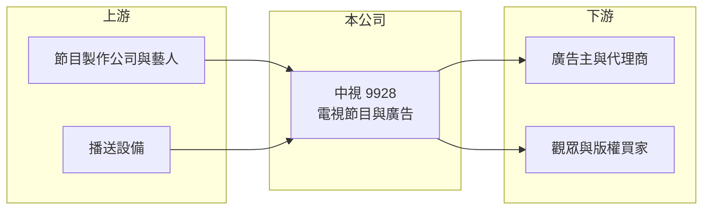

# 9928 中視

> 上市｜[[產業索引-其他業|其他業]]｜上市（櫃）日期 1999/08/09

# 第一章：企業模式與商業藍圖

> [!info] 撰寫說明
> 精簡版，由 Claude 依公開資料整理，架構比照 [[2330台積電]]，資料截至 2026-10-07。來源：winvest.tw 營收快訊、nstock.tw 中視公司概況。公開資料有限，營收結構與股東資料本次未查到。#待校對

中視是台灣老牌[[無線電視]]台，收入來自節目製作、播映與廣告。

- **核心業務：** 製作、播映並發行電視節目，製作與播映電視廣告，並提供國際電視節目轉播。
- **營收結構：** 本次未查到廣告與節目收入的比重；營收隨節目檔期與廣告投放波動，2026 年 6 月營收 9,828 萬元、9 月營收約 0.72 億元。
- **營運據點：** 1968 年成立、1999 年上市，以台灣為主。
- **長期方向：** 面對 [[OTT]] 串流與網路廣告分食，傳統電視業者需要拓展節目版權銷售與數位通路（推估）。

# 第二章：護城河深度與競爭優勢

無線電視台的特許地位已不像過去具備優勢。

- **競爭優勢：** 擁有無線頻道與節目片庫，具一定品牌知名度（推估）。
- **主要對手：** 其他無線台與有線頻道業者，以及 YouTube、Netflix 等串流平台。
- **觀察重點：** 廣告收入能否止跌、節目版權外銷與數位收入成長，以及虧損是否收斂。

# 第三章：財務體質與盈利規模

資料日期：2026-10-07，表格是撰寫當時的快照；最新月營收、毛利率、累計 EPS 由自動排程寫在本筆記的屬性欄位（月營收、毛利率、累計EPS 等）。#待校對

中視目前處於虧損，且多年未配息。

- **營收規模：** 2026 年 4 月營收 6,074 萬元、5 月 6,301 萬元、6 月 9,828 萬元，單月營收規模在 0.6 至 1 億元之間。
- **獲利：** 2026 年第二季 EPS 負 0.33 元；[[毛利率]] 3.04%、[[營業利益率]] 負 17.92%。
- **財務特色：** 資本額 7.07 億元，近五年沒有配發現金股利。

# 第四章：總體風險與地緣政治

中視面對的是結構性的產業衰退。

- **產業週期：** 廣告支出隨景氣起伏，且長期由電視轉往數位平台。
- **營運風險：** 節目製作成本固定，收視率與廣告下滑時虧損擴大。
- **其他風險：** 通傳會（NCC）法規與換照審查、媒體政治爭議對廣告主的影響。

# 專有名詞解析

## 金融

- **[[毛利率]]**：毛利占營收的比例，反映產品定價能力與生產成本控制。
- **[[營業利益率]]**：營業利益占營收的比例，扣除營業費用後衡量本業獲利能力。

## 產業

- **[[OTT]]**：透過網際網路直接提供影音或通訊服務的業者，例如串流平台與通訊軟體，會替代傳統電視與語音。
- **[[無線電視]]**：以無線電波發送、民眾用天線即可免費收看的電視頻道，收入主要來自廣告。

# 核心供應鏈

- 上游：節目製作公司、演藝人員與播送設備供應商（推估）
- 下游／客戶：廣告主與廣告代理商、觀眾與節目版權買家
- 同業：其他無線電視台與有線頻道業者、串流平台

## 最新新聞
<!-- news:start -->
<!-- news:end -->

## 相關連結
- [公開資訊觀測站](https://mopsov.twse.com.tw/mops/web/t05st03?step=1&firstin=1&co_id=9928)
- [Goodinfo](https://goodinfo.tw/tw/StockDetail.asp?STOCK_ID=9928)
- [Yahoo 股市](https://tw.stock.yahoo.com/quote/9928)
- [鉅亨網新聞](https://www.cnyes.com/twstock/9928/news)
