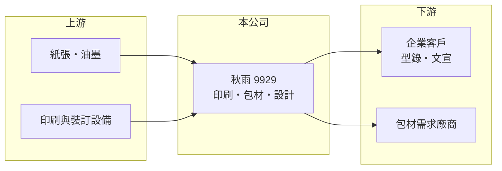

# 9929 秋雨

> 上市｜[[產業索引-其他業|其他業]]｜上市（櫃）日期 1999/06/28

# 第一章：企業模式與商業藍圖

> [!info] 撰寫說明
> 精簡版，由 Claude 依公開資料整理，架構比照 [[2330台積電]]，資料截至 2026-10-07。來源：nstock 公司概況頁、winvest 營收快訊標題。公開資料有限。#待校對

秋雨是老牌印刷公司，業務以印刷與包材製作為主，另有廣告、醫材零售與土地開發等項目。

- **核心業務：** 營業項目包括印刷、包材製作、照相製版、裝訂、企劃設計，以及醫療器材零售、一般廣告服務與土地開發。
- **營收結構：** 以[[商業印刷]]與包材製作為主要收入來源（推估）；各業務營收比重未查得。
- **營運據點：** 以台灣為主要營運地，1999 年上市，掛牌約 27 年。
- **長期方向：** 在傳統印刷需求下滑的環境下，嘗試透過設計服務、包材與土地開發等項目分散收入來源（推估）。

# 第二章：護城河深度與競爭優勢

秋雨的規模小，競爭優勢主要來自長年經營累積的客戶關係與一條龍印製能力。

- **競爭優勢：** 從企劃設計、製版、印刷到裝訂可在同一家公司完成，對需要多樣印刷品的企業客戶有便利性（推估）。
- **主要對手：** 台灣眾多中小型印刷廠與網路印刷業者，產業高度分散。
- **觀察重點：** 月營收能否維持 2026 年的年增趨勢，以及本業能否穩定獲利、擺脫 2025 年的小幅虧損。

# 第三章：財務體質與盈利規模

資料日期：2026-10-07，表格是撰寫當時的快照；最新月營收、毛利率、累計 EPS 由自動排程寫在本筆記的屬性欄位（月營收、毛利率、累計EPS 等）。#待校對

秋雨 2026 年營收與獲利都比 2025 年改善，但絕對規模仍小。

- **營收規模：** 2025 年全年營收 6.5 億元；2026 年 1 至 8 月累計 4.71 億元，年增 11.49%，8 月營收 0.67 億元，年增 29.18%。
- **獲利：** 2025 年全年 EPS -0.07 元；2026 年第二季 EPS 0.18 元，上半年累計 0.4 元。第二季[[毛利率]] 21.65%，[[營業利益率]] 9%。
- **財務特色：** 資本額 10.13 億元、市值約 12.7 億元，第二季 [[ROE]] 2.14%，資本效率偏低；近五年未發放現金股利。

# 第四章：總體風險與地緣政治

秋雨的風險在於所處產業需求長期萎縮，且公司規模小、資訊揭露有限。

- **產業週期：** 紙本印刷品需求受數位化影響長期下滑，景氣轉弱時企業廣告與型錄預算最先被刪減。
- **營運風險：** 營收規模小，單一大客戶或訂單變動就會明顯影響月營收與獲利；土地開發等非本業收入時點不固定。
- **其他風險：** 紙張與油墨等原物料價格波動會壓縮毛利；股本小、成交量低，股價波動可能較大。

# 專有名詞解析

## 金融

- **[[毛利率]]**：毛利除以營收，反映產品或服務本身的獲利能力。
- **[[營業利益率]]**：營業利益除以營收，反映本業扣除營業費用後的獲利能力。
- **[[ROE]]**：股東權益報酬率，稅後淨利除以股東權益，衡量公司運用股東資金賺錢的效率。

## 產業

- **[[商業印刷]]**：為企業或個人印製名片、型錄、海報、喜帖等印刷品的服務。

# 核心供應鏈

- 上游：紙廠與油墨供應商、印刷設備廠商（推估）
- 下游／客戶：需要文宣、型錄與包材的企業客戶
- 同業：台灣中小型印刷廠與網路印刷業者

## 最新新聞
<!-- news:start -->
<!-- news:end -->

## 相關連結
- [公開資訊觀測站](https://mopsov.twse.com.tw/mops/web/t05st03?step=1&firstin=1&co_id=9929)
- [Goodinfo](https://goodinfo.tw/tw/StockDetail.asp?STOCK_ID=9929)
- [Yahoo 股市](https://tw.stock.yahoo.com/quote/9929)
- [鉅亨網新聞](https://www.cnyes.com/twstock/9929/news)
