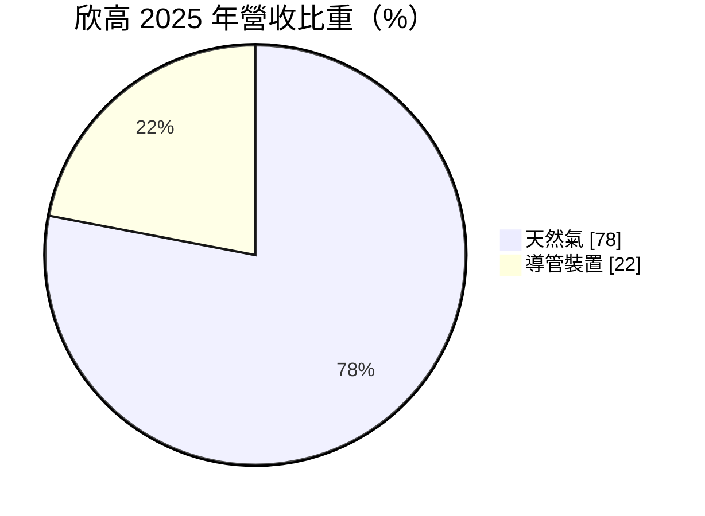
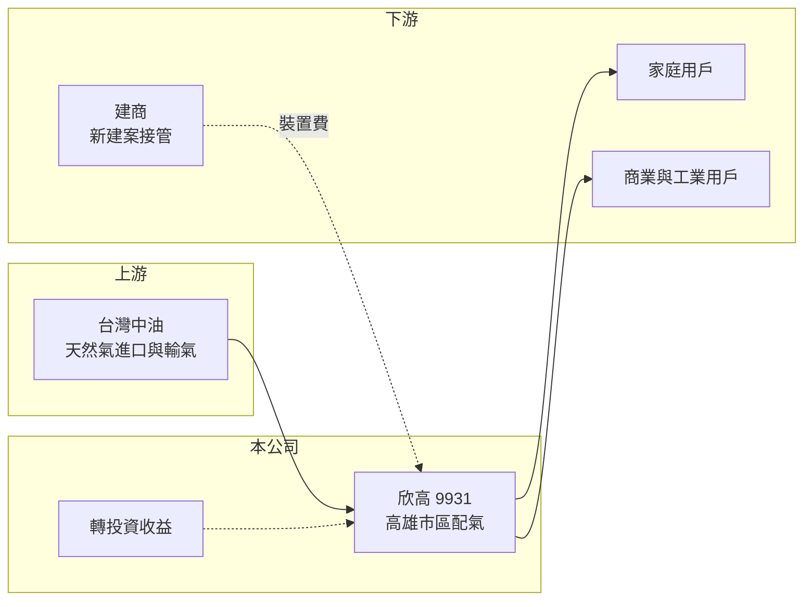

# 9931 欣高

> 上市｜[[產業索引-油電燃氣業|油電燃氣業]]｜上市（櫃）日期 2000/03/21

# 第一章：企業模式與商業藍圖

> [!info] 撰寫說明
> 精簡版，由 Claude 依公開資料整理，架構比照 [[2330台積電]] 的四章研究，資料截至 2026-10-08。財務數字來源：Goodinfo 年度經營績效頁、MoneyDJ 個股基本資料（2025 年營收比重）、證交所開放資料（基本資料、2026 年第二季資產負債與綜合損益、營益分析、股利、本益比）；供氣區域與轉投資部分憑既有知識撰寫，已標「待校對」。公開資料有限。#待校對

本章說明欣高石油氣（股票代號：9931，以下簡稱欣高）作為高雄地區天然氣配氣業者的商業模式，以及它的獲利為何有相當比例來自本業以外。

- **核心業務：** 欣高成立於 1983 年，董事長為莊雯苑，實收資本額約 12.0 億元。公司名稱雖然保留「石油氣」，現在的主業是向台灣中油購入天然氣，透過管線配送給轄區內的家庭與工商用戶。依 MoneyDJ 的 2025 年營收分類，天然氣占 78%、[[導管裝置費]]占 22%。
- **營運據點：** 供氣區域位於高雄市區（憑既有知識，推估為舊高雄市部分行政區，待校對）。和其他城市燃氣公司一樣，欣高在轄區內屬於[[區域特許經營]]，用戶要使用管線天然氣只能向它申請。
- **獲利來源：** 天然氣售價由主管機關核定，欣高賺取購氣成本與零售價之間的配氣價差，毛利率長期在 18% 至 22% 之間。裝置費收入占比高於多數同業，代表欣高的營收對轄區新建案與接管工程的依賴較深，2024 年營收一度跳升到 19.5 億元，原因未查得（推估與裝置工程認列有關）。
- **長期方向：** 本業成長取決於高雄市的住宅開發與工商業用氣。近年高雄因半導體新廠與重劃區開發吸引人口，若轄區涵蓋相關區域，新用戶有機會增加；用戶數與售氣量的歷年數字這次未查得。

# 第二章：護城河深度與競爭優勢

本章分析欣高的競爭優勢、限制與值得長期追蹤的指標。

- **競爭優勢：** 地下管線網路與區域特許制度，讓欣高在轄區內沒有直接競爭者。配氣價差由主管機關公式決定，景氣好壞對售氣量影響有限，因此 2020 至 2025 年 EPS 都維持在 1.4 元至 2.9 元之間，沒有虧損年度（Goodinfo）。
- **規模限制：** 欣高年營收約 12 億至 20 億元，是天然氣同業中規模較小的一家，本業的營業利益每年只有 1.5 億至 3 億元左右。公司的獲利因此相當依賴業外收益，評估時要把本業與投資收益分開看。
- **主要對手：** 轄區內沒有直接對手，比較對象是 [[8908欣雄]]、[[9908大台北]]、[[9918欣天然]]、[[9926新海]]。替代能源為桶裝液化石油氣與住宅電氣化。
- **觀察重點：** 第一，轄區新建案帶來的接管戶數與裝置收入；第二，業外收益的來源與穩定度；第三，主管機關對天然氣售價公式的調整。

# 第三章：財務體質與盈利規模

資料日期：2026-10-08，表格是撰寫當時的快照；最新月營收、毛利率、累計 EPS 由自動排程寫在本筆記的屬性欄位（月營收、毛利率、累計EPS 等）。#待校對

本章用多年度的三率、ROE 與資本報酬，檢視欣高本業與業外的獲利組成。

| 年度 | 營收（新台幣） | [[毛利率]] | [[營業利益率]] | EPS（元） | [[ROE]] |
|---|---|---|---|---|---|
| 2020 | 12.3 億 | 18.0% | 12.9% | 1.73 | 9.00% |
| 2021 | 11.9 億 | 19.5% | 13.9% | 2.15 | 10.4% |
| 2022 | 12.5 億 | 18.1% | 12.7% | 1.57 | 7.18% |
| 2023 | 12.3 億 | 18.9% | 13.9% | 1.44 | 6.85% |
| 2024 | 19.5 億 | 21.6% | 15.2% | 2.86 | 12.4% |
| 2025 | 15.7 億 | 18.2% | 12.5% | 2.45 | 9.36% |
| 2026 上半年 | 8.57 億 | 17.99% | 11.82% | 1.48 | 未查得 |

註：2020 至 2025 年取自 Goodinfo，2026 上半年取自證交所營益分析與綜合損益。

- **營收規模：** 2020 至 2025 年營收年複合成長率約 5.0%（推算），但中間有 2024 年的跳升，不宜直接外推。2026 年 1 至 8 月累計營收約 11.5 億元，較去年同期成長約 9%（證交所每月營收）。
- **獲利結構：** 2026 年上半年營業利益約 1.01 億元，營業外收入卻有約 1.22 億元，業外收益超過本業。這代表欣高的 EPS 有一半以上來自轉投資或金融資產（明細未查得），本業貢獻其實不大。
- **長期指標：** 2021 至 2025 年平均 ROE 約 9.2%（推算）。2025 年度每股配發現金股利 1.80 元，以 EPS 2.45 元計算，[[配息率]]約 73%（推算，證交所股利資料）。
- **財務特色：** 2026 年第二季底總負債約 36.4 億元、權益約 40.0 億元，流動負債約 25.5 億元（證交所開放資料）。保留盈餘約 13.5 億元，股價淨值比約 1.06 倍。

**[[ROIC]] 與 [[WACC]]：** 以 2025 年營收 15.7 億元乘營業利益率 12.5%，營業利益約 1.96 億元，稅後約 1.57 億元；投入資本以權益 40.0 億元加上假設占總負債三成的有息負債約 10.9 億元，合計約 50.9 億元，ROIC 約 3.1%（推算）。WACC 以 CAPM 推估：無風險利率 1.75%、市場風險溢酬 6%、β 取公用事業常見值 0.4，股東權益成本約 4.15%；負債成本 2.5%、稅後 2.0%；權益約占 79%，WACC 約 3.7%（推算）。只看本業，ROIC 略低於資金成本；但權益中有不少投入轉投資，若把業外收益納入，整體報酬接近 ROE 的 9% 左右。結論是欣高的價值創造主要靠轉投資，本業屬於穩定但報酬偏低的配氣業務。

# 第四章：總體風險與地緣政治

本章分析欣高長期面對的風險。

- **產業週期：** 天然氣用量對景氣不敏感，但裝置費收入占比高，高雄房市與建案量轉弱時，營收波動會比同業明顯。2024 年營收跳升、2025 年回落，就是這種波動的例子。
- **營運風險：** 管線老化與公安事故是城市燃氣業者的共同風險，高雄過去曾發生地下管線氣爆事件，社會對管線安全要求很高。業外收益占比高，轉投資表現不佳時，EPS 可能明顯下滑。
- **其他風險：** 售價受主管機關管制，國際氣價上漲而售價調整落後時會壓縮價差；長期淨零政策推動電氣化，可能壓低家庭用氣量；購氣全數仰賴台灣中油。

# 專有名詞解析

## 金融

- **[[配息率]]**：現金股利占每股盈餘的比例，反映公司把獲利發還給股東的程度。
- **[[毛利率]]**：營業毛利占營收的比例，反映產品定價能力與生產成本控制。
- **[[營業利益率]]**：扣除營業費用後的營業利益占營收的比例，衡量本業整體獲利能力。
- **[[ROE]]**：股東權益報酬率，稅後淨利除以股東權益，衡量公司運用股東資金的效率。
- **[[ROIC]]**：投入資本報酬率，稅後營業利益除以股東權益與有息負債的合計，衡量本業對所有資金提供者的報酬。
- **[[WACC]]**：加權平均資金成本，依股東權益與負債的比重加權計算的資金成本，ROIC 高於它才代表創造價值。

## 產業

- **[[區域特許經營]]**：政府核准單一業者在特定區域獨家經營公用事業，換取價格與服務受主管機關管制。
- **[[導管裝置費]]**：新用戶接上天然氣管線時，向公用天然氣事業支付的管線與錶具安裝費用。

# 核心供應鏈

- 上游：台灣中油（天然氣進口、接收站與輸氣管線）。
- 下游／客戶：轄區內家庭、商業與工業用戶，以及申請接管的建商。
- 同業：[[8908欣雄]]、[[9908大台北]]、[[9918欣天然]]、[[9926新海]]。

## 最新新聞
<!-- news:start（自動產生，請勿手動編輯此範圍） -->
- 2026-10-08 📰 媒體 18:21｜營收速報 - 欣高(9931)9月營收1.54億元年增率高達33.1％｜[鉅亨網](https://news.cnyes.com/news/id/6625197)

完整紀錄：[[9931欣高 新聞]]
<!-- news:end -->

## 相關連結
- [公開資訊觀測站](https://mopsov.twse.com.tw/mops/web/t05st03?step=1&firstin=1&co_id=9931)
- [Goodinfo](https://goodinfo.tw/tw/StockDetail.asp?STOCK_ID=9931)
- [Yahoo 股市](https://tw.stock.yahoo.com/quote/9931)
- [鉅亨網新聞](https://www.cnyes.com/twstock/9931/news)
