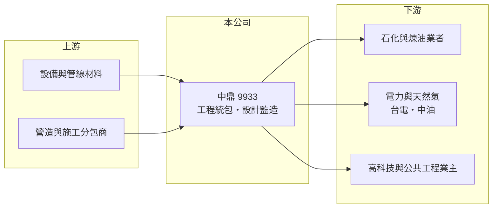

# 9933 中鼎

> 上市｜[[產業索引-其他業|其他業]]｜上市（櫃）日期 1993/05/28

# 第一章：企業模式與商業藍圖

> [!info] 撰寫說明
> 精簡版，由 Claude 依公開資料整理，架構比照 [[2330台積電]]，資料截至 2026-10-07。來源：nstock 公司概況頁、winvest 營收快訊標題；業務分布為整理性描述。#待校對

中鼎是台灣最大的工程公司，以[[統包工程]]方式替客戶從設計、採購到施工完成整座工廠或設施。

- **核心業務：** 提供工廠生產設備與工程的設計、規劃、監理施工，以及環境影響評估與工廠安全評估等服務。
- **營收結構：** 以石化、煉油、天然氣、電力與環保等工程統包為主，近年也承接半導體廠與公共建設工程（推估）；各業別比重未查得。
- **營運據點：** 總部在台灣，在中國、東南亞、印度、中東等地設有子公司或專案據點（推估）。
- **長期方向：** 隨能源轉型承接天然氣接收站、燃氣電廠、離岸風電與焚化等工程，並延伸到高科技廠房（推估）。

# 第二章：護城河深度與競爭優勢

中鼎的優勢在於大型工程的執行經驗與規模，但工程業競爭激烈、利潤率薄。

- **競爭優勢：** 累積數十年石化與能源工程實績，具備大型專案的設計、採購與施工整合能力，是台灣電力與天然氣工程的主要承包商之一。
- **主要對手：** 國際工程公司如日揮（JGC）、千代田化工、韓國三星 E&A 等，以及在中國與東南亞的當地工程公司。
- **觀察重點：** 新接訂單與在手訂單的變化、國內燃氣電廠與天然氣接收站工程進度，以及舊專案的成本控制。

# 第三章：財務體質與盈利規模

資料日期：2026-10-07，表格是撰寫當時的快照；最新月營收、毛利率、累計 EPS 由自動排程寫在本筆記的屬性欄位（月營收、毛利率、累計EPS 等）。#待校對

中鼎 2026 年營收比去年同期低，但獲利率明顯回升。

- **營收規模：** 2025 年全年營收 918.29 億元；2026 年 1 至 8 月累計 512.17 億元，年減 14.13%；8 月營收 69.96 億元，年增 5.25%。
- **獲利：** 2025 年全年 EPS 1.91 元；2026 年第二季 EPS 1.7 元，上半年累計 2.71 元，已超過 2025 年全年。第二季[[毛利率]] 13.67%、[[營業利益率]] 11.2%。
- **財務特色：** 工程業以[[完工百分比法]]認列營收，獲利隨專案結算與成本估計調整而波動；第二季 [[ROE]] 6.62%，近五年平均現金股利 1.59 元。

# 第四章：總體風險與地緣政治

中鼎的風險集中在大型專案的執行與成本控制。

- **產業週期：** 石化與能源投資受油價、利率與政府能源政策影響，新接訂單有明顯的循環。
- **營運風險：** 統包合約多為固定總價，若材料、人工或工期超出預估，虧損由承包商吸收，過去曾因此提列損失。
- **其他風險：** 海外專案涉及地緣政治、匯率與當地法規風險；國內缺工與營建成本上漲也會壓縮利潤。

# 專有名詞解析

## 金融

- **[[完工百分比法]]**：工程業依專案完工進度分期認列營收與成本的會計方法，成本估計變動會影響當期獲利。
- **[[毛利率]]**：毛利除以營收，反映產品或服務本身的獲利能力。
- **[[營業利益率]]**：營業利益除以營收，反映本業扣除營業費用後的獲利能力。
- **[[ROE]]**：股東權益報酬率，稅後淨利除以股東權益，衡量公司運用股東資金賺錢的效率。

## 產業

- **[[統包工程]]**：由單一承包商負責設計、採購與施工整合的工程模式，英文常稱 EPC 或 Turnkey。

# 核心供應鏈

- 上游：壓縮機、熱交換器、管線、鋼材等設備材料商與施工分包商（推估）
- 下游／客戶：石化與煉油業者、台電與中油等能源業主、高科技廠與公共工程業主
- 同業：日揮（JGC）、千代田化工、三星 E&A 等國際工程公司

## 最新新聞
<!-- news:start（自動產生，請勿手動編輯此範圍） -->
- 2026-10-06 🏛️ 重訊 17:14｜本公司配合法務部調查局高雄市調查處進行相關調查｜[觀測站](https://mops.twse.com.tw/mops/#/web/t05st01)

完整紀錄：[[9933中鼎 新聞]]
<!-- news:end -->

## 相關連結
- [公開資訊觀測站](https://mopsov.twse.com.tw/mops/web/t05st03?step=1&firstin=1&co_id=9933)
- [Goodinfo](https://goodinfo.tw/tw/StockDetail.asp?STOCK_ID=9933)
- [Yahoo 股市](https://tw.stock.yahoo.com/quote/9933)
- [鉅亨網新聞](https://www.cnyes.com/twstock/9933/news)
