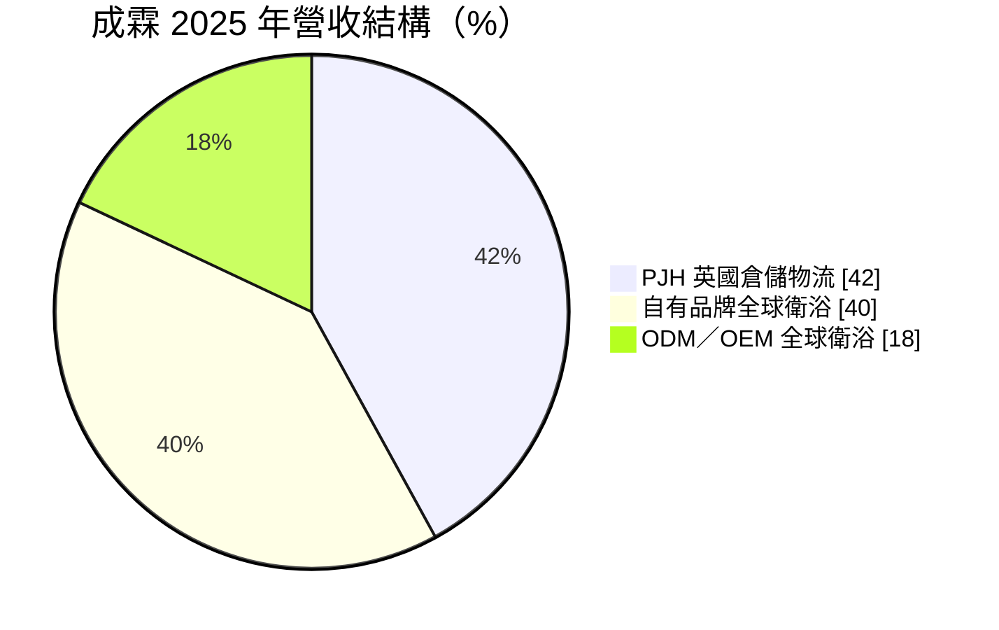
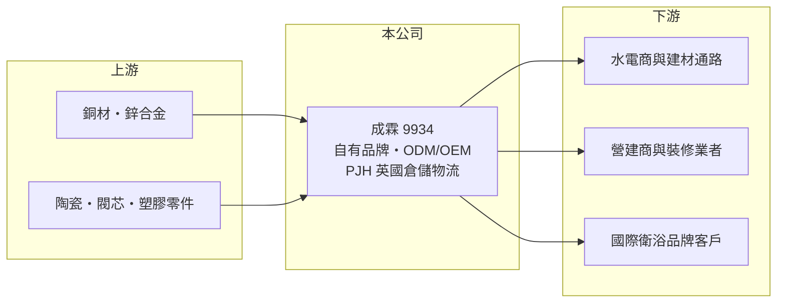

# 9934 成霖

> 上市｜[[產業索引-居家生活|居家生活]]｜上市（櫃）日期 2000/09/11

# 第一章：企業模式與商業藍圖

> [!info] 撰寫說明
> 精簡版，由 Claude 依公開資料整理，架構比照 [[2330台積電]]，資料截至 2026-10-08。來源：MoneyDJ 理財網財務比率年表（2021 至 2025 年）與個股基本資料（2025 年營收比重、歷年股利）、成霖集團官網法說簡報清單（2020 至 2024 年）。公開資料有限，各品牌名稱、生產基地與客戶名單未逐一查證；營收金額由 EPS、稅後淨利率與股本推算後再以年增率回推，屬推算值。#待校對

成霖企業成立於 1979 年、總部在台中潭子，從水龍頭代工起家，現在是結合衛浴[[自有品牌]]、代工與英國倉儲物流通路的集團，三塊業務的毛利結構差異很大。

- **核心業務：** 成霖設計、製造並銷售水龍頭、淋浴設備與衛浴產品，同時經營英國的衛浴倉儲物流事業 PJH。依 MoneyDJ 的分類，2025 年 PJH 英國倉儲物流占 42%、全球衛浴自有品牌占 40%、全球衛浴 [[ODM]]／[[OEM]] 代工占 18%。
- **營收結構：** 三塊業務各有角色：代工提供工廠的基本產能利用，自有品牌帶來較高的毛利，PJH 則讓成霖直接掌握英國的通路與配送。

- **營運據點：** 總部位於台中潭子，營運橫跨北美、英國與亞洲；自有品牌包括美國的 Gerber 等（依公司過往資料，待校對）。生產基地的具體位置本次未查得。
- **長期方向：** 2021 至 2025 年[[毛利率]]從 24.6% 提高到 34.1%，代表公司持續把營收重心從代工移向品牌與通路。這條路線毛利較高，但行銷、倉儲與人事費用也較重，營業利益率因此仍在 1% 至 3% 的低檔。

# 第二章：護城河深度與競爭優勢

成霖的護城河主要在品牌與通路，而不是製造；問題在於品牌的高毛利還沒轉成穩定的高營業利益。

- **競爭優勢：** 自有品牌讓成霖可以直接面對水電商、建材通路與營建商，掌握定價權；PJH 的倉儲物流網則讓它在英國市場有配送與庫存服務能力，這些都是單純代工廠沒有的資產。品牌與通路一旦建立，競爭者很難在短時間內複製。
- **主要對手：** 國際衛浴品牌如 Masco（Delta）、Fortune Brands（Moen）、Kohler、LIXIL，以及台灣與中國的水龍頭代工廠（推估名單，待校對）。在代工端競爭主要比價格，在品牌端則比通路覆蓋與設計。
- **觀察重點：** 營業利益率能否從 1% 至 3% 提高到 5% 以上，是品牌轉型是否成功的判斷標準。另外要看英國房市與裝修需求，以及北美自有品牌在通路的上架狀況。

# 第三章：財務體質與盈利規模

資料日期：2026-10-08，表格是撰寫當時的快照；最新月營收、毛利率、累計 EPS 由自動排程寫在本筆記的屬性欄位（月營收、毛利率、累計EPS 等）。#待校對

成霖的毛利率逐年提升，但營業利益率與 EPS 起伏很大，2022 年與 2025 年都出現虧損，顯示費用結構偏重。

| 年度 | 營收（億元） | [[毛利率]] | [[營業利益率]] | EPS（元） | [[ROE]] |
|---|---|---|---|---|---|
| 2021 | 約 196（推算） | 24.62% | 0.81% | 0.04 | 0.24% |
| 2022 | 約 203（推算） | 24.56% | -3.45% | -2.48 | -18.05% |
| 2023 | 約 184（推算） | 30.69% | 1.81% | 1.52 | 11.45% |
| 2024 | 約 183（推算） | 34.01% | 3.21% | 1.15 | 7.66% |
| 2025 | 約 175（推算） | 34.14% | 1.44% | -0.29 | -1.90% |

註：2025 年營收以每股營收約 42.6 元（EPS -0.29 ÷ 稅後淨利率 -0.68%）乘以股本約 4.11 億股推算，其他年度依 MoneyDJ 營收成長率回推。

- **長期指標：** 2021 至 2025 年營收年複合成長率約 -2.8%（推算），近 5 年平均 ROE 約 0%（推算）。2022 至 2025 年度現金股利依序為 0、1.2、0.35、0.1 元，配息隨獲利大幅波動，穩定度低。
- **[[ROIC]] 與 [[WACC]]：** 以每股計算：2025 年每股營業利益約 0.61 元（每股營收 42.6 元 × 1.44%），稅後約 0.49 元；投入資本以每股淨值 14.76 元加上每股有息負債約 11.9 元（負債比率 61.77% 換算的總負債一半）計，約 26.7 元，ROIC 約 1.8%（推算）。WACC 約 4.7%（推算：無風險利率 1.75%、市場風險溢酬 6%、β 取消費性製造業常見值 0.8，股東權益成本約 6.55%；稅前負債成本 3%、稅率 20%；權益比重約 55%）。ROIC 長期低於 WACC，代表目前的資本規模並沒有創造足夠的報酬，品牌轉型尚未轉化成價值。
- **財務特色：** 負債比率約 61% 至 72%，在消費性製造業中偏高，與倉儲物流事業需要的庫存與租賃資產有關（推估）。每股淨值長期停在 13 至 16 元。

# 第四章：總體風險與地緣政治

成霖的風險來自歐美房市、匯率，以及高費用結構下的獲利敏感度。

- **產業週期：** 衛浴產品的需求跟著新屋開工與住宅翻修走，歐美升息時裝修需求下降，通路會減少庫存，形成[[長鞭效應]]。
- **營運風險：** 營業利益率只有 1% 至 3%，營收小幅下滑就可能轉為虧損；PJH 的倉儲與物流成本較固定，景氣差時壓力更大。
- **其他風險：** 營收以英鎊、美元為主，匯率波動會影響換算後的獲利；銅價是水龍頭的主要成本；美國關稅政策會影響亞洲生產的進口成本。

# 專有名詞解析

## 金融

- **[[長鞭效應]]**：終端需求的小幅變動沿供應鏈往上游傳遞時被逐級放大，造成上游訂單劇烈波動。
- **[[ROIC]]**：投入資本報酬率，稅後營業利益除以股東權益加有息負債，衡量本業運用資本的效率。
- **[[WACC]]**：加權平均資金成本，股東與債權人要求報酬率的加權平均，是 ROIC 要超越的門檻。

## 產業

- **[[自有品牌]]**：公司以自己的品牌銷售產品，掌握定價與通路，但需負擔行銷與售後服務成本。
- **[[ODM]]**：代工廠同時負責設計與製造，產品仍以客戶品牌銷售。
- **[[OEM]]**：代工生產，依客戶的設計與規格製造，產品掛客戶的品牌。

# 核心供應鏈

- 上游：銅材、鋅合金、閥芯、陶瓷與塑膠零件供應商（名稱未查得）。
- 下游／客戶：北美與英國的水電商、建材通路、營建商，以及代工的國際衛浴品牌（客戶名稱未查得）。
- 同業：Masco、Fortune Brands、Kohler、LIXIL 等國際衛浴品牌，以及台灣與中國的水龍頭代工廠（推估，待校對）。

## 最新新聞
<!-- news:start -->
<!-- news:end -->

## 相關連結
- [公開資訊觀測站](https://mopsov.twse.com.tw/mops/web/t05st03?step=1&firstin=1&co_id=9934)
- [Goodinfo](https://goodinfo.tw/tw/StockDetail.asp?STOCK_ID=9934)
- [Yahoo 股市](https://tw.stock.yahoo.com/quote/9934)
- [鉅亨網新聞](https://www.cnyes.com/twstock/9934/news)
