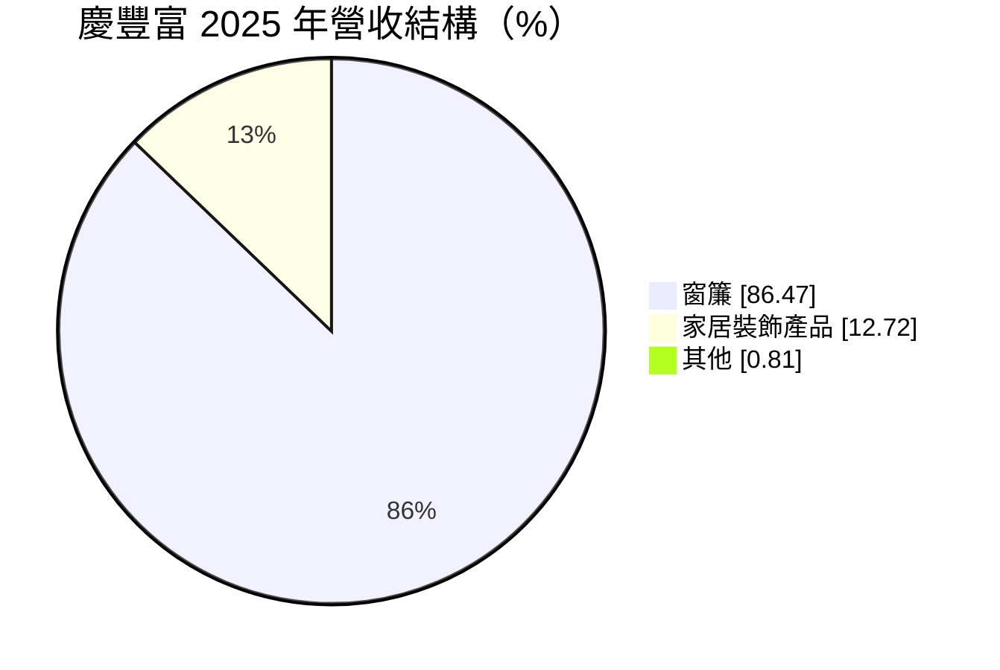
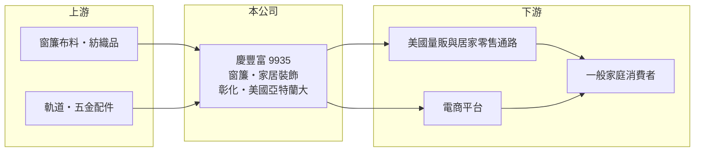

# 9935 慶豐富

> 上市｜[[產業索引-居家生活|居家生活]]｜上市（櫃）日期 2000/09/11

# 第一章：企業模式與商業藍圖

> [!info] 撰寫說明
> 精簡版，由 Claude 依公開資料整理，架構比照 [[2330台積電]]，資料截至 2026-10-08。來源：MoneyDJ 理財網財務比率年表（2021 至 2025 年）與個股基本資料（2025 年營收比重、歷年股利）、經濟日報（2025 年營收 49.4 億元）、優分析報導標題（美國電商通路與亞特蘭大據點）。公開資料有限，生產基地與主要客戶名稱未查得；2021 至 2024 年營收以 MoneyDJ 年增率回推。#待校對

慶豐富實業成立於 1977 年、總部在彰化福興鄉，是以窗簾為主的家飾製造與銷售公司，主要市場在美國，近年積極經營電商與「全通路」銷售。

- **核心業務：** 慶豐富設計、生產並銷售窗簾與家居裝飾產品，依 MoneyDJ 的分類，2025 年窗簾占 86.47%、家居裝飾產品占 12.72%、其他 0.81%。窗簾屬於居家耐久消費品，更換週期長但需求穩定，款式、花色與尺寸多，考驗的是開發速度與庫存管理。
- **營收結構：** 窗簾是絕對主力，家居裝飾產品是延伸品項，讓公司在同一個通路可以賣更多東西。

- **營運據點：** 總部位於彰化，依財經媒體報導，公司在美國亞特蘭大設有據點並擴充產能，以支援當地電商出貨。在美國設倉的意義是縮短交期，讓電商訂單能在當地快速配送。
- **長期方向：** 經濟日報報導 2025 年營收 49.4 億元，窗簾事業逆勢成長，並以全渠道（實體通路加電商）優化產品結構。2021 至 2025 年[[毛利率]]由 15.7% 提高到 26.1%，顯示轉向電商與高附加價值產品確實改善了利潤。

# 第二章：護城河深度與競爭優勢

慶豐富的競爭力在於美國在地的倉儲配送能力與多通路經營，這比單純的成本優勢更難被模仿。

- **競爭優勢：** 窗簾品項多、尺寸雜，電商客戶要的是「下單後幾天內送到」，因此在美國有倉儲與加工能力的供應商會比只能從亞洲出貨的對手更有優勢。慶豐富同時經營實體零售與電商通路，能把同一套產品賣到不同渠道，攤薄開發成本。
- **主要對手：** 中國與東南亞的窗簾與家紡代工廠，以及美國本土的家飾品牌，具體公司本次未查得。在量販通路的標準品上主要比價格，在電商通路則比上架速度、評價與配送。
- **觀察重點：** 毛利率能否維持在 25% 以上，代表電商與自有產品的比重能否守住；另外要看美國據點的擴充效益，以及美國住宅與家飾消費的景氣。

# 第三章：財務體質與盈利規模

資料日期：2026-10-08，表格是撰寫當時的快照；最新月營收、毛利率、累計 EPS 由自動排程寫在本筆記的屬性欄位（月營收、毛利率、累計EPS 等）。#待校對

慶豐富的營收大致在 45 億至 54 億元之間來回，但毛利率與營業利益率五年來明顯向上，獲利品質在改善。

| 年度 | 營收（億元） | [[毛利率]] | [[營業利益率]] | EPS（元） | [[ROE]] |
|---|---|---|---|---|---|
| 2021 | 約 49.7（推算） | 15.68% | 3.70% | 0.46 | 3.74% |
| 2022 | 約 52.9（推算） | 17.41% | 4.95% | 1.31 | 10.25% |
| 2023 | 約 45.5（推算） | 20.01% | 5.36% | 0.60 | 4.59% |
| 2024 | 約 54.0（推算） | 24.34% | 10.50% | 2.39 | 16.37% |
| 2025 | 49.4 | 26.07% | 10.86% | 1.64 | 10.60% |

註：2025 年營收取自經濟日報；以 EPS ÷ 稅後淨利率 × 股本 1.778 億股驗算約 49.8 億元，兩者一致。其他年度依 MoneyDJ 營收成長率回推。

- **長期指標：** 2021 至 2025 年營收年複合成長率約 0%（推算），近 5 年平均 ROE 約 9.1%（推算）。2022 至 2025 年度現金股利依序為 0.65、0.5、1.8、1.2 元，[[配息率]]約 50% 至 83%，隨獲利調整但每年都有配發。
- **[[ROIC]] 與 [[WACC]]：** 以每股計算：2025 年每股營收約 28.0 元，每股營業利益約 3.04 元，稅後約 2.43 元；投入資本以每股淨值 15.03 元加上每股有息負債約 14.7 元（負債比率 66.21% 換算的總負債一半）計，約 29.8 元，ROIC 約 8.2%（推算）。WACC 約 4.5%（推算：無風險利率 1.75%、市場風險溢酬 6%、β 取家用消費品常見值 0.8，股東權益成本約 6.55%；稅前負債成本 3%、稅率 20%；權益比重約 51%）。2024 至 2025 年 ROIC 明顯高於 WACC，代表轉型後的事業開始創造價值；但 2021 與 2023 年 ROE 不到 5%，利差並不穩定。
- **財務特色：** 負債比率長期在 63% 至 68%，在消費性製造業中偏高，與庫存、美國據點與營運資金需求有關（推估）。高槓桿放大了 ROE，也放大了景氣反轉時的風險。

# 第四章：總體風險與地緣政治

慶豐富的風險集中在美國消費景氣、通路集中度與偏高的負債。

- **產業週期：** 窗簾與家飾屬於可延後的消費，美國房市交易與搬家需求下降時，換購窗簾的需求跟著減少；零售通路調整庫存時，訂單波動會被放大，即[[長鞭效應]]。
- **營運風險：** 電商通路的流量與演算法規則變動快，平台費用調漲會直接壓縮毛利；美國據點擴充後固定成本上升，營收下滑時壓力較大。
- **其他風險：** 主要以美元交易（推估），新台幣升值不利；美國對亞洲進口紡織品的關稅政策、布料與運費價格都會影響成本。

# 專有名詞解析

## 金融

- **[[配息率]]**：現金股利占每股盈餘的比率，用來衡量公司把多少獲利發給股東。
- **[[長鞭效應]]**：終端需求的小幅變動沿供應鏈往上游傳遞時被逐級放大，造成上游訂單劇烈波動。
- **[[ROIC]]**：投入資本報酬率，稅後營業利益除以股東權益加有息負債，衡量本業運用資本的效率。
- **[[WACC]]**：加權平均資金成本，股東與債權人要求報酬率的加權平均，是 ROIC 要超越的門檻。

## 產業

- **[[全通路]]**：同時經營實體零售、電商平台與自營網站等多個銷售渠道，讓同一套產品觸及不同客群。

# 核心供應鏈

- 上游：窗簾布料、紡織品、軌道與五金配件供應商（名稱未查得）。
- 下游／客戶：美國量販與居家零售通路、電商平台（客戶名稱未查得）。
- 同業：中國與東南亞的窗簾與家紡代工廠、美國本土家飾品牌（名稱未查得）。

## 最新新聞
<!-- news:start -->
<!-- news:end -->

## 相關連結
- [公開資訊觀測站](https://mopsov.twse.com.tw/mops/web/t05st03?step=1&firstin=1&co_id=9935)
- [Goodinfo](https://goodinfo.tw/tw/StockDetail.asp?STOCK_ID=9935)
- [Yahoo 股市](https://tw.stock.yahoo.com/quote/9935)
- [鉅亨網新聞](https://www.cnyes.com/twstock/9935/news)
