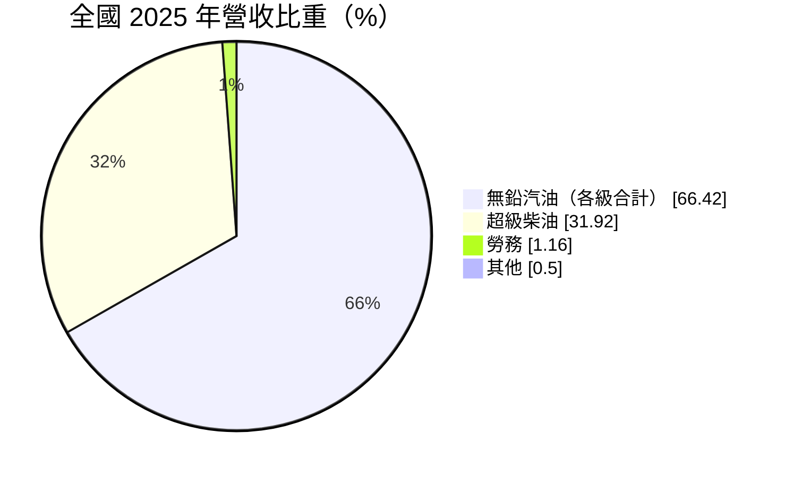
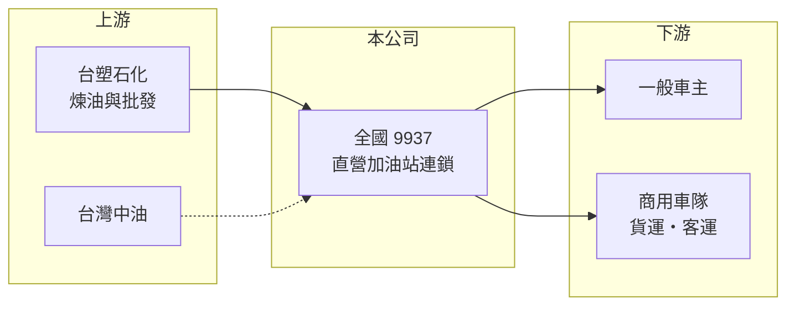

# 9937 全國

> 上市｜[[產業索引-油電燃氣業|油電燃氣業]]｜上市（櫃）日期 2000/09/11

# 第一章：企業模式與商業藍圖

> [!info] 撰寫說明
> 精簡版，由 Claude 依公開資料整理，架構比照 [[2330台積電]] 的四章研究，資料截至 2026-10-08。財務數字來源：Goodinfo 年度經營績效頁、MoneyDJ 個股基本資料（2025 年營收比重）、證交所開放資料（基本資料、2026 年第二季資產負債與綜合損益、營益分析、股利、本益比）；站數、油源與經營背景部分憑既有知識撰寫，已標「待校對」。公開資料有限。#待校對

加油站是「高營收、低毛利、高周轉」的典型通路生意。本章說明全國加油站（股票代號：9937，以下簡稱全國）如何用薄利多銷的模式，維持穩定的股東報酬。

- **核心業務：** 全國成立於 1988 年，2000 年在證交所上市，董事長為王瑞瑜，實收資本額約 30.9 億元。公司經營直營加油站，銷售汽油、柴油，並提供洗車等勞務。依 MoneyDJ 的 2025 年營收分類，各級無鉛汽油合計約 66%、超級柴油約 32%，勞務約 1.2%，其餘為副產品與點數兌換。
- **營運據點：** 全國從中台灣起家，加油站以中部縣市最為密集，並延伸到北部與南部（憑既有知識，站數約百座以上，待校對）。油品主要向[[6505台塑化]]採購（待校對），屬於民營油源體系中規模較大的連鎖通路。
- **獲利來源：** 油價由上游煉油廠依國際油價調整，加油站賺的是批發價與零售價之間的[[油品價差]]，每公升利潤固定且不高。全國 2025 年營收約 225 億元，[[毛利率]]只有 12% 左右，營業利益率約 3% 至 4%，但因為營收規模大、存貨周轉快，ROE 仍可維持在 13% 上下。
- **長期方向：** 加油站的長期課題是電動車普及後的轉型，包括在站內增設電動車充電、擴大洗車與便利服務，以及善用站點土地的價值。具體轉型進度這次未查得。

# 第二章：護城河深度與競爭優勢

加油站業的競爭力來自站點位置與規模。本章分析全國的護城河、對手與長期挑戰。

- **競爭優勢：** 好的加油站位置需要大面積、交通便利的土地，加上環保與消防法規，新設站點的取得難度很高。全國在中部經營多年，站點網路與會員點數制度讓它在區域內具有穩定的來客基礎。
- **規模與周轉：** 全國的營業利益率只有 3% 至 4%，卻能長期維持 13% 至 15% 的 ROE，關鍵在於每年營收約為權益的 4 倍，資產周轉很快。這種模式重視營運效率與成本控制，而不是單位利潤。
- **主要對手：** 台灣中油直營與加盟站、台塑石化直營站，以及 [[2616山隆]] 等民營連鎖加油站。各站之間主要以地點、促銷折扣與附加服務競爭。
- **觀察重點：** 一是銷售量是否隨電動車普及而下滑；二是充電與非油品業務能否形成新的收入來源；三是油價大幅波動時，價差能否維持穩定。

# 第三章：財務體質與盈利規模

資料日期：2026-10-08，表格是撰寫當時的快照；最新月營收、毛利率、累計 EPS 由自動排程寫在本筆記的屬性欄位（月營收、毛利率、累計EPS 等）。#待校對

本章用多年度的三率、ROE 與資本報酬，檢視全國的薄利多銷模式。

| 年度 | 營收（新台幣） | [[毛利率]] | [[營業利益率]] | EPS（元） | [[ROE]] |
|---|---|---|---|---|---|
| 2020 | 184 億 | 13.3% | 3.86% | 2.57 | 15.2% |
| 2021 | 212 億 | 12.1% | 3.88% | 2.62 | 15.2% |
| 2022 | 242 億 | 10.7% | 3.05% | 2.35 | 13.5% |
| 2023 | 245 億 | 11.1% | 3.33% | 2.53 | 14.4% |
| 2024 | 240 億 | 11.5% | 3.24% | 2.39 | 13.1% |
| 2025 | 225 億 | 12.2% | 3.40% | 2.36 | 12.7% |
| 2026 上半年 | 117.4 億 | 12.03% | 3.59% | 1.30 | 未查得 |

註：2020 至 2025 年取自 Goodinfo，2026 上半年取自證交所營益分析與綜合損益。

- **營收規模：** 營收主要跟著國際油價變動，2022 年油價高漲時營收增加，但毛利率反而降到 10.7%，說明油價上漲不等於獲利增加。2020 至 2025 年營收年複合成長率約 4.1%（推算），多半是油價因素，而非銷售量大幅成長。
- **獲利結構：** EPS 六年都落在 2.35 元至 2.62 元之間，波動極小。每公升的價差相對固定，使得獲利對油價高低不敏感，這是加油站通路的特色。
- **長期指標：** 2021 至 2025 年平均 ROE 約 13.8%（推算）。2025 年度每股配發現金股利 2.20 元，以 EPS 2.36 元計算，[[配息率]]約 93%（推算，證交所股利資料），幾乎把獲利全數發還股東。
- **財務特色：** 2026 年第二季底總負債約 74.1 億元，其中流動負債約 54.2 億元，權益約 55.4 億元（證交所開放資料）。流動負債高主要反映應付油款等營運性負債，以及站點租賃產生的租賃負債（推估）。

**[[ROIC]] 與 [[WACC]]：** 以 2025 年營收 225 億元乘營業利益率 3.40%，營業利益約 7.65 億元，稅後約 6.12 億元；投入資本以權益 55.4 億元加上假設占總負債四成的有息負債（含租賃負債）約 29.6 億元，合計約 85.0 億元，ROIC 約 7.2%（推算）。WACC 以 CAPM 推估：無風險利率 1.75%、市場風險溢酬 6%、β 取通路業常見值 0.5，股東權益成本約 4.75%；負債成本 2.5%、稅後 2.0%；權益約占 65%，WACC 約 3.8%（推算）。ROIC 高出 WACC 約 3 個百分點，代表全國在油品通路上穩定創造價值；但這個利差建立在汽柴油需求不萎縮的前提上，電動化是長期最大的變數。

# 第四章：總體風險與地緣政治

本章分析全國長期面對的風險。

- **產業週期：** 油品需求和經濟活動、車輛數相關，短期波動不大，但長期取決於交通能源轉型。電動車與油電混合車比例提高，每輛車的耗油量下降，加油站的銷售量可能逐年縮減。
- **營運風險：** 營收高度集中於油品，非油品收入占比很低。油源若高度依賴單一煉油廠，採購條件與價差都受上游影響；站點多為租用時，租約到期與租金上漲也會壓縮獲利。
- **其他風險：** 油價受政府平穩油價機制影響，政策介入時可能壓縮通路價差；環保法規對油槽與土壤汙染的要求趨嚴，增加站點維護成本；高配息率也代表公司保留的轉型資金有限。

# 專有名詞解析

## 金融

- **[[配息率]]**：現金股利占每股盈餘的比例，反映公司把獲利發還給股東的程度。
- **[[毛利率]]**：營業毛利占營收的比例，反映產品定價能力與生產成本控制。
- **[[營業利益率]]**：扣除營業費用後的營業利益占營收的比例，衡量本業整體獲利能力。
- **[[ROE]]**：股東權益報酬率，稅後淨利除以股東權益，衡量公司運用股東資金的效率。
- **[[ROIC]]**：投入資本報酬率，稅後營業利益除以股東權益與有息負債的合計，衡量本業對所有資金提供者的報酬。
- **[[WACC]]**：加權平均資金成本，依股東權益與負債的比重加權計算的資金成本，ROIC 高於它才代表創造價值。

## 產業

- **[[油品價差]]**：加油站向煉油廠進貨的批發價與賣給消費者的零售價之間的差額，是加油站的主要毛利來源。

# 核心供應鏈

- 上游：[[6505台塑化]]（主要油源，待校對）、台灣中油。
- 下游／客戶：一般汽機車車主、貨運與客運等商用車隊。
- 同業：台灣中油直營站、台塑石化直營站、[[2616山隆]]。

## 最新新聞
<!-- news:start -->
<!-- news:end -->

## 相關連結
- [公開資訊觀測站](https://mopsov.twse.com.tw/mops/web/t05st03?step=1&firstin=1&co_id=9937)
- [Goodinfo](https://goodinfo.tw/tw/StockDetail.asp?STOCK_ID=9937)
- [Yahoo 股市](https://tw.stock.yahoo.com/quote/9937)
- [鉅亨網新聞](https://www.cnyes.com/twstock/9937/news)
