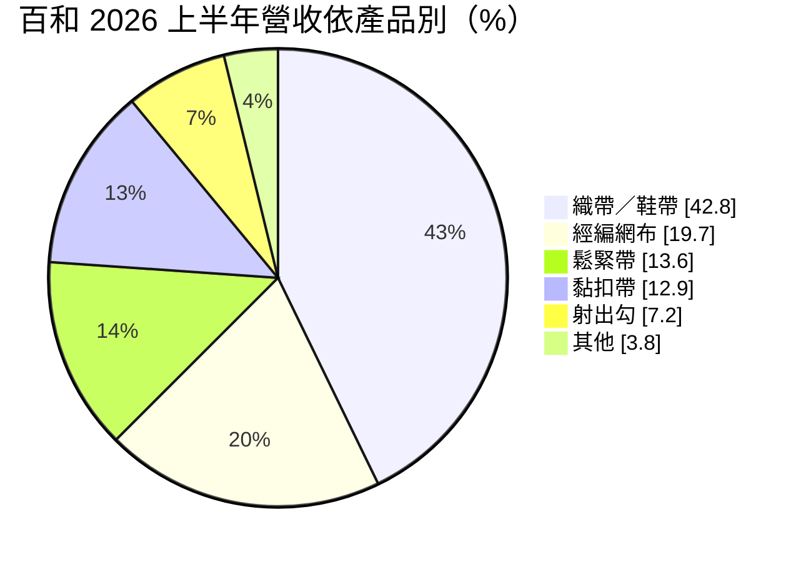
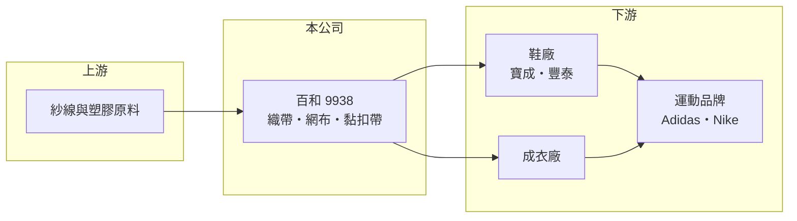

# 9938 百和

> 上市｜[[產業索引-其他業|其他業]]｜上市（櫃）日期 2001/01/12

# 第一章：企業模式與商業藍圖

> [!info] 撰寫說明
> 精簡版，由 Claude 依公開資料整理，架構比照 [[2330台積電]]，資料截至 2026-10-07。來源：富果研究百和 2026 年 7 月法說會整理。#待校對

百和是全球主要的鞋材與服飾副料供應商，產品包括織帶、網布、鬆緊帶與[[黏扣帶]]，主要賣給國際運動品牌的鞋廠。

- **核心業務：** 生產織帶、鞋帶、經編網布、鬆緊帶、黏扣帶與射出勾等副料，用在鞋子、衣著與其他產品。
- **營收結構：** 2026 年上半年依產品別，織帶與鞋帶占 42.8%、經編網布 19.7%、鬆緊帶 13.6%、黏扣帶 12.9%；依應用別，鞋業占 60.1%、衣著占 25%。
- **營運據點：** 在台灣、越南、印尼與中國四國設有九大生產基地，貼近品牌鞋廠的生產地。
- **長期方向：** 2026 年資本支出預算 28.02 億元，持續擴充東南亞產能，並開發 3C、醫療、航太、汽車等非鞋服應用。

# 第二章：護城河深度與競爭優勢

百和的優勢在於多品項副料的一站供應與國際品牌認證。

- **競爭優勢：** 品項齊全、產能遍布東南亞，能就近供應 [[9904寶成]]、[[9910豐泰]] 等品牌鞋廠，通過品牌認證後轉換成本較高。
- **主要對手：** 黏扣帶有 Velcro、YKK 等國際大廠，織帶與網布則面對中國與東南亞的眾多中小型業者。
- **觀察重點：** 前十大客戶占營收 65.5%，其中 Adidas 23.9%、Nike 16.1%；Hoka、BOA、亞瑟士等成長型品牌的訂單增幅，以及 2028 年奧運備貨效應。

# 第三章：財務體質與盈利規模

資料日期：2026-10-07，表格是撰寫當時的快照；最新月營收、毛利率、累計 EPS 由自動排程寫在本筆記的屬性欄位（月營收、毛利率、累計EPS 等）。#待校對

百和毛利率維持在三成以上，獲利能力在鞋材業中屬較佳水準。

- **營收規模：** 2026 年上半年合併營收 78.42 億元。
- **獲利：** 2026 年上半年 EPS 1.36 元，[[毛利率]] 31.1%，[[營業利益率]] 11.6%。
- **財務特色：** 公司表示下半年營運將優於上半年，並預期 2027 年更穩健；資本支出偏高，短期折舊會增加。

# 第四章：總體風險與地緣政治

百和的風險與國際運動品牌的庫存週期高度連動。

- **產業週期：** 品牌庫存調整會沿供應鏈放大成[[長鞭效應]]，副料廠訂單波動往往大於終端銷售。
- **營運風險：** 客戶集中於 Adidas 與 Nike 兩大品牌，品牌訂單轉移或銷售不佳會直接影響營收。
- **其他風險：** 美國對東南亞的關稅政策、越南與印尼的工資上漲，以及新台幣匯率變動都會影響獲利。

# 專有名詞解析

## 金融

- **[[毛利率]]**：毛利除以營收，反映產品或服務本身的獲利能力。
- **[[營業利益率]]**：營業利益除以營收，反映本業扣除營業費用後的獲利能力。

## 產業

- **[[黏扣帶]]**：俗稱魔鬼氈，一面為勾、一面為圈，貼合後可反覆黏開，用於鞋子、服飾與醫療用品。
- **[[長鞭效應]]**：終端需求的小幅變動，沿供應鏈往上游傳遞時被逐級放大，造成上游庫存與訂單劇烈波動。

# 核心供應鏈

- 上游：聚酯與尼龍紗線、塑膠粒等原料供應商（推估）
- 下游／客戶：[[9904寶成]]、[[9910豐泰]] 等鞋廠與成衣廠，終端品牌為 Adidas、Nike、Hoka、亞瑟士
- 同業：Velcro、YKK

## 最新新聞
<!-- news:start -->
<!-- news:end -->

## 相關連結
- [公開資訊觀測站](https://mopsov.twse.com.tw/mops/web/t05st03?step=1&firstin=1&co_id=9938)
- [Goodinfo](https://goodinfo.tw/tw/StockDetail.asp?STOCK_ID=9938)
- [Yahoo 股市](https://tw.stock.yahoo.com/quote/9938)
- [鉅亨網新聞](https://www.cnyes.com/twstock/9938/news)
