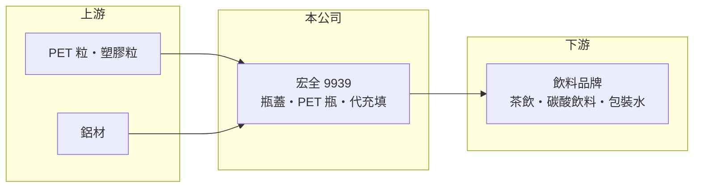

# 9939 宏全

> 上市｜[[產業索引-其他業|其他業]]｜上市（櫃）日期 2001/03/02

# 第一章：企業模式與商業藍圖

> [!info] 撰寫說明
> 精簡版，由 Claude 依公開資料整理，架構比照 [[2330台積電]]，資料截至 2026-10-07。來源：nstock 公司概況頁、經濟日報財報新聞標題、winvest 營收快訊標題；據點與客戶為整理性描述。#待校對

宏全是亞洲主要的飲料包材廠，生產瓶蓋、PET 瓶與標籤，並替飲料品牌代為充填。

- **核心業務：** 製造與銷售鋁蓋、塑蓋、爪蓋、標籤、熱縮薄膜、PET 瓶，以及飲料充填與包裝機械。
- **營收結構：** 以 PET 瓶、瓶蓋與[[代充填]]服務為主；各產品營收比重未查得。
- **營運據點：** 除台灣外，在中國、東南亞與非洲等地設廠，常以[[廠中廠]]方式設在飲料廠旁邊（推估）。
- **長期方向：** 擴大代充填與海外新興市場布局，並因應各國減塑法規發展輕量瓶與再生 PET 材料（推估）。

# 第二章：護城河深度與競爭優勢

宏全的優勢在於貼近客戶的設廠模式與一條龍包材服務。

- **競爭優勢：** 把吹瓶與充填產線設在客戶工廠內，省去空瓶運輸成本，客戶轉換供應商需重新規劃產線，黏著度高（推估）。
- **主要對手：** 中國的飲料包材廠，以及各國飲料品牌自建的吹瓶產線（推估）。
- **觀察重點：** 東南亞與非洲新廠的產能利用率、代充填訂單成長，以及 PET 原料價格對毛利的影響。

# 第三章：財務體質與盈利規模

資料日期：2026-10-07，表格是撰寫當時的快照；最新月營收、毛利率、累計 EPS 由自動排程寫在本筆記的屬性欄位（月營收、毛利率、累計EPS 等）。#待校對

宏全獲利穩定，並維持高配息。

- **營收規模：** 2025 年全年營收 288.77 億元；2026 年 1 至 8 月累計 211.25 億元，年增 3.29%；8 月營收 28.43 億元，年增 7.08%。
- **獲利：** 2025 年全年 EPS 9.1 元；2026 年第二季 EPS 4.3 元，季增 91.11%，上半年累計 6.55 元。第二季[[毛利率]] 27.41%、[[營業利益率]] 18.61%。
- **財務特色：** 2025 年度擬配發現金股利 6.2 元，近五年平均現金股利 5.37 元。第二季 EPS 跳升幅度大於營收成長，可能含季節性旺季或[[一次性收益]]（推估）。

# 第四章：總體風險與地緣政治

宏全的風險主要來自原料價格、法規與海外營運。

- **產業週期：** 飲料需求受天氣與季節影響，夏季為旺季；整體需求較穩定，但新興市場消費力會隨景氣波動。
- **營運風險：** PET 粒與鋁材價格波動影響成本，轉嫁給客戶通常有時間落差；客戶集中於大型飲料品牌。
- **其他風險：** 各國減塑與塑膠稅法規、海外據點的匯率與政治風險。

# 專有名詞解析

## 金融

- **[[一次性收益]]**：不會每年重複發生的收益，例如處分土地或子公司，分析獲利時通常要排除。
- **[[毛利率]]**：毛利除以營收，反映產品或服務本身的獲利能力。
- **[[營業利益率]]**：營業利益除以營收，反映本業扣除營業費用後的獲利能力。

## 產業

- **[[代充填]]**：包材廠替飲料品牌完成吹瓶、裝填飲料與封蓋，品牌商只負責配方與銷售。
- **[[廠中廠]]**：把包材產線直接設在客戶工廠內或旁邊，減少運輸並與客戶生產線緊密銜接。

# 核心供應鏈

- 上游：PET 粒與塑膠原料供應商、鋁材供應商（推估）
- 下游／客戶：國際與台灣的飲料品牌（推估）
- 同業：中國飲料包材廠、飲料品牌自建吹瓶產線

## 最新新聞
<!-- news:start -->
<!-- news:end -->

## 相關連結
- [公開資訊觀測站](https://mopsov.twse.com.tw/mops/web/t05st03?step=1&firstin=1&co_id=9939)
- [Goodinfo](https://goodinfo.tw/tw/StockDetail.asp?STOCK_ID=9939)
- [Yahoo 股市](https://tw.stock.yahoo.com/quote/9939)
- [鉅亨網新聞](https://www.cnyes.com/twstock/9939/news)
