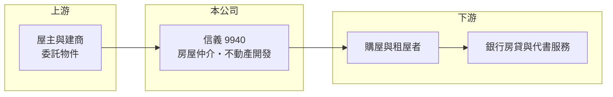

# 9940 信義

> 上市｜[[產業索引-其他業|其他業]]｜上市（櫃）日期 2001/09/17

# 第一章：企業模式與商業藍圖

> [!info] 撰寫說明
> 精簡版，由 Claude 依公開資料整理，架構比照 [[2330台積電]]，資料截至 2026-10-07。來源：nstock 公司概況頁、winvest 營收快訊標題；業務與據點為整理性描述。#待校對

信義是台灣最大的上市[[房屋仲介]]公司，以直營店經營中古屋買賣與租賃居間，並延伸到不動產開發與休閒觀光。

- **核心業務：** 房屋租售的居間仲介，以及不動產開發租售與休閒觀光業務。
- **營收結構：** 以台灣房屋仲介服務收入為主，不動產開發收入隨建案完工交屋認列，金額年度間差異大（推估）；各業務比重未查得。
- **營運據點：** 以台灣直營門市為主，並在中國、日本等地設有據點（推估）。
- **長期方向：** 透過不動產開發、[[不動產代銷]]與周邊服務降低對單一仲介景氣的依賴（推估）。

# 第二章：護城河深度與競爭優勢

信義的優勢在於品牌與直營體系，但房仲業進入門檻不高。

- **競爭優勢：** 長期經營的品牌信任度與直營店管理制度，在高總價與都會區物件具有較強的接案能力（推估）。
- **主要對手：** 永慶房屋、住商不動產、台灣房屋等房仲品牌，以及大量加盟店與地區型仲介。
- **觀察重點：** 全台買賣移轉棟數、央行信用管制與房貸政策變化，以及開發案的完工認列時點。

# 第三章：財務體質與盈利規模

資料日期：2026-10-07，表格是撰寫當時的快照；最新月營收、毛利率、累計 EPS 由自動排程寫在本筆記的屬性欄位（月營收、毛利率、累計EPS 等）。#待校對

信義 2025 年獲利因房市降溫大幅下滑，2026 年第二季開始回升。

- **營收規模：** 2025 年全年營收 114.57 億元；2026 年 1 至 8 月累計 77.69 億元，6 月營收 10.84 億元、年增 41.42%，8 月營收 9.64 億元。
- **獲利：** 2025 年全年 EPS 0.28 元；2026 年第二季 EPS 0.45 元。第二季[[毛利率]] 28.35%、[[營業利益率]] 12.36%。
- **財務特色：** 仲介業人事與店租費用占比高，交易量變動對獲利有明顯的[[營運槓桿]]；2024 年全年現金股利 1.8 元，近五年平均現金殖利率約 5.27%。

# 第四章：總體風險與地緣政治

信義的風險幾乎都與房市景氣和政策有關。

- **產業週期：** 房仲收入直接取決於買賣交易量，房市降溫時營收與獲利會同步大幅下滑。
- **營運風險：** 開發案的入帳時點不穩定，可能造成各季獲利大幅起伏；經紀人員流動率高。
- **其他風險：** 央行選擇性信用管制、房地合一稅等法規變動，以及利率走勢都會影響購屋意願。

# 專有名詞解析

## 金融

- **[[營運槓桿]]**：固定成本比重高的企業，營收增加時利潤增幅更大，營收下滑時利潤也跌得更快。
- **[[毛利率]]**：毛利除以營收，反映產品或服務本身的獲利能力。
- **[[營業利益率]]**：營業利益除以營收，反映本業扣除營業費用後的獲利能力。

## 產業

- **[[房屋仲介]]**：替買方與賣方媒合房屋交易，成交後依成交價收取服務費的行業。
- **[[不動產代銷]]**：受建商委託負責建案廣告與銷售，依成交金額收取服務費。

# 核心供應鏈

- 上游：委託出售或出租的屋主、委託代銷的建商
- 下游／客戶：購屋與租屋的個人及企業
- 同業：永慶房屋、住商不動產、台灣房屋

## 最新新聞
<!-- news:start -->
<!-- news:end -->

## 相關連結
- [公開資訊觀測站](https://mopsov.twse.com.tw/mops/web/t05st03?step=1&firstin=1&co_id=9940)
- [Goodinfo](https://goodinfo.tw/tw/StockDetail.asp?STOCK_ID=9940)
- [Yahoo 股市](https://tw.stock.yahoo.com/quote/9940)
- [鉅亨網新聞](https://www.cnyes.com/twstock/9940/news)
