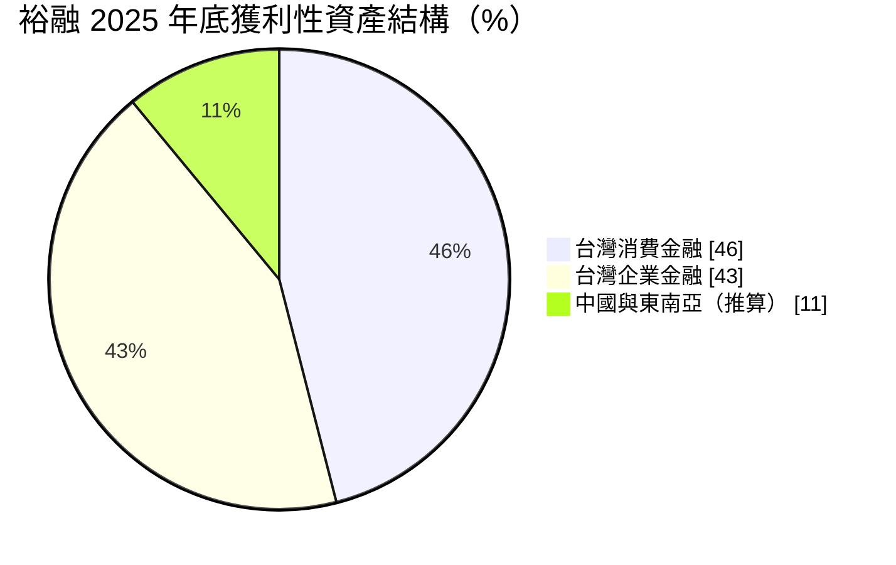
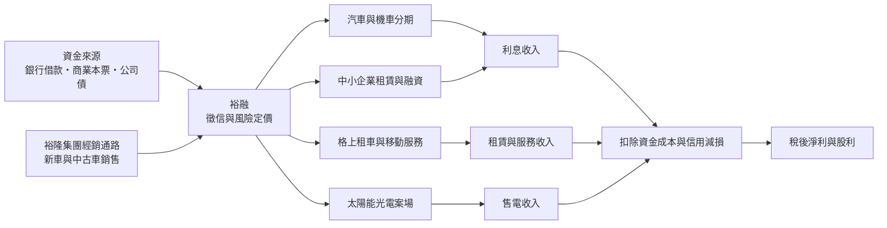
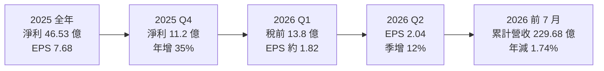
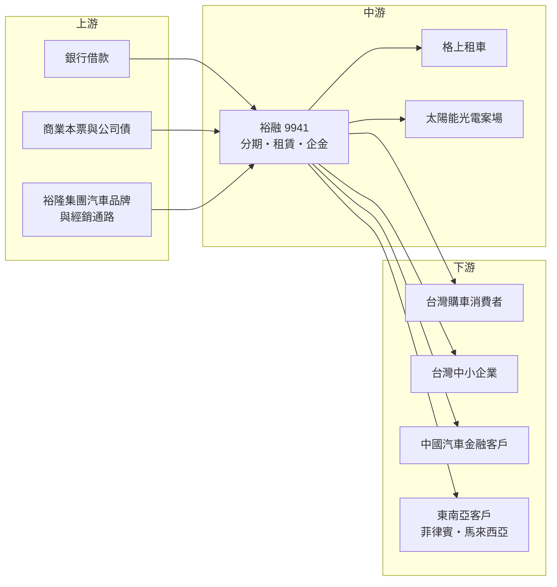

# 9941 裕融

> 上市｜[[產業索引-其他業|其他業]]｜上市（櫃）日期 2001/09/17

# 第一章：企業模式與商業藍圖

> [!info] 撰寫說明
> 本文由 Claude 依公開資料整理，架構比照 [[2330台積電]] 的四章研究，資料截至 2026-10-07。財務數字來源：富果研究（裕融 2026 年 3 月法說會摘要）、優分析（2025 年自結獲利報導）、旺得富／工商時報（2025 年股利與 2026 年第一季獲利報導）、winvest 營收快訊與公司基本資料；產業描述為整理性內容，尚未逐條比對原始文件。#待校對

在評估單一個股的長期投資價值時，首要步驟是拆解企業的底層獲利邏輯。本章針對裕融企業（股票代號：9941，以下簡稱裕融）的商業模式進行定性分析，說明一家從裕隆集團汽車分期起家的融資公司，如何把業務延伸到中小企業融資、租車、綠能與東南亞市場。

## 一、核心定位：裕隆集團的金融與移動服務平台

裕融成立於 1990 年 4 月 12 日，2001 年 9 月上市，資本額約 67.56 億元。它最初是裕隆集團替旗下汽車經銷體系提供購車[[分期付款]]的公司，買車的人向裕融借款，分期償還本息。三十多年下來，裕融的業務已經從「集團車貸」擴大成三條主線：

* **金融事業：** 汽車與機車分期、中古車融資、中小企業設備[[融資租賃]]與營運週轉融資，是獲利主體。
* **移動服務：** 子公司格上租車的長短期租車、汽車零配件與二手車業務。
* **綠能事業：** 投資太陽能光電案場，案場數超過 350 座，並銷售綠電。

和中租-KY 相比，裕融的客群更集中在「車」：消費金融以購車分期為主，資產品質相對穩定，但利差也較低。

## 二、業務板塊：台灣消金與企金各占四成多

以 2025 年底的獲利性資產計算，台灣消費金融約 1,039 億元、占 46%，台灣企業金融約 971 億元、占 43%，其餘為中國汽車金融與東南亞業務（比重以 100% 減去台灣兩項推算）：

* **台灣消費金融：** 新車與中古車分期、機車分期。2025 年資產餘額年減 11.1%，主因是法規調整與市場競爭；新車分期 30 天以上延滯率維持在 0.2% 以下，資產品質很好。公司預期 2026 年[[中古車融資]]成為成長動力，第一季中古車業務年增約三成。
* **台灣企業金融：** 中小企業的設備租賃與融資，2025 年資產餘額年增 9.5%，是近年成長主力。
* **中國汽車金融：** 2024 年處分中國裕隆金融，產生一次性處分利益；剩餘中國汽車金融資產約人民幣 50.5 億元，2025 年減少 17.3%，採穩健收縮策略。
* **東南亞：** 菲律賓與馬來西亞「菲馬雙引擎」。菲律賓 2025 年 4 月啟動保險代理業務，與融資業務形成綜效；馬來西亞已取得 Money Lending 執照並正式營運，預期 2026 年轉虧為盈。2025 年東南亞獲利貢獻約 1%。

## 三、資本轉化邏輯：集團通路帶來的低風險車貸

* **通路即客源：** 裕隆集團的汽車經銷據點直接把購車客戶導入裕融，獲客成本低，且車輛本身就是擔保品，違約時可以拍賣回收。
* **利差與信用成本：** 和所有融資公司一樣，裕融的獲利公式是「放款收益率減資金成本（[[利差]]），再扣除[[信用成本]]與營運費用」。2025 年第四季信用減損損失年減 30%，2026 年第一季預期信用損失季減與年減都約 20%，營業費用年減 3%。
* **多元收入：** 租車與綠電收入不受信用循環直接影響，能分散純放款業務的風險。

## 四、企業長期藍圖：中古車、企金、東南亞與綠能

* **台灣：** 組織再造完成後，年度業績目標設定雙位數成長，延滯率目標從 1.4% 進一步降到 1.2%。
* **東南亞：** 菲律賓與馬來西亞預期雙位數成長，逐步提高海外獲利占比。
* **綠能：** 2026 年發電量目標突破 1 億度，新增 20 至 30MW 裝置容量，預計簽訂超過 5,000 萬度的[[綠電]]訂單。
* **股東回報：** 2025 年度股利發放率調升到約 60%，為近五年新高。

# 第二章：護城河深度與競爭優勢

在長期價值投資中，「護城河」指企業抵禦競爭、維持超額利潤的保護機制。本章分析裕融的護城河構成、主要競爭對手，以及這些優勢在車市與信用循環中能守住多少。

## 一、裕融護城河的核心組成要素

裕融的護城河屬於「窄到中等護城河」，主要來自以下三點：

* **1. 集團通路的獲客優勢：** 裕隆集團旗下品牌（如 Nissan、Luxgen 等）經銷體系提供穩定客源，裕融不需要像獨立融資公司那樣花大量成本找客戶。
* **2. 以車為擔保的低損失率：** 新車分期 30 天以上延滯率在 0.2% 以下，加上車輛可拍賣回收，損失率遠低於無擔保的消費性貸款。
* **3. 服務生態系：** 分期、租車、二手車、零配件串成完整的汽車生命週期服務，客戶從買車、用車到換車都可能留在裕融體系內。

## 二、主要競爭對手格局

| 對手 | 定位 | 對裕融的威脅 |
|---|---|---|
| [[5871中租-KY]] | 台灣最大租賃集團，中小企業融資與車貸並重，布局中國與東協 | 在中小企業融資與中古車貸款直接競爭，規模與資金成本占優 |
| 和潤企業 | 和泰集團旗下，以 TOYOTA 與 Lexus 車輛分期為主 | 背後有台灣市占最高的汽車品牌，在新車分期市場最直接競爭 |
| 台灣各銀行車貸 | 資金成本低 | 以低利率搶優質購車客戶 |
| 菲律賓、馬來西亞當地融資業者 | 熟悉當地市場 | 裕融在東南亞仍屬新進者 |

## 三、優勢轉化：哪些市場守得住、哪些守不住

* **守得住：** 集團品牌的新車分期與中小企業融資。新車分期資產品質佳，企金資產 2025 年仍年增近一成。
* **守不住或需觀察：** 台灣消費金融整體規模。2025 年消金資產年減 11.1%，反映法規調整與銀行、同業的競爭，若集團汽車品牌的市占下滑，裕融的新車分期客源也會減少。
* **觀察重點：** 中古車融資能否延續三成成長、馬來西亞能否如期轉盈，以及台灣延滯率能否降到 1.2% 的目標。

# 第三章：財務體質與盈利規模

資料日期：2026-10-07。數字取自富果研究、優分析、工商時報與 winvest 整理的公司自結與法說會資料，表格是撰寫當時的快照；最新月營收、毛利率、累計 EPS 由自動排程寫在本筆記的屬性欄位（月營收、毛利率、累計EPS 等）。#待校對

財務報表是檢驗護城河是否真實存在的最終標準。融資業不適用製造業的毛利率與營業利益率，本章改以稅後淨利與 EPS、ROE 與資產結構、資產品質與信用成本、股利政策四個面向，檢視裕融的獲利品質。

## 一、獲利能力的基石：稅後淨利與 EPS

| 項目 | 2025 全年 | 2025 Q4 | 2026 Q1 | 2026 Q2 | 2026 上半年 |
|---|---|---|---|---|---|
| 營收（新台幣） | 395 億 | 未查得 | 95.9 億 | 未查得 | 未查得 |
| 稅後淨利 | 46.53 億 | 11.2 億 | 未查得（稅前 13.8 億） | 未查得 | 未查得 |
| EPS（元） | 7.68 | 未查得 | 1.82（推算） | 2.04 | 3.86 |

2026 年第一季 EPS 以上半年 3.86 元減第二季 2.04 元推算。

* 2025 年營收約 395 億元、年減 4.7%，稅後淨利 46.53 億元、年減約 9%。年減主因是 2024 年處分中國裕隆金融的一次性收益墊高比較基期，並非本業大幅轉差。
* 2025 年第四季淨利年增 35%，2026 年第二季 EPS 季增 12%、年增 6%，顯示信用成本下降帶動獲利回升；上半年累計 EPS 3.86 元，與去年同期大致持平（年減 1%）。

## 二、[[ROE]] 與資產結構

* **ROE 與 ROA：** 2025 年 ROE 11.43%、[[ROA]] 1.65%。融資公司以約 6 至 7 倍的財務槓桿把低 ROA 放大成雙位數 ROE（槓桿倍數為推估）。
* **資產規模：** 2025 年底總資產約 2,846 億元、年減 2%，第一季開始止跌趨穩。
* **資產組合：** 台灣企金比重持續提高，消金比重下降，代表收益率與風險結構正在改變；企金的單筆金額較大、風險較集中。

## 三、資產品質與信用成本

* **台灣[[延滯率]]：** 由 1.60% 降到 1.40%，連續 8 季下降，2026 年目標 1.2%。
* **中國延滯率：** 由 3.15% 降到 2.9%。
* **延滯金額：** 2025 年底約 28.4 億元。
* **信用成本：** 2025 年第四季信用減損損失年減 30%，2026 年第一季預期信用損失再減約 20%，是 2026 年獲利回升的主要來源。

## 四、股利政策

* 2025 年度配發現金股利 4.38 元與[[股票股利]] 0.2 元，合計 4.58 元，發放率調升到約 60%，為近五年新高。
* 裕融每年保留部分盈餘並配發少量股票股利，以支應放款資產成長所需的資本。以 ROE 約 11%、發放率約六成推估，留存盈餘可支撐每年約 4% 至 5% 的資產成長（推估）。

# 第四章：總體風險與地緣政治

任何企業都無法脫離宏觀環境獨立存在。本章分析裕融未來必須面對的地緣政治、景氣與利率、營運與法規風險。

## 一、地緣政治風險

* **中國業務收縮：** 處分中國裕隆金融後，中國曝險已大幅降低，但剩餘的中國汽車金融資產仍受中國車市價格戰與景氣影響。
* **東南亞新興市場：** 菲律賓與馬來西亞的政治、匯率與法規環境與台灣差異大，裕融屬新進者，需要時間建立風控經驗。
* **台灣車市與關稅：** 美國關稅與台灣進口車稅制調整，可能改變國產車與進口車的價格結構，影響集團汽車品牌的銷量與裕融的分期客源。

## 二、利率與景氣週期

* **利率方向：** 裕融的資金成本隨市場利率浮動，車貸利率則多為固定，升息時利差會被壓縮，降息則有利。
* **車市週期：** 新車銷量受景氣、油價與政策（如汰舊換新補助）影響，車市轉弱時分期新承作量下降。
* **信用循環：** 企金資產比重上升後，裕融對中小企業景氣的敏感度提高，景氣反轉時信用成本可能回升。

## 三、營運環境的隱性風險

* **集團依賴：** 裕隆集團汽車品牌的市占若持續下滑，裕融的新車分期業務會受影響，需要靠中古車與非集團品牌補上。
* **資金來源：** 不能吸收存款，依賴銀行借款與票債市場，信用市場緊縮時資金成本會快速上升。
* **資安與詐騙：** 融資公司握有大量個資，裕融已與法務部調查局簽署資安合作備忘錄，強化資料保護與打擊詐騙。

## 四、法規與科技演進

* **金融監理：** 優分析報導指出，隨著相關法規調整完成，裕融認為法規環境已進入穩定期；但融資業若被納入更嚴格的監理框架，資本與揭露要求可能提高。
* **電動車轉型：** [[EV]] 的殘值評估與二手車價格比燃油車更難預測，車貸的擔保品價值風險上升；但電動車價格較高，也可能提高單筆分期金額。
* **數位金融：** 線上貸款與數位比價平台降低客戶轉換成本，裕融需要靠數位應用升級維持客戶黏著度。
* **綠能政策：** 台灣綠電交易與躉購制度變化，影響太陽能案場的投資報酬。

# 專有名詞解析

## 應用

- **[[EV]]**：電動車，以電池與馬達取代內燃機驅動的車輛。

## 金融

- **[[分期付款]]**：把購買車輛或設備的款項分成多期償還，融資公司賺取分期利息。
- **[[融資租賃]]**：租賃公司買下設備再租給企業使用，企業按期支付租金，實質上是一種放款。
- **[[延滯率]]**：逾期未還款的放款占總放款的比例，數字越高代表資產品質越差。
- **[[信用成本]]**：為預期呆帳提列的損失占放款的比例，直接從獲利中扣除。
- **[[利差]]**：放款收益率減去資金成本的差距，是融資業最主要的獲利來源。
- **[[ROE]]**：股東權益報酬率，稅後淨利除以股東權益，衡量公司用股東的錢賺錢的效率。
- **[[ROA]]**：資產報酬率，稅後淨利除以總資產，衡量整體資產的獲利效率。
- **[[股票股利]]**：以新發行股票配發給股東的股利，會增加股本，常用於保留資本支應成長。

## 產業

- **[[中古車融資]]**：以二手車為擔保品的貸款，利率通常高於新車分期，但車輛殘值評估較困難。
- **[[綠電]]**：再生能源發出的電力，企業可透過購電合約購買以達成減碳目標。

# 核心供應鏈

## 1. 上游：資金來源與集團通路
- 銀行借款與票債市場
- 裕隆集團：[[2201裕隆]]（母公司）、[[2227裕日車]]（Nissan 代理）

## 2. 中游：裕融本身與子公司
- 汽車與機車分期、中古車融資、中小企業融資
- 格上租車、二手車與零配件業務
- 太陽能光電案場

## 3. 下游：主要客群
- 台灣購車消費者與中小企業
- 中國與東南亞汽車金融及信貸客戶

## 4. 同業比較
- 租賃與融資：[[5871中租-KY]]、和潤企業

## 最新新聞
<!-- news:start -->
<!-- news:end -->

## 相關連結
- [公開資訊觀測站](https://mopsov.twse.com.tw/mops/web/t05st03?step=1&firstin=1&co_id=9941)
- [Goodinfo](https://goodinfo.tw/tw/StockDetail.asp?STOCK_ID=9941)
- [Yahoo 股市](https://tw.stock.yahoo.com/quote/9941)
- [鉅亨網新聞](https://www.cnyes.com/twstock/9941/news)
