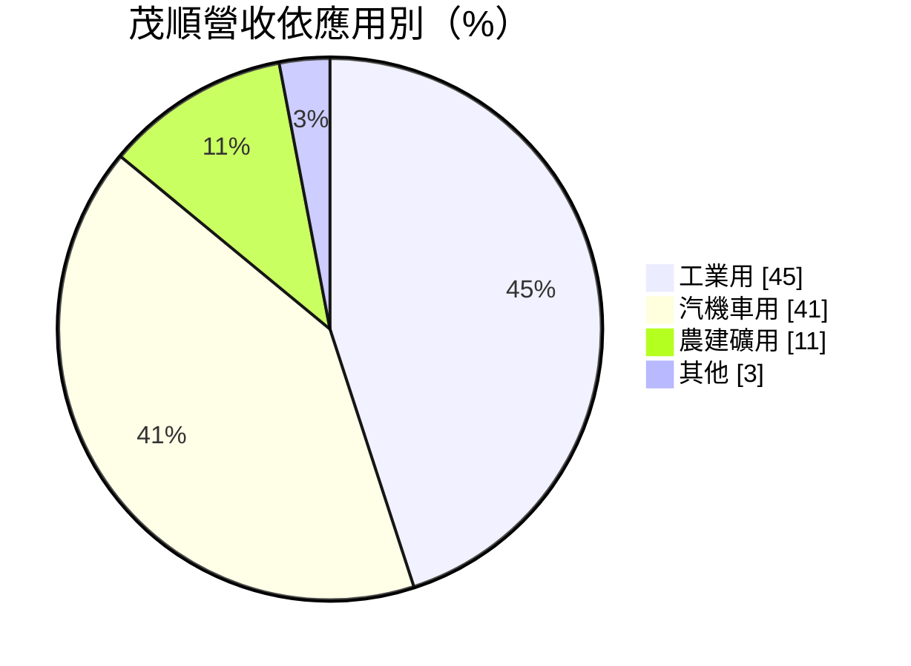
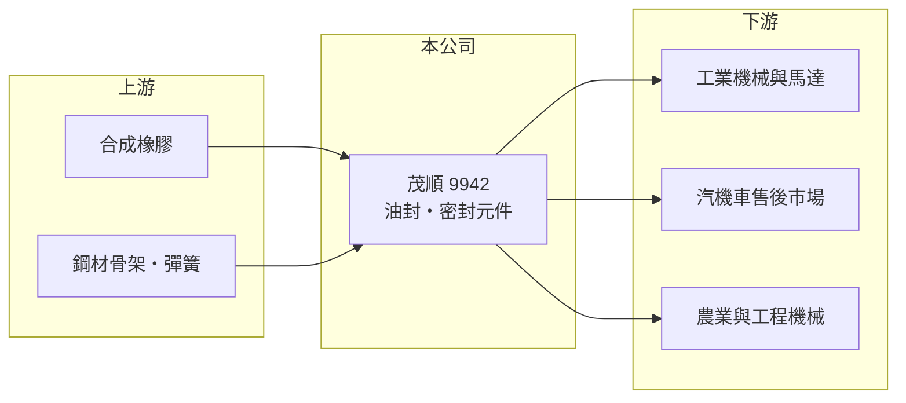

# 9942 茂順

> 上市｜[[產業索引-其他業|其他業]]｜上市（櫃）日期 2002/01/28

# 第一章：企業模式與商業藍圖

> [!info] 撰寫說明
> 精簡版，由 Claude 依公開資料整理，架構比照 [[2330台積電]]，資料截至 2026-10-07。來源：富果研究茂順 2026 年 9 月法說會整理。#待校對

茂順是台灣最大的[[油封]]製造商，生產防止機械漏油的密封元件，產品以售後維修市場與工業用途為主。

- **核心業務：** 研發與製造油封等橡膠密封元件，用在馬達、減速機、汽機車引擎、農業與工程機械。
- **營收結構：** 依應用別，工業用占 45%、汽機車用 41%、農建礦用 11%；依地區別，亞洲占 63%（其中中國 47%）、歐洲 23%、美洲 13%。
- **營運據點：** 主要生產基地在台灣南投，另在中國昆山設廠。
- **長期方向：** 已購入約 4,800 坪土地供未來十年擴產，並維持[[毛利率]] 40% 以上的目標。

# 第二章：護城河深度與競爭優勢

茂順以少量多樣的生產能力，在售後市場建立了穩定利潤。

- **競爭優勢：** 油封規格多達上萬種，茂順能以少量多樣快速出貨，滿足售後維修與工業通路的需求，毛利率長期高於一般零組件廠（推估）。
- **主要對手：** 日本 NOK、德國 Freudenberg、瑞典 SKF 等國際密封件大廠，以及中國當地油封廠。
- **觀察重點：** 中國工業需求變化、歐美通路庫存水位，以及擴產後產能能否順利消化。

# 第三章：財務體質與盈利規模

資料日期：2026-10-07，表格是撰寫當時的快照；最新月營收、毛利率、累計 EPS 由自動排程寫在本筆記的屬性欄位（月營收、毛利率、累計EPS 等）。#待校對

茂順獲利能力高，2026 年營運回到成長軌道。

- **營收規模：** 2026 年上半年合併營收 22.89 億元，前 8 月累計營收年增 14.53%。
- **獲利：** 2026 年上半年稅後淨利 3.96 億元，EPS 4.76 元，毛利率 40%，稅後淨利率 17%。
- **財務特色：** 公司表示全年營收獲利挑戰歷史次高，股利目標不低於 7 元，屬高配息的利基型零組件股。

# 第四章：總體風險與地緣政治

茂順的風險在於中國市場占比高，以及工業景氣循環。

- **產業週期：** 工業與工程機械需求隨全球製造業景氣波動，通路商庫存調整會造成[[長鞭效應]]。
- **營運風險：** 中國占營收近半，當地景氣與同業低價競爭會影響訂單與售價。
- **其他風險：** 合成橡膠等原料價格波動、新台幣與人民幣匯率，以及美國關稅政策。

# 專有名詞解析

## 金融

- **[[毛利率]]**：毛利除以營收，反映產品或服務本身的獲利能力。

## 產業

- **[[油封]]**：裝在旋轉軸上的環狀橡膠密封件，防止潤滑油外漏並阻擋灰塵進入，用於引擎、馬達與減速機。
- **[[長鞭效應]]**：終端需求的小幅變動，沿供應鏈往上游傳遞時被逐級放大，造成上游庫存與訂單劇烈波動。

# 核心供應鏈

- 上游：合成橡膠、鋼材與彈簧等原料供應商（推估）
- 下游／客戶：工業機械與馬達廠、汽機車維修通路、農建礦機械業者
- 同業：NOK、Freudenberg、SKF

## 最新新聞
<!-- news:start -->
<!-- news:end -->

## 相關連結
- [公開資訊觀測站](https://mopsov.twse.com.tw/mops/web/t05st03?step=1&firstin=1&co_id=9942)
- [Goodinfo](https://goodinfo.tw/tw/StockDetail.asp?STOCK_ID=9942)
- [Yahoo 股市](https://tw.stock.yahoo.com/quote/9942)
- [鉅亨網新聞](https://www.cnyes.com/twstock/9942/news)
