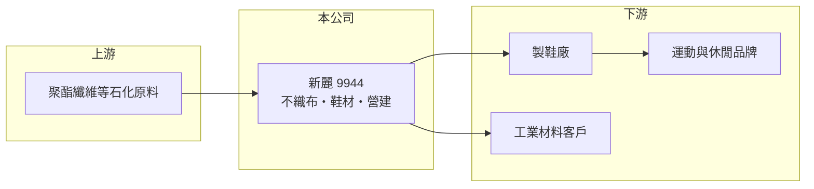

# 9944 新麗

> 上市｜[[產業索引-其他業|其他業]]｜上市（櫃）日期 2002/08/26

# 第一章：企業模式與商業藍圖

> [!info] 撰寫說明
> 精簡版，由 Claude 依公開資料整理，架構比照 [[2330台積電]]，資料截至 2026-10-07。來源：nstock 公司概況頁、winvest 營收快訊標題。公開資料有限。#待校對

新麗是生產[[不織布]]與相關材料的公司，產品主要用於鞋材，另有保溫隔離工業材料與營建業務。

- **核心業務：** 不織布、保溫及隔離工業材料與相關產品的製造買賣，紡織機器製造，以及住宅商業大樓的興建出售與租賃。
- **營收結構：** 以不織布鞋材為主要收入來源（推估）；各產品營收比重未查得。
- **營運據點：** 台灣以外在東南亞與中國設有生產據點，貼近鞋廠（推估）。
- **長期方向：** 維持鞋材本業，並以營建與租賃業務增加收入來源（推估）。

# 第二章：護城河深度與競爭優勢

新麗屬於鞋材供應鏈中的利基材料廠，規模不大。

- **競爭優勢：** 長期供應鞋廠的不織布材料，具備材料開發與品牌認證經驗（推估）。
- **主要對手：** 其他鞋材與不織布業者，如 [[9938百和]] 等鞋材供應商，以及中國與東南亞當地材料廠。
- **觀察重點：** 運動品牌庫存與鞋廠訂單變化，以及營建案入帳時點。

# 第三章：財務體質與盈利規模

資料日期：2026-10-07，表格是撰寫當時的快照；最新月營收、毛利率、累計 EPS 由自動排程寫在本筆記的屬性欄位（月營收、毛利率、累計EPS 等）。#待校對

新麗 2026 年營收成長約一成，獲利率維持穩定但資本效率偏低。

- **營收規模：** 2025 年全年營收 22.75 億元；2026 年 1 至 8 月累計 17.62 億元，年增 10.26%；8 月營收 1.75 億元，年增 9.65%。
- **獲利：** 2026 年第二季 EPS 0.4 元，季減 38.46%；第二季[[毛利率]] 31.99%、[[營業利益率]] 8.78%。
- **財務特色：** 資本額 10.59 億元，第二季 [[ROE]] 1.41%；近五年平均現金股利 0.65 元。

# 第四章：總體風險與地緣政治

新麗的風險與鞋業景氣及營建業務相關。

- **產業週期：** 品牌庫存調整會沿鞋業供應鏈放大，材料廠訂單波動大於終端銷售。
- **營運風險：** 營建業務收入隨建案完工認列，造成年度間獲利起伏。
- **其他風險：** 石化原料價格波動、東南亞工資與匯率變動，以及美國對東南亞的關稅政策。

# 專有名詞解析

## 金融

- **[[毛利率]]**：毛利除以營收，反映產品或服務本身的獲利能力。
- **[[營業利益率]]**：營業利益除以營收，反映本業扣除營業費用後的獲利能力。
- **[[ROE]]**：股東權益報酬率，稅後淨利除以股東權益，衡量公司運用股東資金賺錢的效率。

## 產業

- **[[不織布]]**：不經紡紗織布，直接把纖維以熱、化學或機械方式黏合成布，用於鞋材、口罩、衛材與隔熱材料。

# 核心供應鏈

- 上游：聚酯纖維等石化原料供應商（推估）
- 下游／客戶：製鞋廠與運動休閒品牌、工業材料客戶（推估）
- 同業：[[9938百和]] 等鞋材供應商

## 最新新聞
<!-- news:start -->
<!-- news:end -->

## 相關連結
- [公開資訊觀測站](https://mopsov.twse.com.tw/mops/web/t05st03?step=1&firstin=1&co_id=9944)
- [Goodinfo](https://goodinfo.tw/tw/StockDetail.asp?STOCK_ID=9944)
- [Yahoo 股市](https://tw.stock.yahoo.com/quote/9944)
- [鉅亨網新聞](https://www.cnyes.com/twstock/9944/news)
