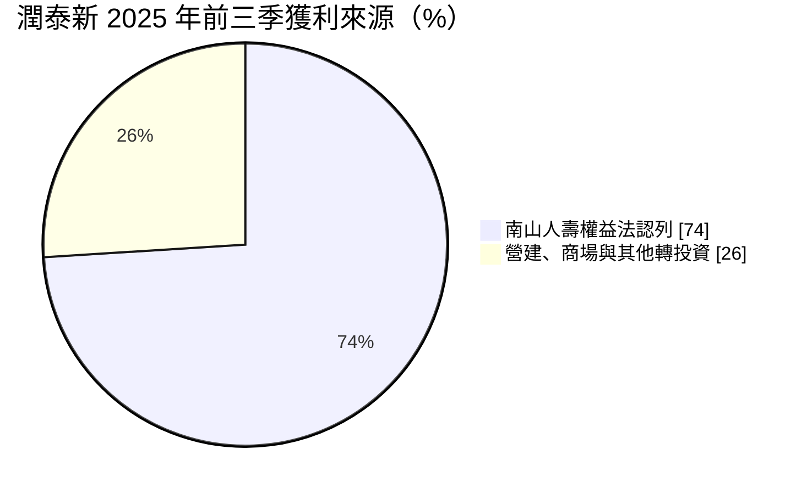
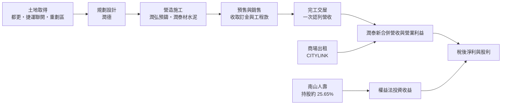
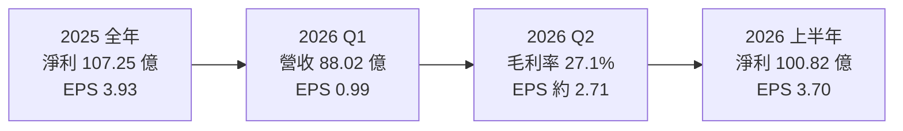
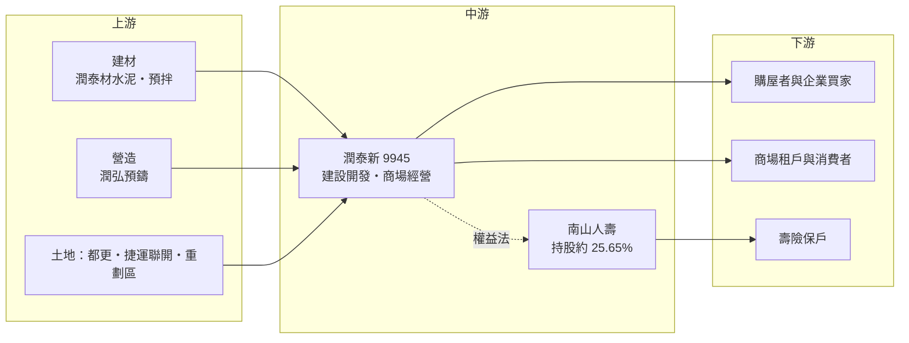

# 9945 潤泰新

> 上市｜[[產業索引-其他業|其他業]]｜上市（櫃）日期 1992/04/30

# 第一章：企業模式與商業藍圖

> [!info] 撰寫說明
> 本文由 Claude 依公開資料整理，架構比照 [[2330台積電]] 的四章研究，資料截至 2026-10-07。財務數字來源：富果研究（潤泰新 2025 年 12 月與 2026 年 7 月法說會摘要）、經濟日報（潤泰集團 2025 年獲利與股利報導）、旺得富／工商時報（2026 年第一季財報與推案報導）、CMoney（2026 年上半年獲利整理）、nstock 公司資料；產業描述為整理性內容，尚未逐條比對原始文件。#待校對

在評估單一個股的長期投資價值時，首要步驟是拆解企業的底層獲利邏輯。本章針對潤泰創新國際（股票代號：9945，以下簡稱潤泰新）的商業模式進行定性分析，說明一家建設公司為什麼有七成以上的獲利來自南山人壽，以及營建本業與轉投資如何共同決定它的價值。

## 一、核心定位：建設本業加上南山人壽的控股型公司

潤泰新成立於 1977 年，原名潤泰建設，1991 年更名，1992 年 4 月上市，資本額約 284.42 億元。表面上它是一家建設公司，主要在大台北地區推案、興建住宅與商辦，同時經營 CITYLINK 等商場；實際上，它最重要的資產是對南山人壽的持股。

* **南山人壽的大股東：** 潤泰新透過直接與間接方式綜合持有南山人壽約 25.65% 股權，以[[權益法]]認列南山人壽的獲利。依法說會資料，南山人壽貢獻潤泰新獲利約七至八成，2025 年前三季約 74%。
* **建設與商場本業：** 以[[都更]]、[[捷運聯合開發]]與大型[[重劃區]]土地開發為主，搭配商場出租經營，提供另一條穩定的收入來源。
* **潤泰集團的營建平台：** 旗下或轉投資包括預鑄工法的 [[2597潤弘]]、水泥與預拌材料的 [[8463潤泰材]]、室內設計的 [[6881潤德]]、廢棄物處理的 [[8341日友]]，形成從材料、營造到設計的完整營建供應鏈。

所以分析潤泰新，必須同時看兩件事：營建推案的認列節奏，以及南山人壽的保險獲利。

## 二、終端應用／產品板塊：南山人壽是獲利主體

依 2025 年 12 月法說會資料，2025 年前三季南山人壽的獲利貢獻約占 74%，其餘來自營建、商場與其他轉投資。營收各板塊的精確比重未查得，以下以獲利來源呈現：

* **營建推案：** 2026 年推案量約 700 億元，為歷史新高，十年儲備案量超過 1,500 億元。主要個案包括南港之星（總銷約 600 億元，每坪均價至少 150 萬元）、板橋潤泰峘翠（約 47 億元）、板橋新都段案（約 29 億元）。在建個案中，潤泰 CITY PARK（三重捷運聯合開發）銷售約八成、華山松江與印象左岸約五成、潤泰菁英匯約兩成。
* **商場經營：** CITYLINK 三重店於 2025 年 12 月開幕；潤泰新也以約 27 億元向三井不動產買回潤泰創新開發 30% 股權，取得完全控制權。
* **南山人壽：** 台灣大型壽險公司之一，2026 年上半年稅後純益 308.7 億元、年增 114.5%，是潤泰新上半年獲利突破百億的主因。
* **土地儲備：** 在新北塭仔圳重劃區已整合約 2 萬坪土地，預計規劃 12 筆個案，2027 年完成配地、2032 年後推案。

## 三、資本轉化邏輯（營運模式）：建案的完工認列與保險的權益法

* **[[完工比例法]]與交屋認列：** 台灣建商依會計準則在交屋時才一次認列營收，所以營收高度集中在完工年度。2026 年有松濤苑、潤泰峰左岸、潤泰 CITY PARK 交屋，2027 年有華山松江、潤泰玉成廣場，2029 年起進入下一波完工高峰。
* **預售制度的現金流：** [[預售屋]]在興建期間分期收取價款，降低建商的資金壓力，但收入要等交屋才能入帳，財報獲利和現金流的時間點不一致。
* **權益法的獲利波動：** 南山人壽的獲利受股市、債市、匯率與避險成本影響，波動很大，直接傳導到潤泰新的 EPS。

## 四、企業長期藍圖：推案高峰與南山人壽的資本體質

* **推案高峰：** 2026 年推案 700 億元，搭配十年 1,500 億元以上的儲備案量，營建本業在 2029 年後有望進入獲利高峰。
* **大台北深耕：** 聚焦台北都會區的大型案與捷運聯合開發，以預鑄工法縮短工期、控制品質。
* **整合集團資源：** 透過買回潤泰創新開發股權，強化商場與不動產開發的整合。
* **南山人壽接軌新制：** 南山人壽面對 [[IFRS 17]] 與新一代清償能力制度，資本體質與股利能力會影響潤泰新的長期價值。

# 第二章：護城河深度與競爭優勢

在長期價值投資中，「護城河」指企業抵禦競爭、維持超額利潤的保護機制。本章分析潤泰新的護城河構成、主要競爭對手，以及這些優勢在房市與保險業循環中能守住多少。

## 一、潤泰新護城河的核心組成要素

潤泰新的護城河由營建與保險兩部分組成，整體屬於「中等護城河」：

* **1. 垂直整合的營建供應鏈：** 從水泥（潤泰材）、預鑄構件與營造（潤弘）到室內設計（潤德），集團內部就能完成大部分工序。[[預鑄工法]]在工廠先做好樑柱再到現場組裝，工期較短、品質穩定，在缺工與工期延長的營建業環境中是明顯優勢。
* **2. 大型土地與聯合開發能力：** 捷運聯合開發、都更與重劃區整合需要長期的政府溝通與資金實力，南港之星、塭仔圳等大型案顯示潤泰新具備一般中小建商難以取得的開發規模。
* **3. 南山人壽的規模：** 南山人壽是台灣大型壽險公司，擁有龐大的保單與業務員通路。這部分的護城河屬於南山人壽本身，潤泰新以大股東身分分享。

## 二、主要競爭對手格局

| 對手 | 定位 | 對潤泰新的威脅 |
|---|---|---|
| [[2542興富發]] | 推案量大的大型建商 | 在大台北與中南部爭取土地與客戶 |
| [[2548華固]] | 大台北高價住宅與商辦 | 在台北高價住宅市場直接競爭 |
| [[5522遠雄]] | 大型住宅、商辦與自有營造 | 同樣具備大型開發與營造能力 |
| 國泰人壽、富邦人壽等 | 金控旗下大型壽險 | 在壽險市場與南山人壽競爭 |

## 三、優勢轉化：哪些市場守得住、哪些守不住

* **守得住：** 大型捷運聯開與都更案，以及預鑄工法帶來的工期與品質優勢。2025 年營建本業獲利年增逾五成，顯示本業執行力。
* **守不住或不可控：** 南山人壽的投資收益。2025 年潤泰新淨利年減 35.24%，主因是南山人壽認列減少約 30 億元，以及前一年南港潤泰玉成大樓約 40 億元的公允價值利益不再出現。這部分不是潤泰新經營能力能決定的。
* **觀察重點：** 南港之星的銷售速度與價格、2026 年交屋案的認列進度，以及南山人壽在匯率與利率變動下的獲利穩定度。

# 第三章：財務體質與盈利規模

資料日期：2026-10-07。數字取自富果研究、經濟日報、工商時報、CMoney 與 nstock 整理的財報資料，表格是撰寫當時的快照；最新月營收、毛利率、累計 EPS 由自動排程寫在本筆記的屬性欄位（月營收、毛利率、累計EPS 等）。#待校對

財務報表是檢驗護城河是否真實存在的最終標準。本章用三率、ROE、現金流與資本報酬，檢視潤泰新在營建認列與保險轉投資雙重影響下的獲利品質。由於大部分獲利來自權益法認列，傳統的三率只能反映營建本業。

## 一、獲利能力的基石：三率

| 項目 | 2025 全年 | 2025 前三季 | 2026 Q1 | 2026 Q2 | 2026 上半年 |
|---|---|---|---|---|---|
| 合併營收（新台幣） | 未查得 | 未查得 | 88.02 億 | 未查得 | 未查得 |
| [[毛利率]] | 未查得 | 未查得 | 未查得 | 27.1% | 未查得 |
| [[營業利益率]] | 未查得 | 未查得 | 約 17.7%（推算） | 未查得 | 未查得 |
| 稅後淨利 | 107.25 億 | 73.24 億 | 27.07 億 | 約 73.8 億（推算） | 100.82 億 |
| EPS（元） | 3.93 | 2.68 | 0.99 | 約 2.71 | 3.70 |

2026 年第一季營業利益率以營業利益 15.59 億元除以營收 88.02 億元推算；第二季淨利與 EPS 以上半年減第一季推算（nstock 列第二季 EPS 2.72 元，差異來自四捨五入）。

* **營建本業：** 2026 年第一季營收年增 25%，營業利益 15.59 億元，高於去年同期的 11.21 億元，主要來自潤泰峰左岸交屋約 13 億元。第二季起潤泰 CITY PARK 預計可認列約 80 億元營收。
* **南山人壽認列：** 第一季認列約 19 億至 22.85 億元（不同報導口徑），低於去年同期，使第一季淨利年減約 20%；第二季南山人壽獲利大增，帶動上半年淨利突破百億。
* **2025 年：** 淨利 107.25 億元、年減 35.24%，EPS 3.93 元；營建本業年增逾五成，但被南山人壽認列減少與前一年一次性利益墊高基期抵銷。

## 二、[[ROE]]：資本效率

潤泰新每股淨值由 2025 年第三季的約 34 元，提高到 2026 年第一季的約 40 元。以 2025 年 EPS 3.93 元對照每股淨值 34 至 40 元，ROE 約 10% 上下（推估）。由於獲利主要來自南山人壽，ROE 的波動與保險業投資收益高度相關，不能單純用營建本業解讀。

## 三、資本支出與[[自由現金流]]

* **土地與在建投資：** 建設公司的主要「資本支出」是購地與在建工程，會計上多列在存貨而非固定資產。2026 年推案 700 億元與塭仔圳整合，意味著未來數年需要大量資金投入土地與工程（推估）。
* **現金流特性：** 預售屋分期收款可以支應部分工程款，但大型案從取得土地到交屋常需 5 年以上，期間現金流以流出為主。
* **股利：** 2025 年度每股配發 1.1 元，其中現金股利約 0.49 元，其餘來自法定盈餘公積與資本公積，以當時股價約 27.9 元計算殖利率約 3.9%。配息率遠低於 EPS，原因之一是權益法認列的南山人壽獲利，不等於潤泰新實際收到的現金股利。

## 四、[[ROIC]] 與 [[WACC]]：價值創造利差

對潤泰新而言，投入資本分成兩塊：營建開發與南山人壽持股。營建本業的報酬率取決於土地成本與售價的差距，大型案若能以每坪 150 萬元以上售出，報酬率可觀；南山人壽持股的報酬則取決於保險業的投資收益與配息能力。整體 ROIC 與 WACC 的利差在南山人壽獲利好的年度明顯為正，在保險業虧損或匯損年度則可能接近零（推估，具體數值未查得）。

# 第四章：總體風險與地緣政治

任何企業都無法脫離宏觀環境獨立存在。本章分析潤泰新未來必須面對的地緣政治、房市週期、營運與法規風險。

## 一、地緣政治風險

* **南山人壽的海外資產：** 台灣壽險業大量投資美元債券，台海情勢、美國利率與新台幣匯率的變化，會直接影響南山人壽的投資收益與避險成本，進而影響潤泰新。
* **房市信心：** 兩岸緊張升溫時，高價住宅的買氣可能受到影響，南港之星這類總銷數百億元的大案對市場信心特別敏感。

## 二、產業週期與市場結構

* **房市信用管制：** 央行選擇性信用管制與銀行不動產放款集中度限制，會壓抑購屋貸款，影響預售屋銷售速度與價格。
* **營建業的景氣循環：** 建案從推出到交屋需要多年，推案時的市場狀況與交屋時可能完全不同；景氣反轉時，客戶可能放棄訂金解約。
* **利率：** 升息會提高購屋者的房貸負擔與建商的融資成本；降息則有利房市。
* **保險業週期：** 壽險業獲利受利率、股市與匯率影響，波動大，且需因應新制提高資本。

## 三、營運環境的隱性風險

* **營收認列集中：** 營收與獲利集中在交屋年度，各季 EPS 可能大幅波動，投資人容易誤判趨勢。
* **大型案的執行風險：** 南港之星總銷約 600 億元，若銷售速度不如預期，資金占用時間會拉長。
* **缺工與營建成本：** 營建業缺工與原物料價格上漲，壓縮建案毛利；預鑄工法能部分緩解，但無法完全避免。
* **轉投資的治理：** 獲利過度依賴單一轉投資（南山人壽），而潤泰新對南山人壽的經營只能透過董事會影響。

## 四、科技或法規演進

* **保險業新制：** 南山人壽接軌 [[IFRS 17]] 與新一代清償能力制度，可能需要增資或保留更多盈餘，影響配發給股東（包括潤泰新）的現金股利。
* **營建法規：** 都更條例、容積獎勵、捷運聯開規範與建築節能、耐震標準的調整，都會改變開發成本與時程。
* **營建工法：** 預鑄與工業化營建是潤泰集團的強項，若營建業普遍導入預鑄，這項差異化優勢可能縮小。

# 專有名詞解析

## 金融

- **[[權益法]]**：持有被投資公司 20% 至 50% 股權時，依持股比例把對方獲利認列為自己的投資收益，但不代表實際收到現金。
- **[[IFRS 17]]**：國際保險合約會計準則，改變保險公司認列保費收入與負債的方式，台灣於 2026 年接軌。
- **[[毛利率]]**：毛利除以營收，代表產品扣除直接成本後的獲利空間。
- **[[自由現金流]]**：營業活動現金流減去資本支出，代表企業可自由用於配息、還債或併購的現金。
- **[[ROE]]**：股東權益報酬率，稅後淨利除以股東權益，衡量公司用股東的錢賺錢的效率。

## 產業

- **[[完工比例法]]**：依工程完成進度認列營收的會計方法；台灣建商的預售屋則多在交屋時一次認列，營收因此集中在完工年度。
- **[[預售屋]]**：建案完工前就先銷售的房屋，買方在興建期間分期支付價款，交屋時再付尾款。
- **[[預鑄工法]]**：先在工廠把樑、柱、樓板等結構構件做好，再運到工地組裝的營建方式，可縮短工期並穩定品質。
- **[[捷運聯合開發]]**：政府與民間合作，在捷運站周邊土地共同開發住宅或商辦，開發商分回部分樓地板出售。
- **[[都更]]**：都市更新，把老舊建物拆除重建，原地主與建商依權利價值分配新建物。
- **[[重劃區]]**：政府把零碎土地重新整理、規劃道路與公共設施後再分配給地主，常成為新的建案集中區。

# 核心供應鏈

## 1. 上游：建材、營造與土地
- 水泥與預拌材料：[[8463潤泰材]]
- 預鑄構件與營造：[[2597潤弘]]
- 室內與景觀設計：[[6881潤德]]

## 2. 中游：潤泰新本身與關係企業
- 建設開發與商場經營：潤泰新、潤泰創新開發
- 保險轉投資：南山人壽（與 [[2915潤泰全]] 同為主要股東）
- 環保轉投資：[[8341日友]]

## 3. 下游：主要客群
- 大台北購屋者與企業買家、商場租戶、南山人壽保戶

## 4. 同業比較
- 建設同業：[[2542興富發]]、[[2548華固]]、[[5522遠雄]]

## 最新新聞
<!-- news:start -->
<!-- news:end -->

## 相關連結
- [公開資訊觀測站](https://mopsov.twse.com.tw/mops/web/t05st03?step=1&firstin=1&co_id=9945)
- [Goodinfo](https://goodinfo.tw/tw/StockDetail.asp?STOCK_ID=9945)
- [Yahoo 股市](https://tw.stock.yahoo.com/quote/9945)
- [鉅亨網新聞](https://www.cnyes.com/twstock/9945/news)
