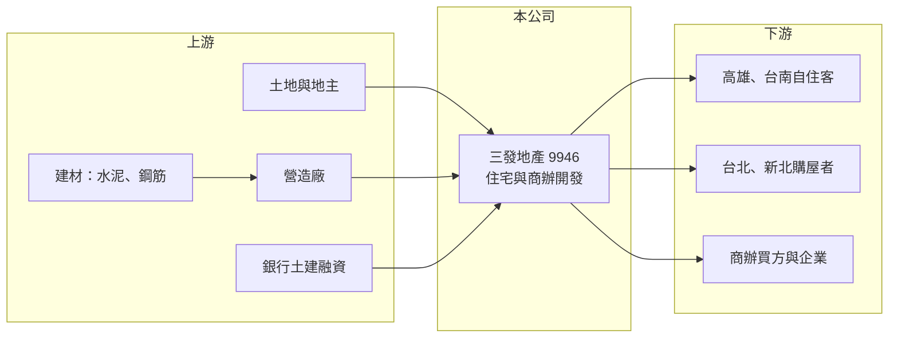

# 9946 三發地產

> 上市｜[[產業索引-建材營造業|建材營造業]]｜上市（櫃）日期 2013/09/17

# 第一章：企業模式與商業藍圖

> [!info] 撰寫說明
> 精簡版，由 Claude 依公開資料整理，架構比照 [[2330台積電]]，資料截至 2026-10-08。來源：證交所開放資料（基本資料、資產負債、綜合損益、營益分析、股利、每月營收）、Goodinfo 年度經營績效、富果法說會備忘錄（2026-09-23）。建案總銷與完工時程為管理層說法，可能變動。#待校對

本章說明三發地產（9946）如何以高雄為根據地，跨足台北、新北與台南推案的住宅與商辦開發模式。

- **核心業務：** 三發地產成立於 1993 年，2013 年上市，董事長鍾鼎晟。公司核心業務是營建收入，也就是自行購地、規劃、委託營造並銷售住宅與商辦。依 2026 年 9 月法說會，推案範圍涵蓋台北、新北、台南與高雄等都會區，集團另有三發教育基金會與子公司金革音樂。
- **營收結構與認列：** 營收在[[建案交屋]]時認列，2026 年第二季營收約 26.45 億元，主要來自高雄「澄德段・三發首席大院」交屋，這個案子 2025 年底完工、總銷約 97 億元，是公司史上最大的認列來源之一。在售案包括台北北投 MAX 豐璟與台南三發橋等新成屋。
- **在建案與土地庫存：** 依 2026 年 9 月法說會，在建案包括台南中西區「三發 DIAMOND ONE」（總銷約 38 億元，預計 2029 年第三季完工）與新北新莊副都心商辦（總銷約 85 億元，採先建後售，預計 2028 年第四季完工）；可售案量含餘屋約 90 億元，在建及存貨土地案量合計約 300 億元。另有高雄前鎮、苓雅與台南安平等土地尚未推案。
- **長期方向：** 公司策略是聚焦自住需求與核心區位，並逐步加入商業不動產，以商辦案分散單一住宅市場的風險。先建後售的商辦案資金壓力較大，但完工後售價較能反映實際市場行情，這是三發從純住宅開發商轉向多元不動產開發的觀察重點。

# 第二章：護城河深度與競爭優勢

本章分析三發地產的競爭條件與限制。

- **競爭優勢：** 三發在高雄深耕多年，熟悉當地土地與客群，2020 年代高雄因半導體設廠帶動房市時，手上的土地成本相對較低，這反映在 2025 年 53.5% 的毛利率上。公司也以 ISO9001 認證、建物生產履歷查驗等方式建立品質形象，在自住客為主的市場中，品牌信任有助於去化。
- **主要對手：** 南部住宅市場的對手包括 [[2542興富發]]、[[9906欣巴巴]] 等上市櫃建商與大量地方建商；北部市場則面對 [[2548華固]]、[[5522遠雄]] 等大型建商。三發在北部的規模與品牌知名度不如在地龍頭，跨區推案需要時間建立實績。
- **觀察重點：** 第一是新莊副都心商辦的銷售與完工進度，這是公司最大的在建案之一。第二是土地庫存何時推案，以及推案時的房市與政策環境。第三是 2026 年大量交屋後，營收能否在 2027 至 2028 年維持，避免重演 2023 年的空窗。

# 第三章：財務體質與盈利規模

資料日期：2026-10-08，表格是撰寫當時的快照；最新月營收、毛利率、累計 EPS 由自動排程寫在本筆記的屬性欄位（月營收、毛利率、累計EPS 等）。#待校對

本章用多年度數字檢視三發地產的獲利與資本報酬。

| 年度 | 營收（新台幣） | [[毛利率]] | [[營業利益率]] | EPS（元） | [[ROE]] |
|---|---|---|---|---|---|
| 2020 | 14.9 億 | 29.2% | 14.0% | 0.57 | 2.76% |
| 2021 | 17.2 億 | 24.4% | 12.9% | 0.68 | 3.40% |
| 2022 | 22.7 億 | 17.0% | 7.7% | 0.43 | 2.15% |
| 2023 | 9.63 億 | 27.7% | 12.0% | 0.27 | 1.37% |
| 2024 | 20.3 億 | 35.2% | 22.7% | 1.15 | 5.69% |
| 2025 | 17.9 億 | 53.5% | 38.8% | 1.52 | 7.35% |

- **營收規模：** 2020 至 2025 年營收在 9.6 至 22.7 億元之間波動，2026 年上半年單靠首席大院交屋就達約 26.5 億元，超過過去任何一個全年。依證交所資料，2026 年上半年毛利率 53.5%、營業利益率 45.3%、EPS 2.84 元。
- **獲利：** 2020 至 2023 年 ROE 長期在 1% 至 3.4% 之間，獲利能力偏弱；2024 年後高毛利建案入帳，ROE 才回升到 5.7% 至 7.4%。近五年（2021 至 2025）平均 ROE 約 4.0%（推算），以建設業來說偏低，主因是淨值規模大、土地庫存多，資本周轉慢。
- **財務特色：** 2026 年第二季歸屬母公司權益約 71.6 億元，每股淨值 22.25 元，總負債約 100.5 億元（流動 68.4 億、非流動 32.0 億）。現金股利 2025 年度每股 1.37 元，2026 年 9 月發放每股 1.38 元；公司 2026 年第二季並執行庫藏股買回。
- **[[ROIC]] 與 [[WACC]]：** 2025 年營業利益約 6.9 億元（17.9 億 × 38.8%），稅後約 5.6 億元；投入資本以股東權益 71.6 億元加上有息負債推算，有息負債以總負債約六成、約 60 億元假設（實際數字未查得），合計約 132 億元，ROIC 約 4.2%（推算）；2024 年約 2.8%（推算）。WACC 以 CAPM 推估：無風險利率 1.75%、市場風險溢酬 6%、β 取建設股常見值 0.9，股東權益成本約 7.15%；負債成本 2.5%、稅後約 2.0%；以帳面權重股權約 54%，WACC 約 4.8%（推算）。過去幾年 ROIC 大致低於或接近 WACC，2026 年大案交屋可能讓 ROIC 短暫超過 WACC，長期能否持續創造價值，取決於龐大土地庫存的開發效率。

# 第四章：總體風險與地緣政治

本章整理三發地產長期必須面對的風險。

- **產業週期：** 住宅與商辦需求受利率、[[信用管制]]與景氣影響。三發以自住客為主要客群，投資需求退場時受到的衝擊相對較小，但房市降溫期間，新案去化與售價都會承壓，而建設公司的土地與利息成本不會因此停止。
- **營運風險：** 營收集中於少數大案，單一建案的交屋時點就能決定全年獲利。先建後售的新莊商辦案需要較長時間自行負擔資金，若完工時商辦市場轉弱，可能形成大量待售存貨。
- **其他風險：** 營建材料與工資上漲壓縮毛利；高雄房市若因供給增加或產業投資放緩而降溫，會影響公司的主要獲利來源；跨區推案也增加管理與品牌經營的難度。

# 專有名詞解析

## 金融

- **[[信用管制]]**：央行限制房貸成數、寬限期與土建融條件的政策，用來抑制房市過熱。
- **[[ROIC]]**：投入資本報酬率，稅後營業利益除以投入資本，衡量本業運用資金創造報酬的能力。
- **[[WACC]]**：加權平均資金成本，股東與債權人要求報酬率的加權平均，ROIC 高於 WACC 才代表創造價值。

## 產業

- **[[建案交屋]]**：建設公司把房屋所有權移轉給買方，營收與獲利在此時一次認列。
- **[[先建後售]]**：建案完工後再銷售的模式，售價較能反映市場，但建商需自行負擔整段施工期間的資金。

# 核心供應鏈

- 上游：土地與地主、營造廠、水泥與鋼筋等建材（例如 [[1101台泥]]、[[2002中鋼]]，產業參考，實際供應商未查得），以及提供土建融資的銀行。
- 下游／客戶：高雄、台南的自住購屋者，台北、新北的住宅買方，以及新莊副都心商辦的企業與投資買方。
- 同業：[[2542興富發]]、[[9906欣巴巴]]、[[2548華固]]、[[5522遠雄]]。

## 最新新聞
<!-- news:start -->
<!-- news:end -->

## 相關連結
- [公開資訊觀測站](https://mopsov.twse.com.tw/mops/web/t05st03?step=1&firstin=1&co_id=9946)
- [Goodinfo](https://goodinfo.tw/tw/StockDetail.asp?STOCK_ID=9946)
- [Yahoo 股市](https://tw.stock.yahoo.com/quote/9946)
- [鉅亨網新聞](https://www.cnyes.com/twstock/9946/news)
