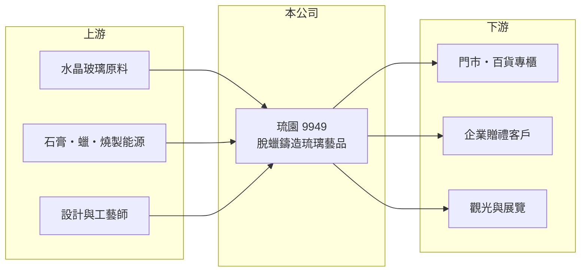

# 9949 琉園

> 上櫃｜[[產業索引-文化創意業|文化創意業]]｜上市（櫃）日期 2003/11/21

# 第一章：企業模式與商業藍圖

> [!info] 撰寫說明
> 精簡版，由 Claude 依公開資料整理，架構比照 [[2330台積電]] 的四章研究，資料截至 2026-10-08。來源：櫃買中心開放資料（基本資料、2026 年上半年資產負債與損益、本益比與股利）、Goodinfo 年度經營績效、nStock 公司小百科。公開資料有限，品牌與通路部分憑既有知識撰寫。#待校對

琉園（股票代號：9949）成立於 1994 年，原名大觀水晶，2002 年更名為琉園，2003 年上櫃，是台灣代表性的[[脫蠟鑄造]]琉璃藝品品牌。琉園的商業模式是把琉璃從工藝品做成品牌精品，透過設計、門市與企業禮品通路銷售，毛利率高，但營收規模小、管銷費用重。

- **核心業務：** 營業項目為水晶玻璃、石膏、蠟等藝品的設計、加工與製造，以及藝文展覽與相關服務。產品以琉璃藝品、擺飾、飾品與企業贈禮為主，並曾在台北設立琉璃博物館推廣琉璃藝術（憑既有知識，待校對）。
- **營收結構：** 產品別營收比重未查得。年營收從 2017 年的 2.93 億元逐步下滑到 2025 年的 1.41 億元，2026 年 1 至 9 月累計 1.03 億元、年增約 8%（nStock 資料）。
- **營運據點：** 總公司在新北市永和，銷售以台灣門市、百貨專櫃與企業客戶為主，並經營海外市場（據點與比重未查得）。
- **長期方向：** 公開資料未見明確的長期計畫。琉園面對的根本問題是精品藝品的需求萎縮與送禮文化改變，品牌能否找到新世代消費者與新的應用（例如跨界聯名、文化觀光），是長期生存的關鍵（推估）。

# 第二章：護城河深度與競爭優勢

琉園的護城河是品牌與工藝，但近十年的營收下滑顯示這條護城河正在變窄。

- **競爭優勢：** 第一是品牌知名度，琉園與琉璃工房是台灣琉璃藝品最具代表性的兩個品牌，在企業贈禮與節慶禮品市場有一定認知度。第二是脫蠟鑄造工藝與設計能力，毛利率長期維持在 50% 至 70%，代表產品具有品牌溢價。
- **主要對手：** 琉璃工房是最直接的競爭者；在禮品市場上，還要與各類精品、茶具、文創商品與國際水晶品牌如施華洛世奇競爭。
- **守得住與守不住：** 守得住的是品牌溢價帶來的高毛利；守不住的是營收規模，門市與人力成本固定，營收下滑使營業利益率從 -7.6%（2017 年）惡化到 -52.7%（2025 年）。
- **觀察重點：** 營收能否止跌回升、門市與費用結構的調整，以及公司如何運用 2025 年業外收益帶來的資金。

# 第三章：財務體質與盈利規模

資料日期：2026-10-08，表格是撰寫當時的快照；最新月營收、毛利率、累計 EPS 由自動排程寫在本筆記的屬性欄位（月營收、毛利率、累計EPS 等）。#待校對

琉園的本業已連續多年虧損，2025 年的獲利來自業外，不能視為本業轉機。

| 年度 | 營收（新台幣） | [[毛利率]] | [[營業利益率]] | EPS（元） | [[ROE]] |
|---|---|---|---|---|---|
| 2021 | 2.04 億 | 63.1% | -18.3% | -0.76 | -7.44% |
| 2022 | 2.12 億 | 55.7% | -16.3% | -0.80 | -8.39% |
| 2023 | 1.78 億 | 66.5% | -18.1% | -0.69 | -7.81% |
| 2024 | 1.69 億 | 50.9% | -41.1% | -1.19 | -15.0% |
| 2025 | 1.41 億 | 64.0% | -52.7% | 5.29 | 51.9% |

- **營收規模：** 2020 至 2025 年營收年複合成長率約 -4.6%（推算）。2017 年以來每年營業虧損。2026 年上半年營收 0.71 億元、毛利率 64.3%、營業損失 0.15 億元、EPS -0.13 元，回到本業虧損的常態。實收資本額約 4.49 億元（櫃買中心資料）。
- **獲利：** 2025 年營業虧損約 0.74 億元，但 EPS 達 5.29 元，代表當年有約 3 億元以上的業外收益（推算）；收益來源未查得，推估為處分資產之類的一次性利益（推估，待校對）。2021 至 2025 年平均 ROE 約 2.7%（推算），扣除 2025 年則為負值。
- **股利：** 2025 年度發放現金股利 2.2 元（櫃買中心資料），配息率約 42%；在此之前長期沒有穩定配息，Goodinfo 統計的一般平均現金股利僅 0.35 元。2026 年上半年股東權益約 5.0 億元、總負債僅約 0.5 億元，每股淨值 11.13 元。

**[[ROIC]] 與 [[WACC]]：** 以 2025 年計，營業損失約 0.74 億元（1.41 億 × -52.7%），虧損不計稅。股東權益約 5.0 億元，幾乎沒有有息負債，投入資本約 5.0 億元，ROIC 約 -15%（推算）。WACC 以 CAPM 推估：無風險利率 1.75%、市場風險溢酬 6%、β 取消費品同業常見值 0.8，股東權益成本約 6.6%，幾乎全為權益融資，WACC 約 6.6%（推算）。本業 ROIC 長期為負、遠低於 WACC，琉園的股東價值目前主要來自資產處分與現金，而非品牌營運。

# 第四章：總體風險與地緣政治

琉園的風險集中在需求萎縮與本業規模不足。

- **產業週期：** 琉璃藝品屬非必需的禮品與收藏消費，景氣差時企業贈禮與個人送禮都會減少；觀光客流量也會影響門市銷售。
- **營運風險：** 營收持續下滑而門市、人力與工藝成本固定，虧損擴大速度快；一次性業外收益用完後，若本業沒有改善，淨值會再度被侵蝕。工藝人才的傳承也是長期挑戰。
- **其他風險：** 消費習慣轉向體驗與數位商品，傳統擺飾與收藏品的需求長期下降；原物料與能源（琉璃燒製耗電耗氣）成本上升會影響毛利。

# 專有名詞解析

## 金融

- **[[業外收益]]**：本業以外的收入，例如投資收益、股利、利息與處分資產利益。
- **[[ROIC]]**：投入資本報酬率，稅後營業利益除以股東權益加有息負債，衡量本業運用資本的效率。
- **[[WACC]]**：加權平均資金成本，股東與債權人要求報酬的加權平均，ROIC 高於它才代表創造價值。

## 產業

- **[[脫蠟鑄造]]**：先以蠟做出原型、包覆耐火模後把蠟熔出，再灌入熔融琉璃成形的工藝，可做出細緻造型。
- **[[品牌溢價]]**：消費者因品牌而願意多付的價格，表現在高於同類產品的毛利率。

# 核心供應鏈

- 上游：水晶玻璃原料、石膏與蠟等耗材，以及燒製所需的電力與燃氣。
- 下游／客戶：門市與百貨專櫃消費者、企業贈禮客戶、觀光與展覽（具名客戶未查得）。
- 同業：琉璃工房、施華洛世奇等水晶與禮品品牌。

## 最新新聞
<!-- news:start -->
<!-- news:end -->

## 相關連結
- [公開資訊觀測站](https://mopsov.twse.com.tw/mops/web/t05st03?step=1&firstin=1&co_id=9949)
- [Goodinfo](https://goodinfo.tw/tw/StockDetail.asp?STOCK_ID=9949)
- [Yahoo 股市](https://tw.stock.yahoo.com/quote/9949)
- [鉅亨網新聞](https://www.cnyes.com/twstock/9949/news)
