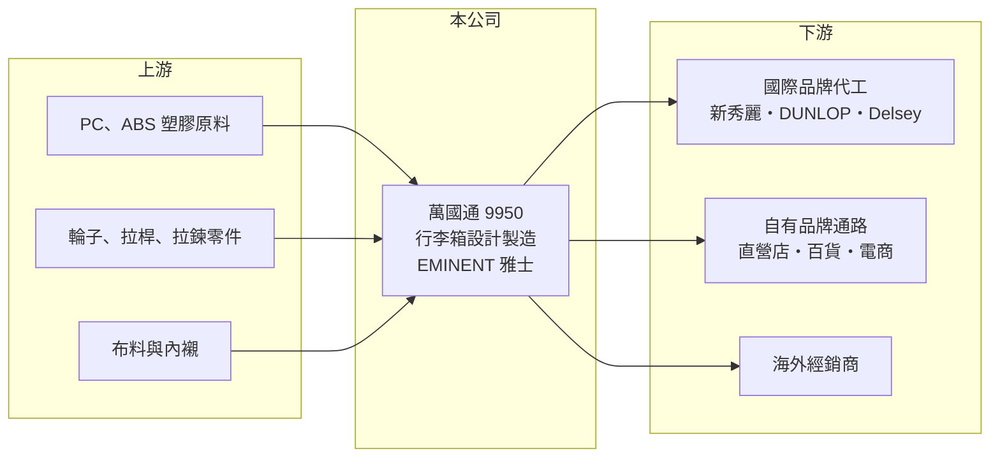

# 9950 萬國通

> 上櫃｜[[產業索引-塑膠工業|塑膠工業]]｜上市（櫃）日期 2004/02/17

# 第一章：企業模式與商業藍圖

> [!info] 撰寫說明
> 精簡版，由 Claude 依公開資料整理，架構比照 [[2330台積電]]，資料截至 2026-10-08。來源：Goodinfo 年度經營績效、富邦 e 點通（MoneyDJ）公司基本資料、Yahoo 股市公司資料、遠見雜誌 2007 年報導。品牌與代工客戶資料來自 2007 年報導，可能已變動；目前生產據點未查得。#待校對

本章說明萬國通（9950）如何以行李箱代工與自有品牌並行經營。

- **核心業務：** 萬國通路成立於 1979 年，2004 年上櫃，總部在台南歸仁，英文名稱與自有品牌為 EMINENT（雅士）。董事長謝明振從學徒起家創業，依 2007 年遠見報導，萬國通是當時台灣唯一上櫃的箱包業者。公司從事各種行李箱與零件的製造、加工與進出口。
- **營收結構：** 依 2025 年營收比重，行李箱占 94.2%，其他 5.8%，幾乎是單一產品公司。2007 年報導指出，自有品牌約占營收六成、[[OEM]] 代工約四成，代工客戶包括新秀麗（Samsonite）、日本 DUNLOP 與法國 Delsey，最新比例未查得。
- **市場與通路：** 依 2007 年報導，產品行銷五大洲 80 多國，重點市場在歐洲、美國與日本，德國與日本合計約占三成五；在台灣則以旗艦店與旅行生活館經營零售通路。研發成本約占營收 2% 至 3%，每月推出上百款新品，兩週內可從設計做到樣品。
- **長期方向：** 行李箱是跟著旅遊人次走的產品，疫情期間營收一度跌到 10 億元左右，2023 年隨國際旅遊復甦回升到 29 億元。萬國通的長期課題是讓自有品牌在國際市場建立足夠的辨識度，降低對代工訂單與旅遊景氣的依賴。

# 第二章：護城河深度與競爭優勢

本章分析萬國通的競爭條件與在行李箱產業的位置。

- **競爭優勢：** 萬國通同時具備設計、製造與自有品牌，能用快速打樣與多款式設計服務品牌客戶，自有品牌則提供較高的毛利空間。2023 至 2025 年毛利率在 23% 至 28% 之間，高於一般代工廠，顯示品牌與設計帶來一定溢價。
- **主要對手：** 國際行李箱市場由新秀麗集團（旗下 Samsonite、American Tourister、Tumi）與 RIMOWA 等品牌主導，中低價位則有大量中國與東南亞代工廠及電商品牌。萬國通既是新秀麗等品牌的代工夥伴，也在自有品牌上與它們競爭，處在兩種角色之間。
- **觀察重點：** 第一是營業利益率能否穩定為正，2025 年已轉為 -0.61%。第二是自有品牌在海外通路的拓展成果。第三是資本結構，負債比例約 66%，淨值偏薄，對景氣下滑的承受力有限。

# 第三章：財務體質與盈利規模

資料日期：2026-10-08，表格是撰寫當時的快照；最新月營收、毛利率、累計 EPS 由自動排程寫在本筆記的屬性欄位（月營收、毛利率、累計EPS 等）。#待校對

本章用五年數字檢視萬國通在疫情前後的獲利波動。

| 年度 | 營收（新台幣） | [[毛利率]] | [[營業利益率]] | EPS（元） | [[ROE]] |
|---|---|---|---|---|---|
| 2021 | 10.3 億 | -10.3% | -56.7% | -4.21 | -96.5% |
| 2022 | 22.9 億 | 11.9% | -7.60% | -1.45 | -68.2% |
| 2023 | 29.1 億 | 26.9% | 6.57% | 6.08 | 122% |
| 2024 | 25.9 億 | 28.2% | 5.46% | 1.02 | 11.7% |
| 2025 | 21.3 億 | 23.3% | -0.61% | -0.27 | -3.08% |

- **營收規模：** 營收從 2021 年疫情谷底的 10.3 億元回升到 2023 年的 29.1 億元，之後回落到 2025 年的 21.3 億元。2021 至 2025 年年複合成長率約 19.9%（推算），但這是從極低基期計算，不代表長期成長趨勢。2006 年營收約 19 億元，二十年來規模大致持平。
- **獲利：** 2023 年 EPS 6.08 元、ROE 122%，但當年營業利益只有約 1.9 億元，稅後淨利卻達 10.2 億元，推估有大額[[一次性收益]]（例如資產處分，細節未查得）。ROE 異常高也是因為 2022 年底每股淨值只有 1.79 元，分母極小。近五年平均 ROE 約 -6.8%（推算），本業真正有獲利的只有 2023 與 2024 年。
- **財務特色：** 2021 年每股淨值一度只剩 2.26 元，2022 年股本由 14.8 億元增加到 16.8 億元，2023 年的一次性收益讓淨值回到 7.95 元。負債比例約 66%，屬於高槓桿。Goodinfo 統計的歷年平均現金股利約 0.48 元，近年配息不穩定。
- **[[ROIC]] 與 [[WACC]]：** 2025 年營業利益約 -0.13 億元（21.3 億 × -0.61%），虧損不計稅；股東權益約 14.7 億元（每股淨值 8.74 元 × 1.68 億股），以負債比 65.6% 推算總負債約 28 億元、假設一半為有息負債約 14 億元，ROIC 約 -0.5%（推算）；2024 年本業有獲利時約 3.9%（推算）。WACC 以 CAPM 推估：無風險利率 1.75%、市場風險溢酬 6%，MoneyDJ 的 β 為 0.08 不具代表性，改用消費性製造業常見值 0.9，股東權益成本約 7.15%；稅後負債成本約 2%，股權權重約 51%，WACC 約 4.6%（推算）。即使在旅遊復甦的 2024 年，ROIC 也只略低於 WACC，代表萬國通的本業報酬長期不足以涵蓋資金成本，價值創造能力有限。

# 第四章：總體風險與地緣政治

本章整理萬國通長期必須面對的風險。

- **產業週期：** 行李箱需求與國際旅遊人次高度相關，疫情、戰爭、經濟衰退都會讓需求在短時間內崩落，2020 至 2021 年就是極端案例。旅遊復甦後的需求也會隨消費力波動，屬於高景氣敏感度的產業。
- **營運風險：** 營收九成以上來自行李箱，產品單一；代工訂單集中在少數國際品牌，客戶轉單或砍單影響很大。高負債與偏薄的淨值，使公司在景氣下滑時更容易陷入資金壓力。
- **其他風險：** 行李箱外殼使用 PC、ABS 等塑膠，原料價格隨油價波動；出口以美元與歐元計價，有匯率風險。電商品牌以低價大量進入市場，對中價位品牌的定價形成長期壓力。

# 專有名詞解析

## 金融

- **[[一次性收益]]**：不會每年重複發生的收益，例如處分土地或子公司，分析獲利時通常要排除。
- **[[ROIC]]**：投入資本報酬率，稅後營業利益除以投入資本，衡量本業運用資金創造報酬的能力。
- **[[WACC]]**：加權平均資金成本，股東與債權人要求報酬率的加權平均，ROIC 高於 WACC 才代表創造價值。

## 產業

- **[[OEM]]**：代工生產，依客戶設計與品牌製造產品。
- **[[ODM]]**：原始設計製造商，替品牌廠設計並生產產品。
- **[[自有品牌]]**：公司以自己的品牌名稱銷售產品，毛利較代工高，但需投入行銷與通路成本。

# 核心供應鏈

- 上游：PC、ABS 等塑膠原料，輪子、拉桿、拉鍊等零件，以及布料與內襯；台灣 ABS 與 PC 供應商如 [[1326台化]]、奇美實業（產業參考，實際供應商未查得）。
- 下游／客戶：依 2007 年報導，代工客戶包括新秀麗、日本 DUNLOP、法國 Delsey；自有品牌經由直營店、百貨、電商與海外經銷商銷售。
- 同業：新秀麗集團、RIMOWA 等國際品牌，以及中國與東南亞行李箱代工廠。

## 最新新聞
<!-- news:start -->
<!-- news:end -->

## 相關連結
- [公開資訊觀測站](https://mopsov.twse.com.tw/mops/web/t05st03?step=1&firstin=1&co_id=9950)
- [Goodinfo](https://goodinfo.tw/tw/StockDetail.asp?STOCK_ID=9950)
- [Yahoo 股市](https://tw.stock.yahoo.com/quote/9950)
- [鉅亨網新聞](https://www.cnyes.com/twstock/9950/news)
